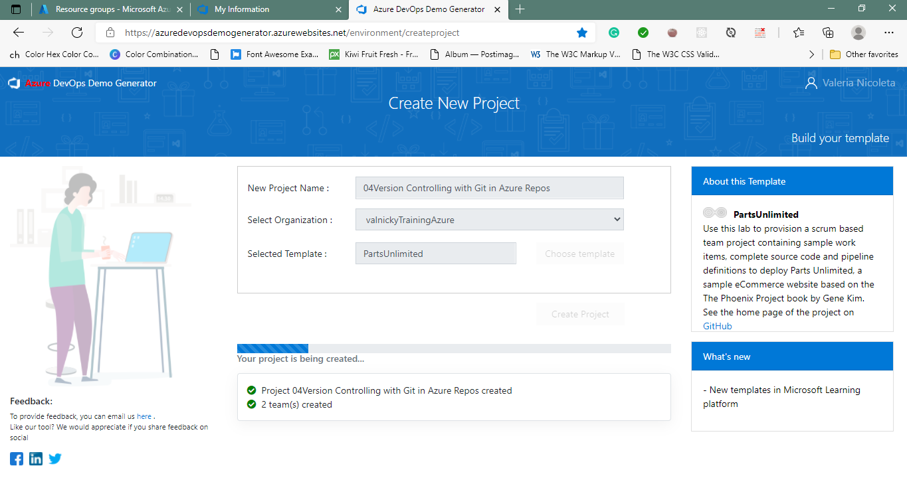

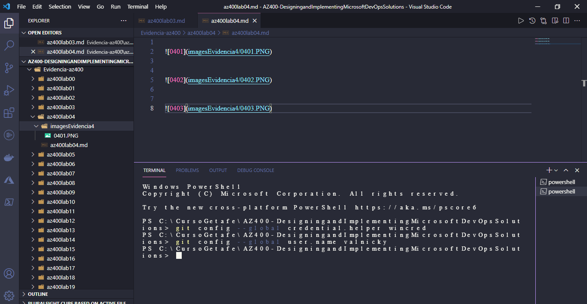

##Exercise 1: Clone an existing repository

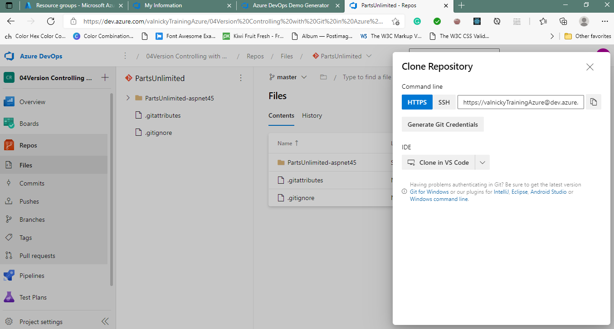

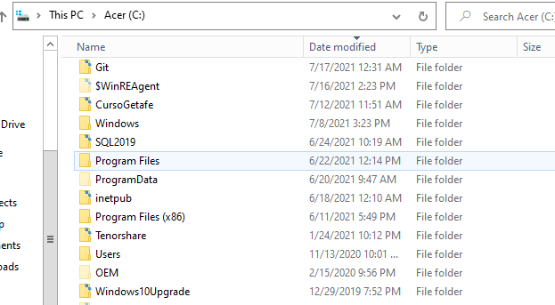

##Exercise 2: Manage branches from Azure DevOps

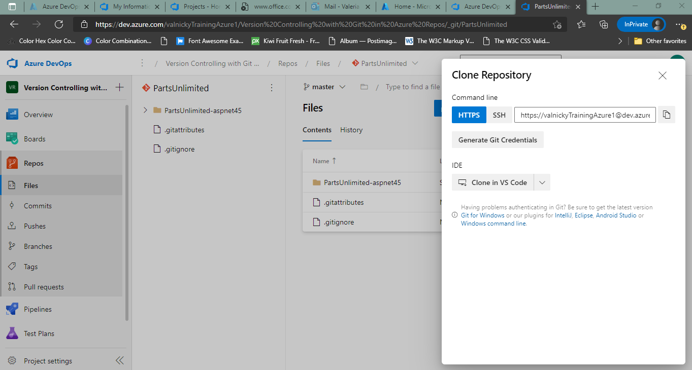

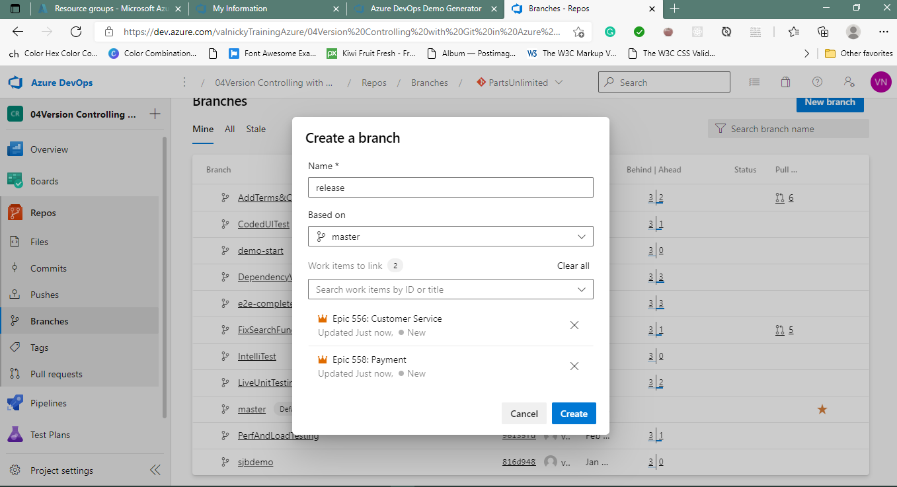

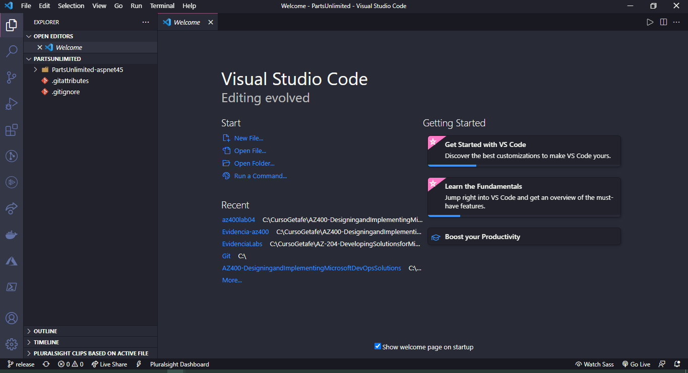

###Task 2: Delete and restore a branch

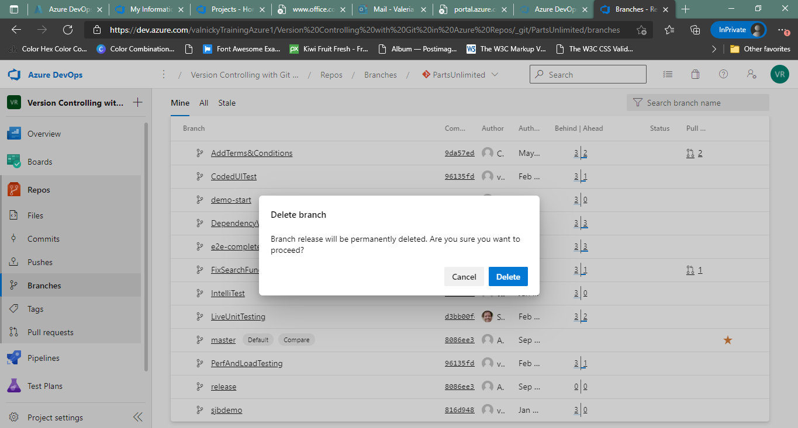

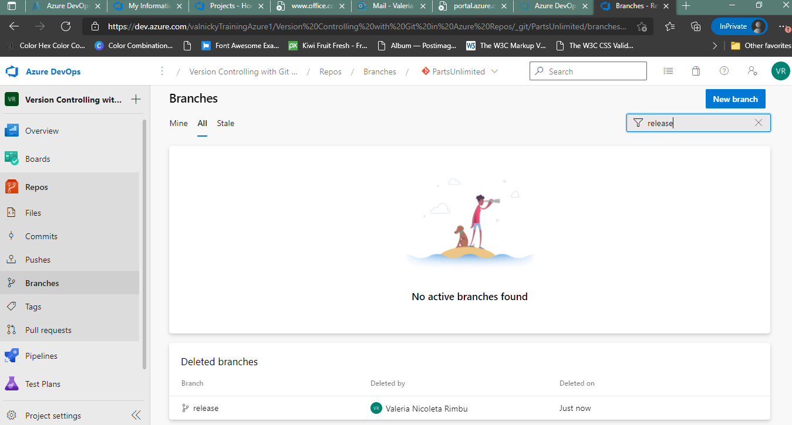

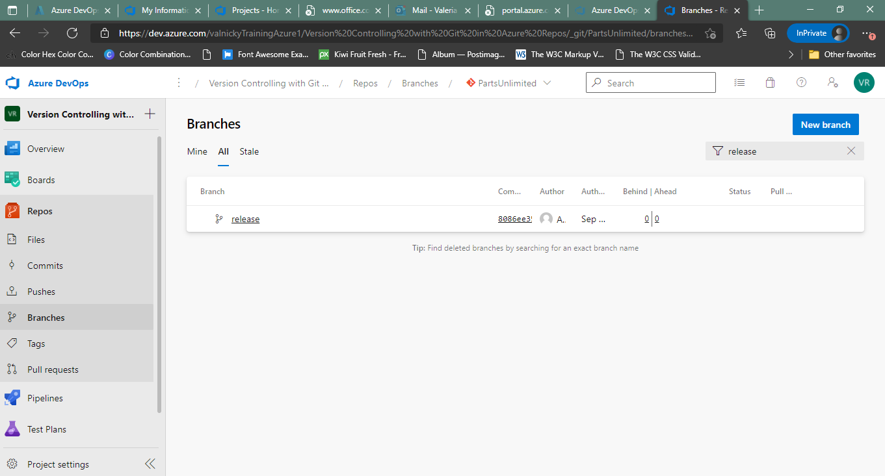

###Task 3: Lock and unlock a branch

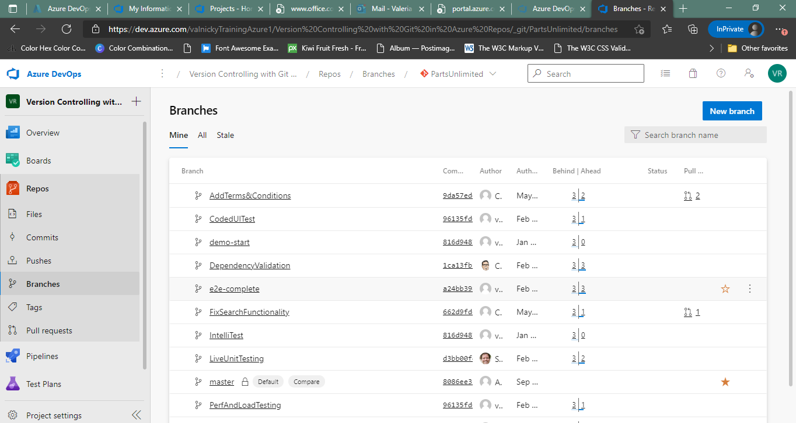

###Task 4: Tag a release

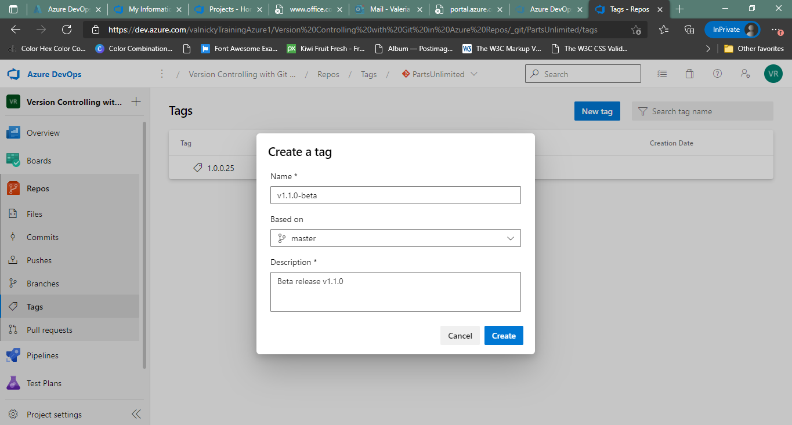

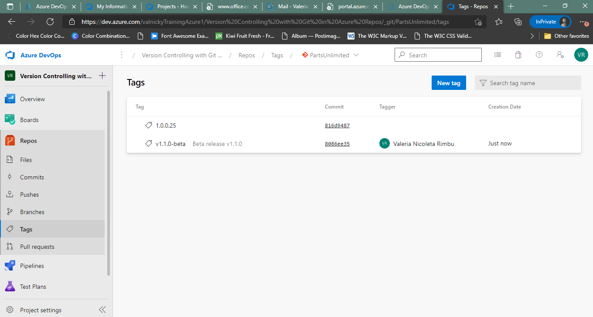

##Exercise 3: Manage repositories
###Task 1: Create a new repo from Azure DevOps

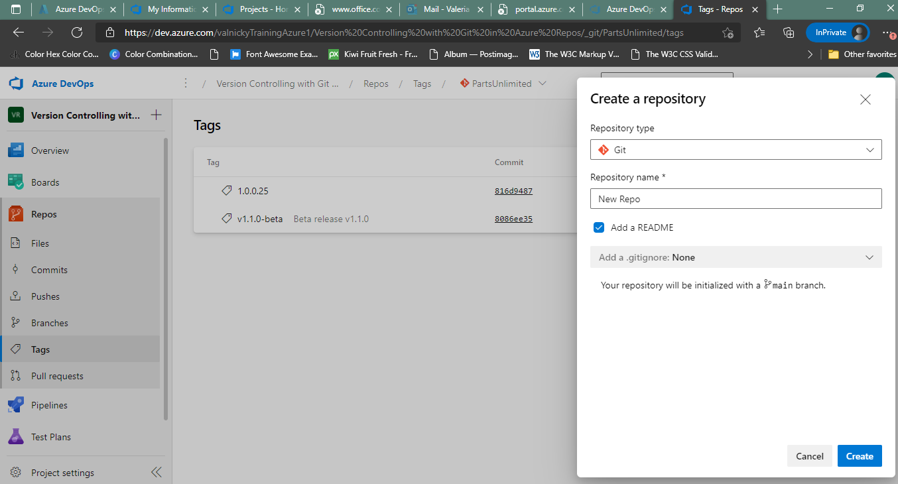

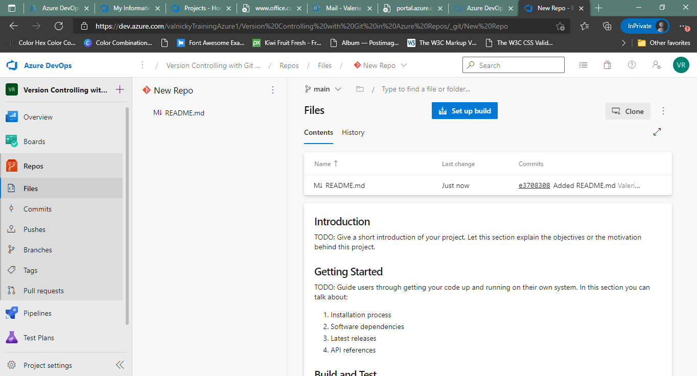

###Task 2: Delete and rename Git repos

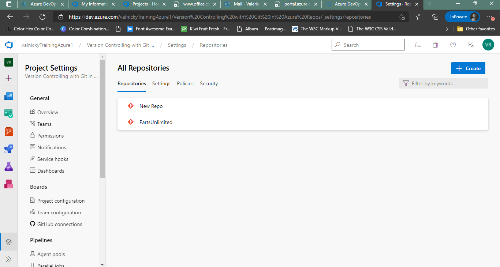

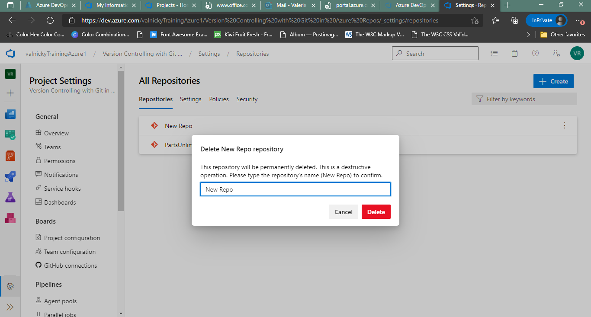

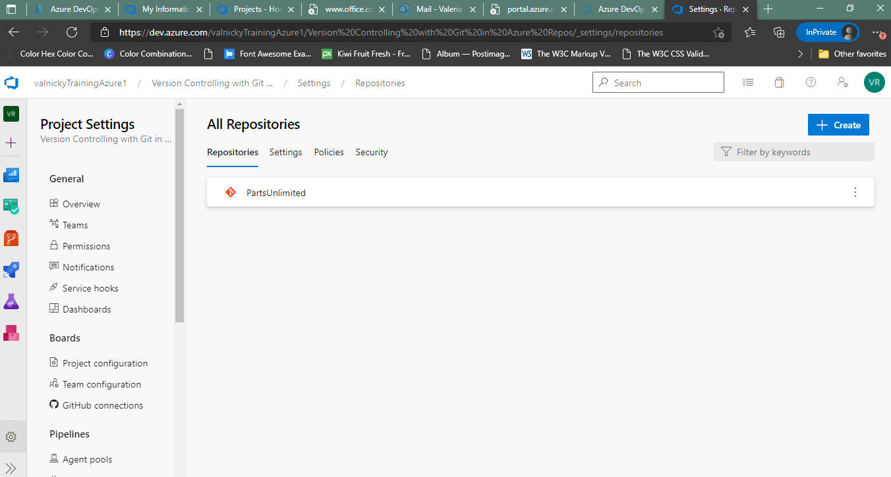
