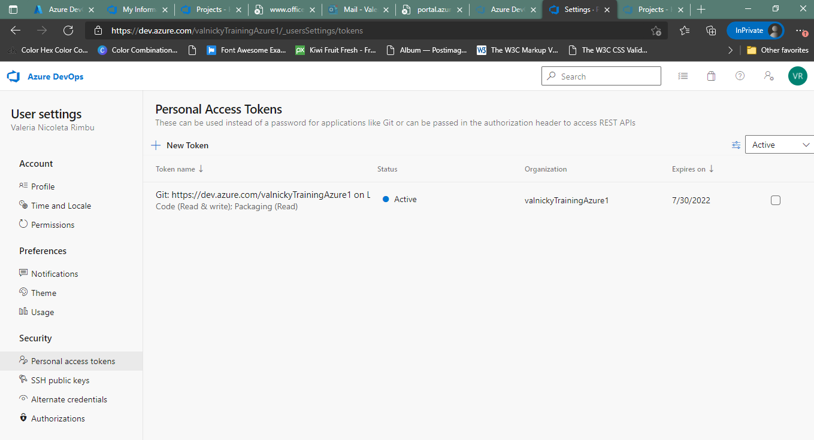
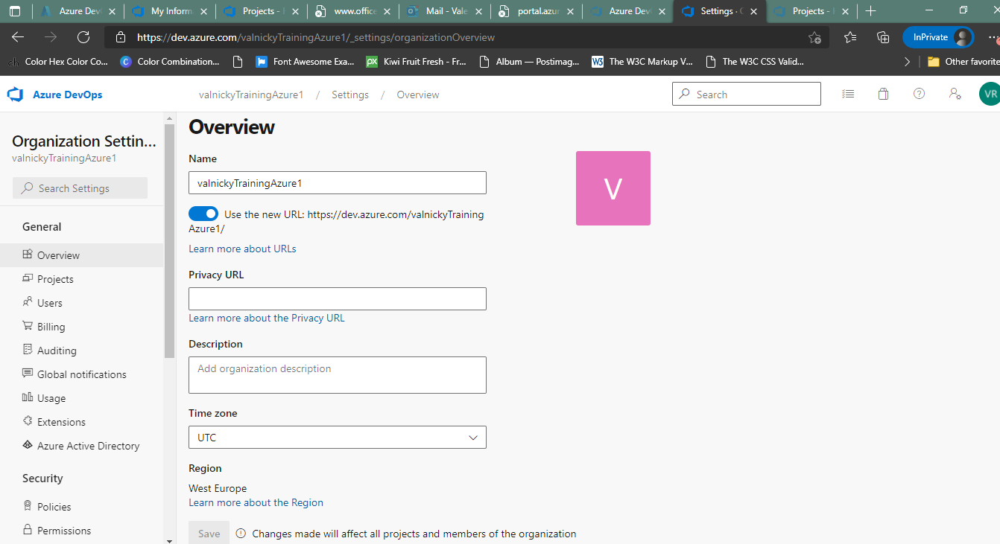
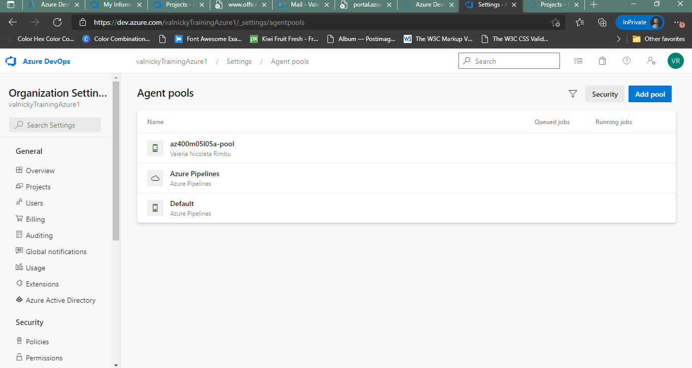
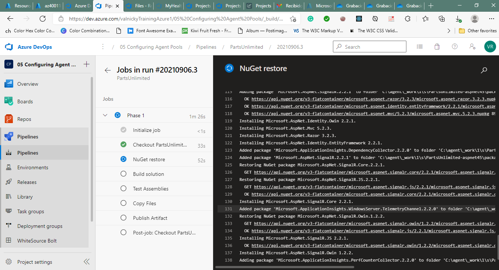

#Lab 05: Configuring Agent Pools and Understanding Pipeline Styles

Student lab manual
Lab overview
YAML-based pipelines allow you to fully implement CI/CD as code, in which pipeline definitions reside in the same repository as the code that is part of your Azure DevOps project. YAML-based pipelines support a wide range of features that are part of the classic pipelines, such as pull requests, code reviews, history, branching, and templates.

Regardless of the choice of the pipeline style, to build your code or deploy your solution by using Azure Pipelines, you need an agent. An agent hosts compute resources that runs one job at a time. Jobs can be run directly on the host machine of the agent or in a container. You have an option to run your jobs using Microsoft-hosted agents, which are managed for you, or implementing a self-hosted agent that you set up and manage on your own.

In this lab, you will step through the process of converting a classic pipeline into a YAML-based one and running it first by using a Microsoft-hosted agent and then performing the equivalent task by using a self-hosted agent.

Objectives
After you complete this lab, you will be able to:

implement YAML-based pipelines
implement self-hosted agents
Lab duration
Estimated time: 45 minutes
Instructions
Before you start
Sign in to the lab virtual machine
Ensure that you’re signed in to your Windows 10 computer by using the following credentials:

Username: Student
Password: Pa55w.rd
Review the installed applications
Find the taskbar on your Windows 10 desktop. The taskbar contains the icons for the applications that you’ll use in this lab:

Microsoft Edge
Visual Studio Code. This will be installed as part of prerequisites for this lab.
Set up an Azure DevOps organization
If you don’t already have an Azure DevOps organization that you can use for this lab, create one by following the instructions available at Create an organization or project collection.

#Exercise 0: Configure the lab prerequisites
In this exercise, you will set up the prerequisite for the lab, which consists of the preconfigured Parts Unlimited team project based on an Azure DevOps Demo Generator template.
##Task 1: Configure the team project
In this task, you will use Azure DevOps Demo Generator to generate a new project based on the PartsUnlimited template.

On your lab computer, start a web browser and navigate to Azure DevOps Demo Generator. This utility site will automate the process of creating a new Azure DevOps project within your account that is prepopulated with content (work items, repos, etc.) required for the lab.

Note: For more information on the site, see https://docs.microsoft.com/en-us/azure/devops/demo-gen.

Click Sign in and sign in using the Microsoft account associated with your Azure DevOps subscription.
If required, on the Azure DevOps Demo Generator page, click Accept to accept the permission requests for accessing your Azure DevOps subscription.
On the Create New Project page, in the New Project Name textbox, type Configuring Agent Pools and Understanding Pipeline Styles, in the Select organization dropdown list, select your Azure DevOps organization, and then click Choose template.
On the Choose a template page, click the PartsUnlimited template, and then click Select Template.
Click Create Project

Note: Wait for the process to complete. This should take about 2 minutes. In case the process fails, navigate to your DevOps organization, delete the project, and try again.

On the Create New Project page, click Navigate to project.

##Exercise 1: Author YAML-based Azure DevOps pipelines
In this exercise, you will convert a classic Azure DevOps pipeline into a YAML-based one.

###Task 1: Create an Azure DevOps YAML pipeline
In this task, you will create a template-based Azure DevOps YAML pipeline.

From the web browser displaying the Azure DevOps portal with the Configuring Agent Pools and Understanding Pipeline Styles project open, in the vertical navigational pane on the left side, click Pipelines.
On the Recent tab of the Pipelines pane, click New pipeline.
On the Where is your code? pane, click Azure Repos Git.
On the Select a repository pane, click PartsUnlimited.
On the Configure your pipeline pane, click Starter pipeline.
On the Review your pipeline YAML pane, review the sample pipeline, click the down-facing caret symbol next to the Save and run button, click Save and, on the Save pane, click Save.

Note: This will result in creation of the azure-pipelines.yml file in the root directory of the repository hosting the project code.

Note: You will replace the content of the sample YAML pipeline with the code of pipeline generated by the classic editor and modify it to account for differences between the classic and YAML pipelines.

###Task 2: Convert a classic pipeline into a YAML pipeline
In this task, you will convert a classic pipeline into a YAML pipeline

From the web browser displaying the Azure DevOps portal with the Configuring Agent Pools and Understanding Pipeline Styles project open, in the vertical navigational pane on the left side, click Pipelines.
On the Recent tab of the Pipelines pane, hover with the mouse pointer over the right edge of the entry containing the PartsUnlimitedE2E entry to reveal the vertical ellipsis symbol designating the More menu, click the ellipsis symbol, and, in the dropdown menu, click Edit. This will display the build pipeline that is part of the project you generated at the beginning of the lab.
On the Tasks tab of the PartsUnlimitedE2E edit pane, click Triggers, on the right side of the PartsUnlimited pane, uncheck the Enable continuous integration checkbox, click the down-facing caret next to the Save & queue button, in the dropdown menu, click Save, and in the Save build pipeline click Save.

Note: This will prevent from unintended execution of automatic build due to changes to the repository during this lab.

Note: Alternatively, you could simply delete the existing pipeline once you copy its content into the new one.

In the Azure DevOps portal, in the vertical navigational pane on the left side, in the Pipelines section, click Pipelines.
On the Recent tab of the Pipelines pane, click the PartsUnlimitedE2E entry.
On the Runs tab of the PartsUnlimitedE2E pane, in the upper right corner, click the vertical ellipsis (three vertical dots) symbol and, in the dropdown menu, click Export to YAML. This will automatically download the PartsUnlimitedE2E.yml file to your local Downloads folder.

Note: The Export to YAML feature replaces an older View YAML option available from the pipeline editor pane within the Azure DevOps portal, which was limited to viewing YAML content one job at a time. The new functionality leverages existing classic and YAML pipeline infrastructure, including YAML parsing library, which results in more accurate translation between the two. It supports the following pipeline components:

Single and multiple jobs
Checkout options
Execution plan parallelism
Timeout and name metadata
Demands
Schedules and other triggers
Pool selection, including jobs which differ from the default
All tasks and all inputs, including optimizing for default inputs
Job and step conditions
Task group unrolling
Note: The only components not covered by the new functionality are variables and timezone translation. Variables defined in YAML override variables set in the user interface of the Azure DevOps portal. If the Export to YAML feature detects presence of Classic pipeline variables, they will be explicitly included in the comments within the newly generated YAML pipeline definition. Similarly, since cron schedules in YAML are expressed in UTC, while classic schedules rely on the organization’s timezone, their presence is also included in the comments.

Note: For more information regarding this functionality, refer to Replacing “View YAML”

On the lab computer, start Visual Studio Code and use it to open the file PartsUnlimitedE2E.yml. The file should have the following content:

Code
name: $(date:yyyyMMdd)$(rev:.r)
jobs:

- job: Phase_1
  displayName: Phase 1
  cancelTimeoutInMinutes: 1
  pool:
  vmImage: vs2017-win2016
  steps:
  - checkout: self
  - task: NuGetInstaller@0
    name: NuGetInstaller_1
    displayName: NuGet restore
    inputs:
    solution: '\*\*\*.sln'
  - task: VSBuild@1
    name: VSBuild_2
    displayName: Build solution
    inputs:
    vsVersion: 15.0
    msbuildArgs: /p:DeployOnBuild=true /p:WebPublishMethod=Package /p:PackageAsSingleFile=true /p:SkipInvalidConfigurations=true /p:PackageLocation="$(build.stagingDirectory)" /p:IncludeServerNameInBuildInfo=True /p:GenerateBuildInfoConfigFile=true /p:BuildSymbolStorePath="$(SymbolPath)" /p:ReferencePath="C:\Program Files (x86)\Microsoft Visual Studio\2017\Enterprise\Common7\IDE\Extensions\Microsoft\Pex"
    platform: $(BuildPlatform)
    configuration: $(BuildConfiguration)
  - task: VSTest@1
    name: VSTest_3
    displayName: Test Assemblies
    inputs:
    testAssembly: '**\$(BuildConfiguration)\*test\*.dll;-:**\obj\*\*'
    codeCoverageEnabled: true
    vsTestVersion: latest
    platform: $(BuildPlatform)
    configuration: $(BuildConfiguration)
  - task: CopyFiles@2
    name: CopyFiles1
    displayName: Copy Files
    inputs:
    SourceFolder: $(build.sourcesdirectory)
    Contents: '\*_/_.json'
    TargetFolder: $(build.artifactstagingdirectory)
  - task: PublishBuildArtifacts@1
    name: PublishBuildArtifacts_5
    displayName: Publish Artifact
    inputs:
    PathtoPublish: $(build.artifactstagingdirectory)
    TargetPath: '\\my\share\$(Build.DefinitionName)\$(Build.BuildNumber)'
    ...
    In the Visual Studio Code window, in the top-level menu, click Selection and, in the dropdown menu, click Select All.
    In the Visual Studio Code window, in the top-level menu, click Edit and, in the dropdown menu, click Copy.
    Switch to the browser window displaying the Azure DevOps portal and, in the vertical navigational pane on the left side, in the Pipelines section, click Pipelines.
    On the Recent tab of the Pipelines pane, select PartsUnlimited and, on the PartsUnlimited pane, select Edit.
    On the PartsUnlimited edit pane, select the existing YAML content of the pipeline, replace it with the content of Clipboard.
    On the PartsUnlimited edit pane, in the upper-right corner, click Save, and, on the Save pane, click Save. This will automatically trigger the build based on this pipeline.
    In the Azure DevOps portal, in the vertical navigational pane on the left side, in the Pipelines section, click Pipelines.
    On the Recent tab of the Pipelines pane, click the PartsUnlimited entry, on the Runs tab of the PartsUnlimited pane, select the most recent run, on the Summary pane of the run, scroll down to the bottom, in the Jobs section, click Phase 1 and monitor the job until its successful completion.

##Exercise 2: Manage Azure DevOps agent pools
In this exercise, you will implement self-hosted Azure DevOps agent.

###Task 1: Configure an Azure DevOps self-hosting agent
In this task, you will configure the LOD VM as an Azure DevOps self-hosting agent and use it to run a build pipeline.

Within the Lab Virtual machine (Lab VM) or your own computer, start a web browser, navigate to the Azure DevOps portal and sign in by using the Microsoft account associated with your Azure DevOps organization.
In the Azure DevOps portal, in the upper right corner of the Azure DevOps page, click the User settings icon, in the dropdown menu, click Personal access tokens, on the Personal Access Tokens pane, and click + New Token.
On the Create a new personal access token pane, click the Show all scopes link and, specify the following settings and click Create (leave all others with their default values):

Setting Value
Name Configuring Agent Pools and Understanding Pipeline Styles lab
Scope (custom defined) Agent Pools (show more scopes option below if needed)
Permissions Read and manage
On the Success pane, copy the value of the personal access token to Clipboard.

Note: Make sure you copy the token. You will not be able to retrieve it once you close this pane.

On the Success pane, click Close.
On the Personal Access Token pane of the Azure DevOps portal, click Azure DevOps symbol in the upper left corner and then click Organization settings label in the lower left corner.
To the left side of the Overview pane, in the vertical menu, in the Pipelines section, click Agent pools.
On the Agent pools pane, in the upper right corner, click Add pool.
On the Add agent pool pane, in the Pool type dropdown list, select Self-hosted, in the Name text box, type az400m05l05a-pool and then click Create.
Back on the Agent pools pane, click the entry representing the newly created az400m05l05a-pool.
On the Jobs tab of the az400m05l05a-pool pane, click the Agents header.
On the Agents tab of the az400m05l05a-pool pane, click the New agent button.
On the Get the agent pane, ensure that the Windows and x64 tabs are selected, and click Download to download the zip archive containing the agent binaries to download it into the local Downloads folder within your user profile.

Note: If you receive an error message at this point indicating that the current system settings prevent you from downloading the file, in the Internet Explorer window, in the upper right corner, click the gearwheel symbol designating the Settings menu header, in the dropdown menu, select Internet Options, in the Internet Options dialog box, click Advanced, on the Advanced tab, click Reset, in the Reset Internet Explorer Settings dialog box, click Reset again, click Close, and try the download again.

Start Windows PowerShell as administrator and in the Administrator: Windows PowerShell console run the following lines to create the C:\agent directory and extract the content of the downloaded archive into it.

Code
cd \
mkdir agent ; cd agent
$TARGET = Get-ChildItem "$Home\Downloads\vsts-agent-win-x64-\*.zip"
Add-Type -AssemblyName System.IO.Compression.FileSystem
[System.IO.Compression.ZipFile]::ExtractToDirectory($TARGET, "$PWD")
In the same Administrator: Windows PowerShell console, run the following to configure the agent:

Code
.\config.cmd
When prompted, specify the values of the following settings:

Setting Value
Enter server URL the URL of your Azure DevOps organization, in the format https://dev.azure.com/<organization_name>, where <organization_name> represents the name of your Azure DevOps organization
Enter authentication type (press enter for PAT) Enter
Enter personal access token The access token you recorded earlier in this task
Enter agent pool (press enter for default) az400m05l05a-pool
Enter agent name az400m05-vm0
Enter work folder (press enter for \_work) Enter
Enter Perform an unzip for tasks for each step. (press enter for N) Enter
Enter run agent as service? (Y/N) (press enter for N) Y
Enter User account to use for the service (press enter for NT AUTHORITY\NETWORK SERVICE) Enter
Note: You can run self-hosted agent as either a service or an interactive process. You might want to start with the interactive mode, since this simplifies verifying agent functionality. For production use, you should consider either running the agent as a service or as an interactive process with auto-logon enabled, since both persist their running state and ensure that the agent starts automatically if the operating system is restarted.

Note: Verify that the agent is reporting the Listening for Jobs status.

Switch to the browser window displaying the Azure DevOps portal and close the Get the agent pane.
Back on the Agents tab of the az400m05l05a-pool pane, note that the newly configured agent is listed with the Online status.
In the web browser window displaying the Azure DevOps portal, in the upper left corner, click the Azure DevOps label.
In the browser window displaying the list of projects, click the tile representing your Configuring Agent Pools and Understanding Pipeline Styles project.
On the Configuring Agent Pools and Understanding Pipeline Styles pane, in the vertical navigational pane on the left side, in the Pipelines section, click Pipelines.
On the Recent tab of the Pipelines pane, select PartsUnlimited and, on the PartsUnlimited pane, select Edit.
On the PartsUnlimited edit pane, in the existing YAML-based pipeline, replace line 7 vmImage: vs2017-win2016 designating the target agent pool the following content, designating the newly created self-hosted agent pool:

Code
name: az400m05l05a-pool
demands:

- agent.name -equals az400m05-vm0
  For Task: NugetInstaller@0, click on Settings (link that is displaying above the task in grey colour), modify Advanced > NuGet Version > 4.0.0 and click on Add.
  On the PartsUnlimited edit pane, in the upper right corner of the pane, click Save and, on the Save pane, click Save again. This will automatically trigger the build based on this pipeline.
  In the Azure DevOps portal, in the vertical navigational pane on the left side, in the Pipelines section, click Pipelines.
  On the Recent tab of the Pipelines pane, click the PartsUnlimited entry, on the Runs tab of the PartsUnlimited pane, select the most recent run, on the Summary pane of the run, scroll down to the bottom, in the Jobs section, click Phase 1 and monitor the job until its successful completion.

