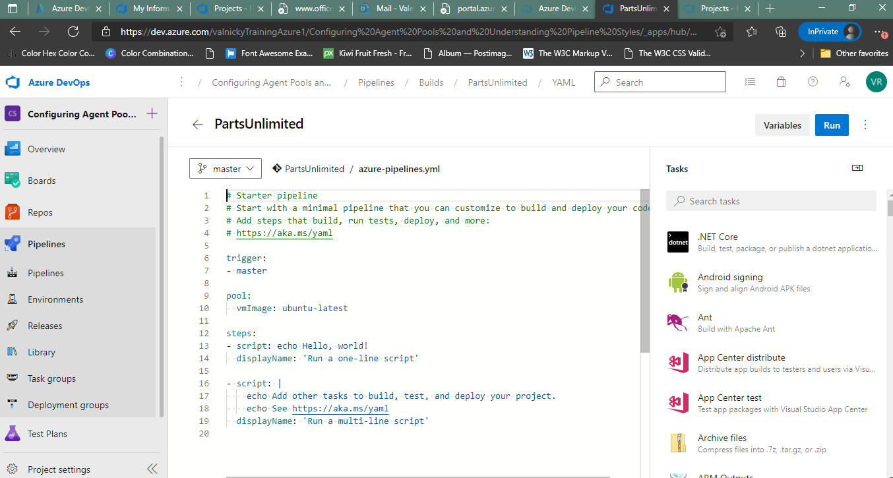
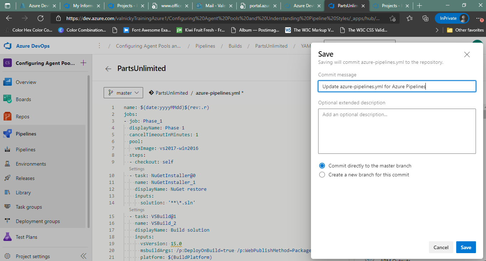
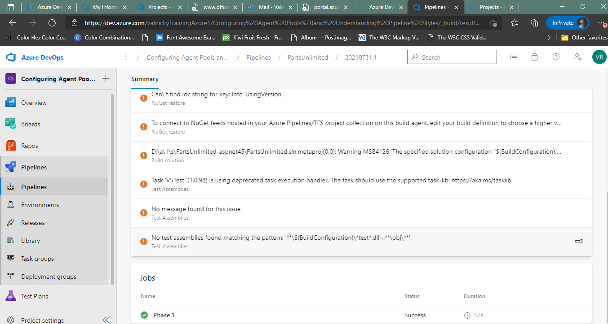
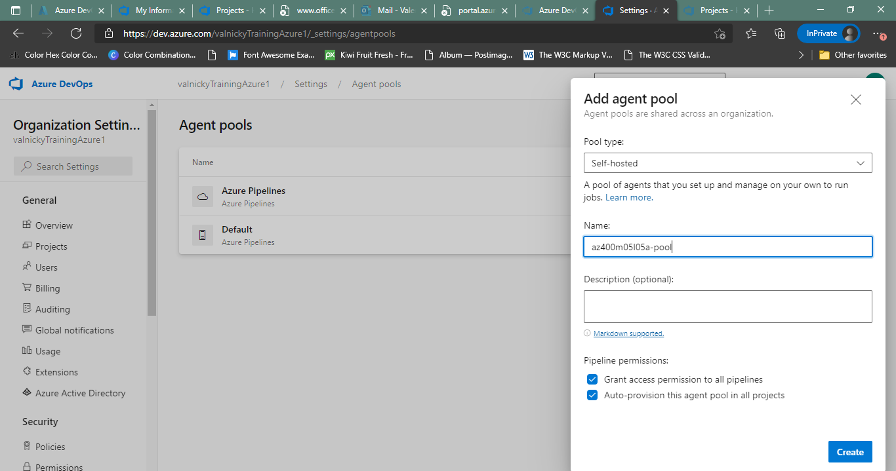

#Lab 05: Configuring Agent Pools and Understanding Pipeline Styles
YAML-based pipelines allow you to fully implement CI/CD as code, in which pipeline definitions reside in the same repository as the code that is part of your Azure DevOps project. YAML-based pipelines support a wide range of features that are part of the classic pipelines, such as pull requests, code reviews, history, branching, and templates.

Regardless of the choice of the pipeline style, to build your code or deploy your solution by using Azure Pipelines, you need an agent. An agent hosts compute resources that runs one job at a time. Jobs can be run directly on the host machine of the agent or in a container. You have an option to run your jobs using Microsoft-hosted agents, which are managed for you, or implementing a self-hosted agent that you set up and manage on your own.

In this lab, you will step through the process of converting a classic pipeline into a YAML-based one and running it first by using a Microsoft-hosted agent and then performing the equivalent task by using a self-hosted agent.

#Exercise 0: Configure the lab prerequisites

##Task 1: Configure the team project

##Exercise 1: Author YAML-based Azure DevOps pipelines

###Task 2: Convert a classic pipeline into a YAML pipeline

##Exercise 2: Manage Azure DevOps agent pools
###Task 1: Configure an Azure DevOps self-hosting agent

