#Integrating External Source Control with Azure Pipelines
##Exercise 1: Getting started with Azure Pipelines
###Task 1: Forking a GitHub repo and installing Azure Pipelines

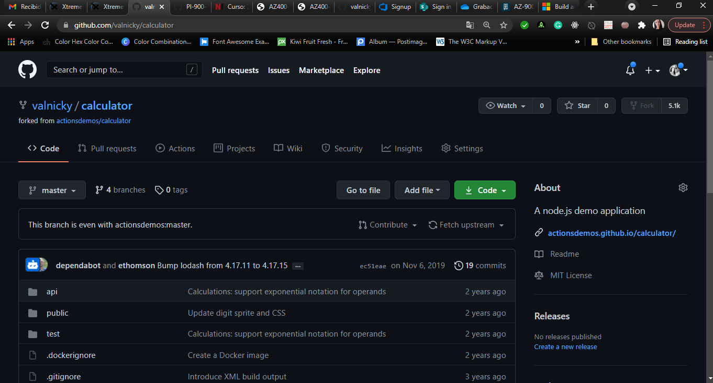

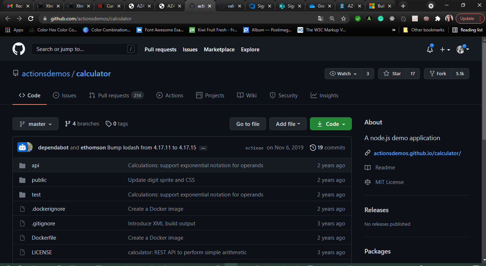

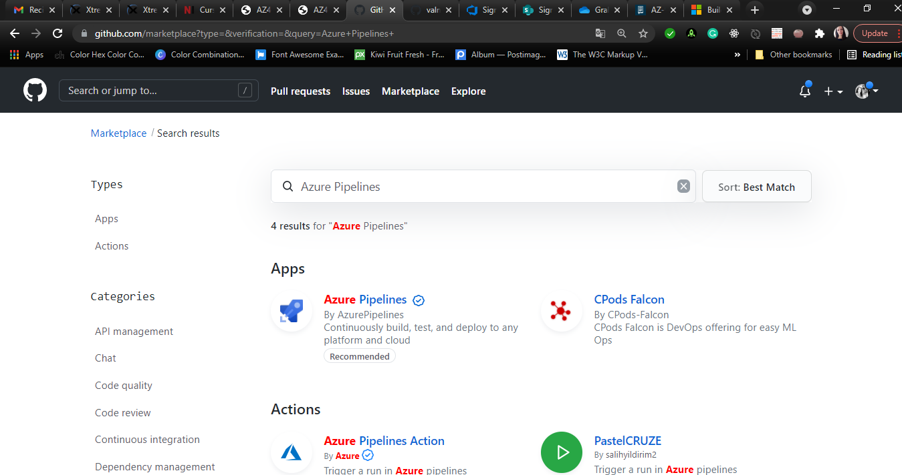

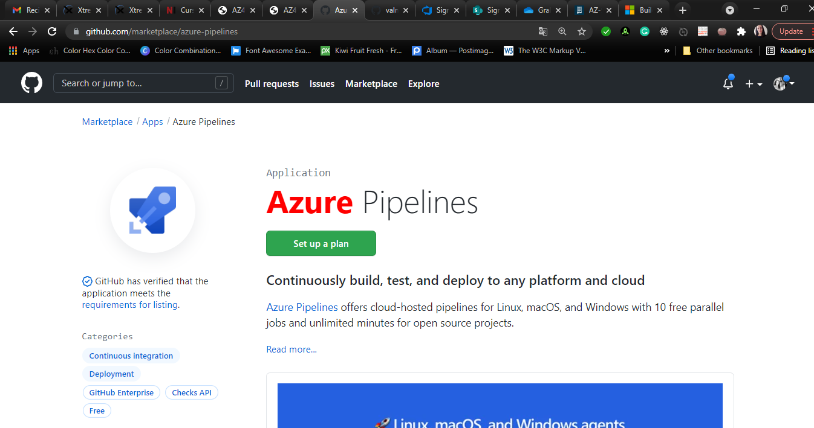

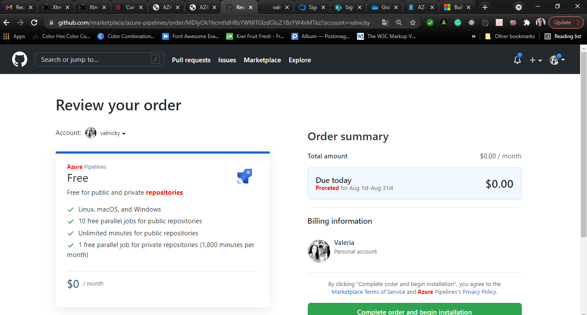

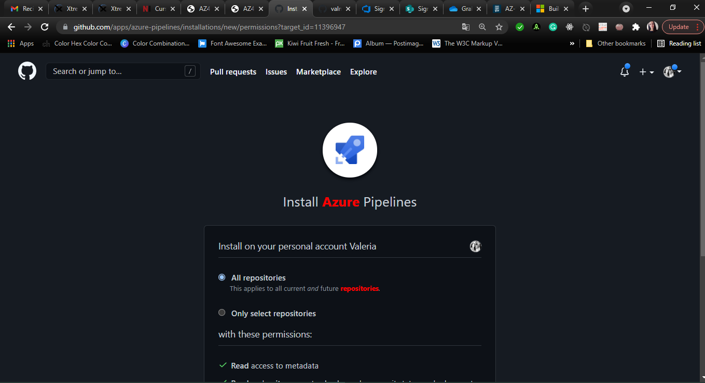

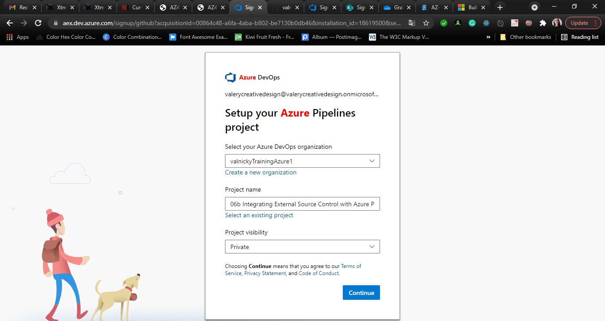

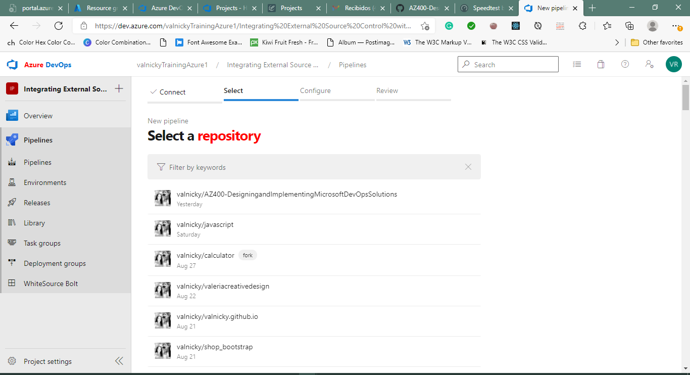

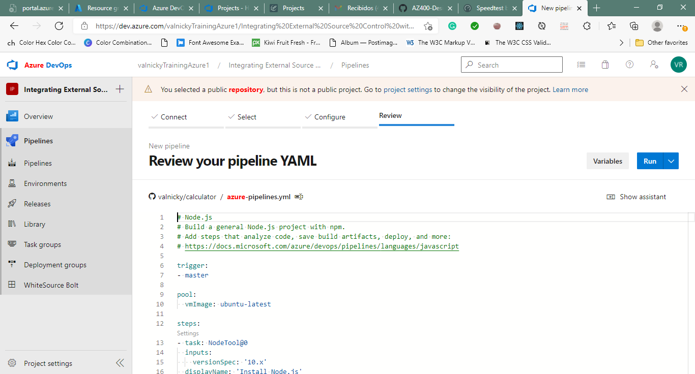

###Task 2: Configuring your Azure Pipelines project

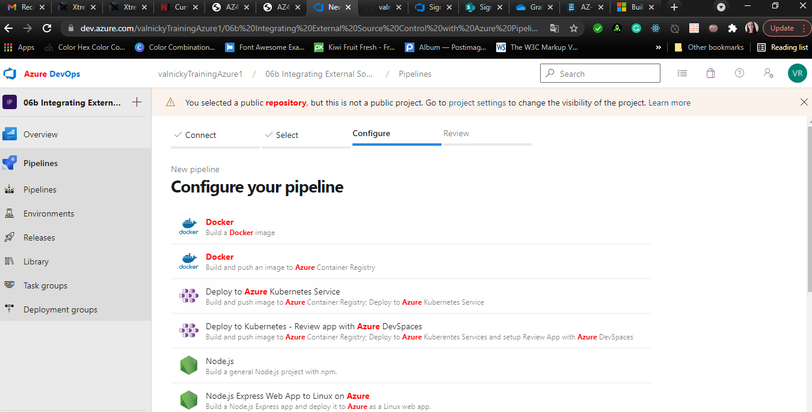

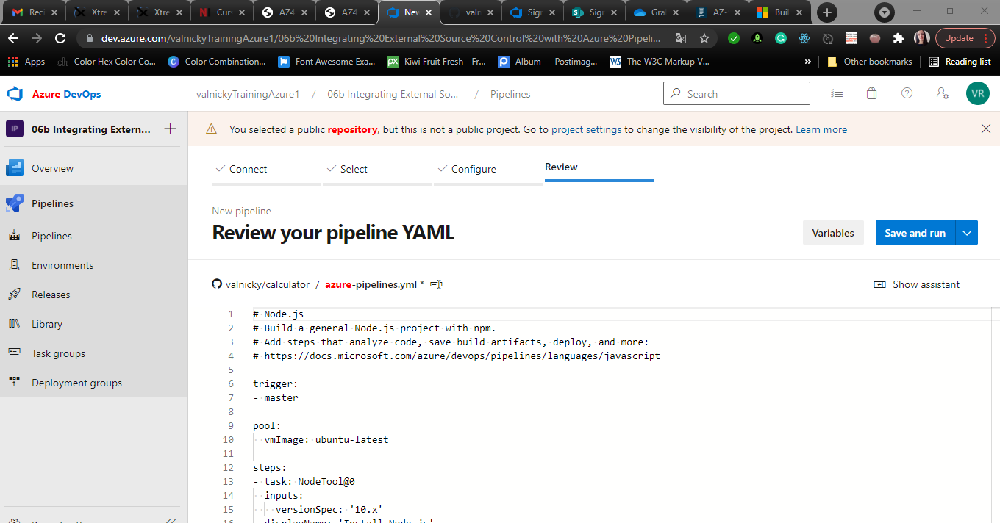

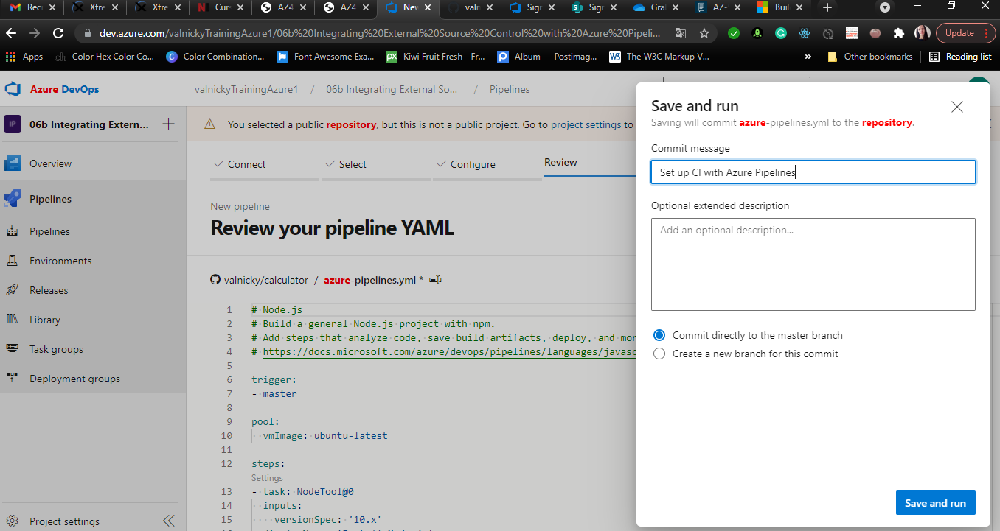

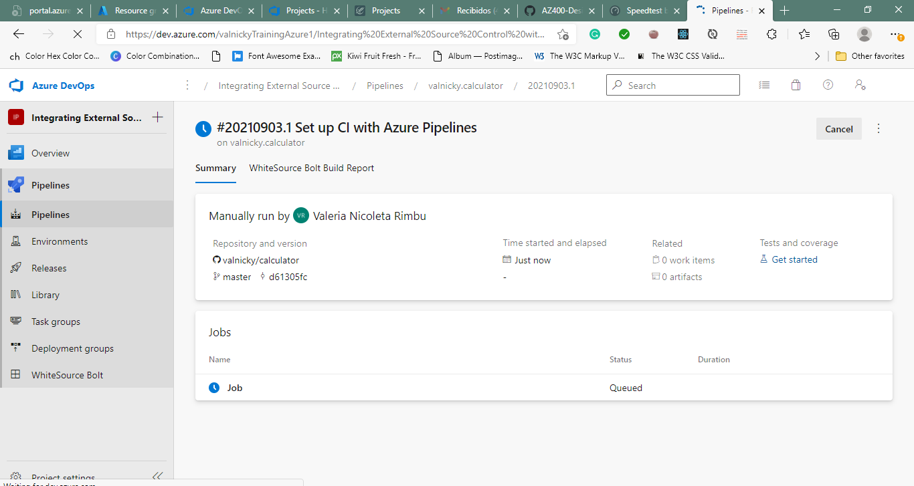

###Task 3: Modifying a YAML build pipeline definition
