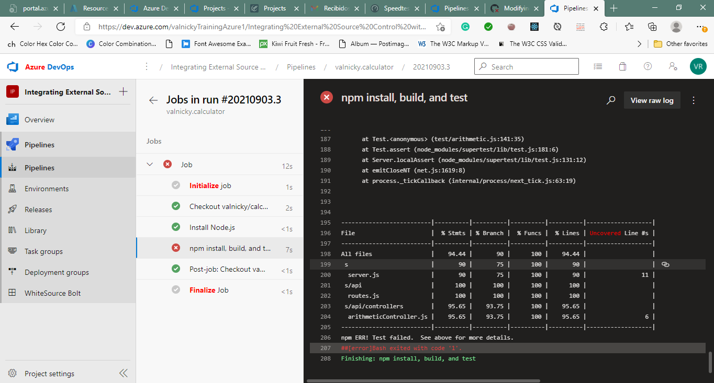

#Lab06b Integrating External Source Control with Azure Pipelines
With the introduction of Azure DevOps, Microsoft is offering developers a new continuous integration/continuous delivery (CI/CD) service called Azure Pipelines that enables you to continuously build, test, and deploy to any platform or cloud. It has cloud-hosted agents for Linux, macOS, and Windows; powerful workflows with native container support; and flexible deployments to Kubernetes, VMs, and serverless environments.

Azure Pipelines provides unlimited CI/CD minutes and 10 parallel jobs to every GitHub open source project for free. All open source projects run on the same infrastructure that our paying customers use. That means you’ll have the same fast performance and high quality of service. Many of the top open source projects are already using Azure Pipelines for CI/CD, such as Atom, CPython, Pipenv, Tox, Visual Studio Code, and TypeScript-and the list is growing every day.

In this lab, you’ll see how easy it is to set up Azure Pipelines with your GitHub projects and how you can start seeing benefits immediately.

##Exercise 1: Getting started with Azure Pipelines
###Task 1: Forking a GitHub repo and installing Azure Pipelines

###Task 2: Configuring your Azure Pipelines project

###Task 3: Modifying a YAML build pipeline definition

In this task, you will modify the YAML build definition in the forked GitHub repository and track the build process triggered by your modification.

###Task 4: Proposing a change via GitHub pull request
In this task, you will propose an invalid change and review the results of a build triggered by a pull request.

###Task 5: Using the broken pull request to improve the project
In this task, you will correct the invalid changes introduced in the pull request created in the previous task.

###Task 6: Adding a build status badge
In this task, you will add a build status badge to your GitHub repo.

