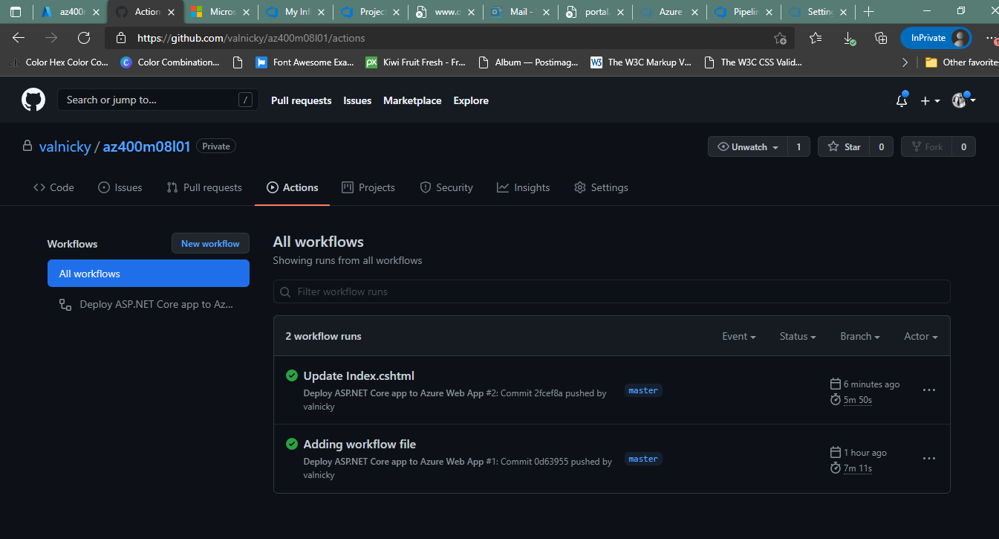

#Implementing GitHub Actions by using DevOps Starter
##Exercise 1 : Create a DevOps Starter project
###Task 1: Create DevOps Starter project

###Task 2: Review the results of creating the DevOps Starter project

##Exercise 2: Remove the Azure lab resources

