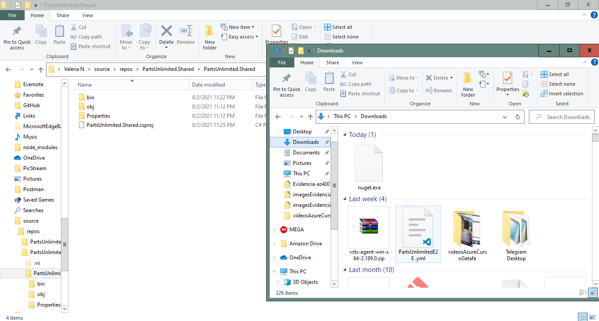

#Lab 09: Package Management with Azure Artifacts
###Task 1: Configure the team project

###Task 2: Configuring the Parts Unlimited solution in Visual Studio

##Exercise 1: Working with Azure Artifacts
work with Azure Artifacts by using the following steps:

- create and connect to a feed.
- create and publish a NuGet package.
- import a NuGet package.
- update a NuGet package.

###Task 1: Creating and connecting to a feed

###Task 2: Creating and publishing a NuGet package

###Task 3: Importing a NuGet package

###Task 4: Updating a NuGet package

