#Lab 10a: Controlling Deployments using Release Gates
###Task 1: Configure the team project

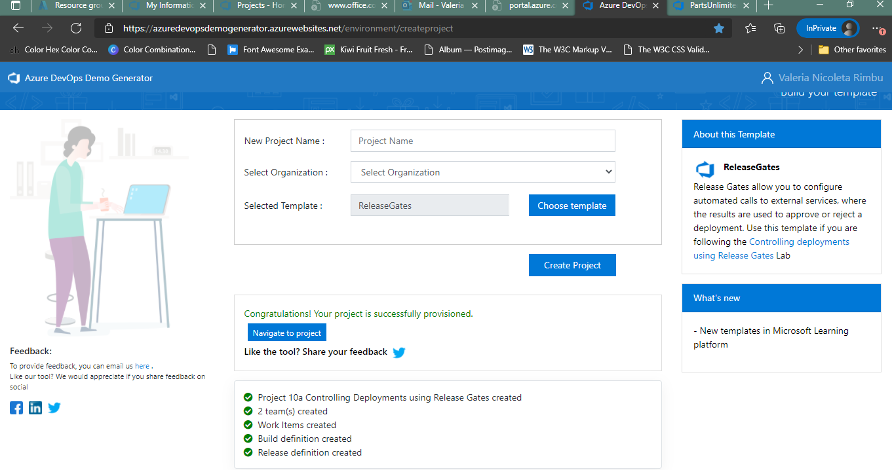

###Task 2: Create two Azure web apps

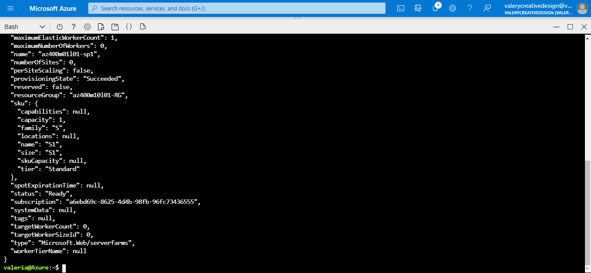

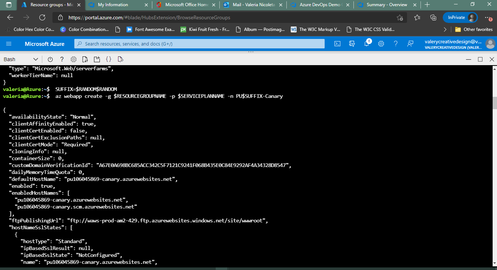

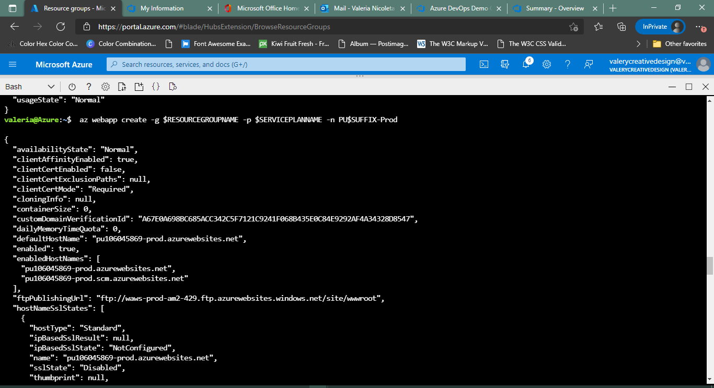

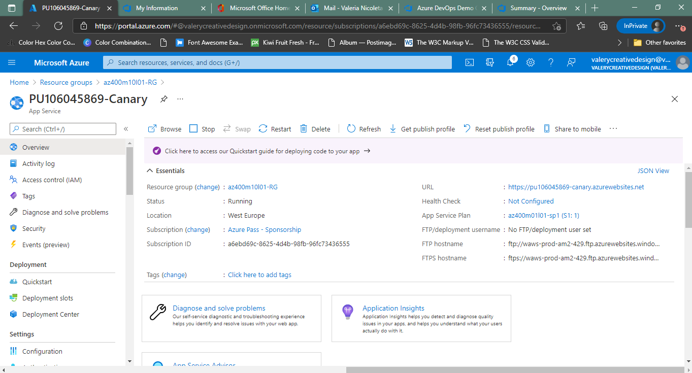

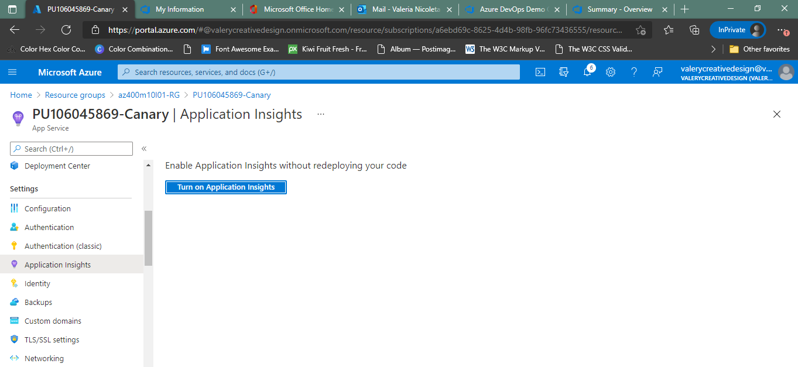

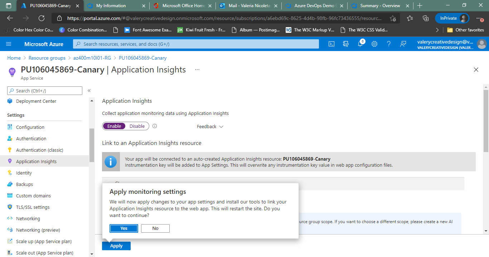

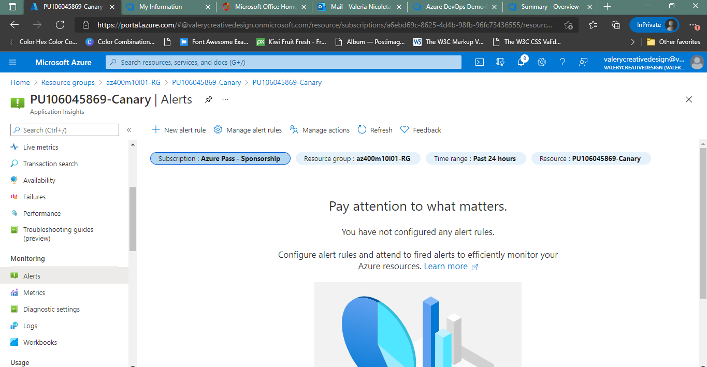

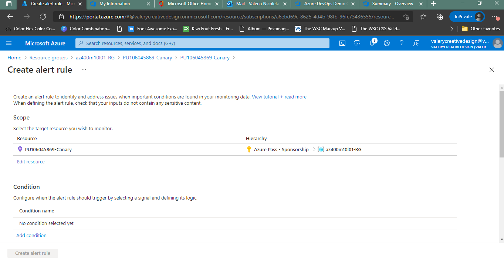

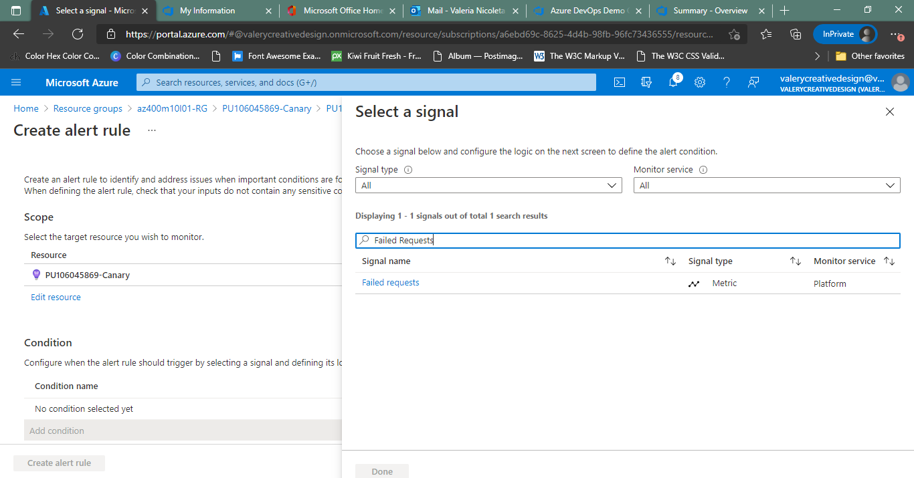

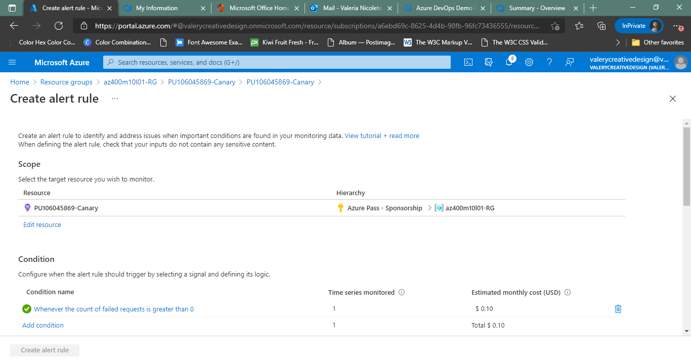

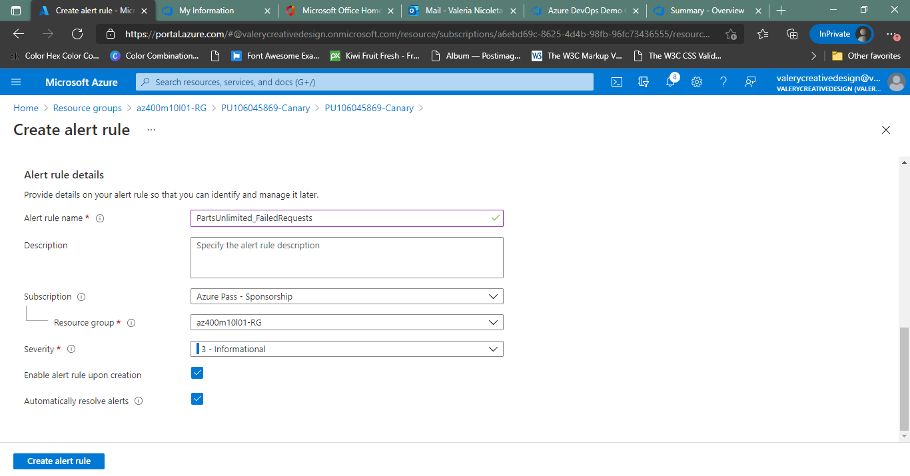

##Exercise 1: Configure release pipeline
###Task 1: Update release tasks
