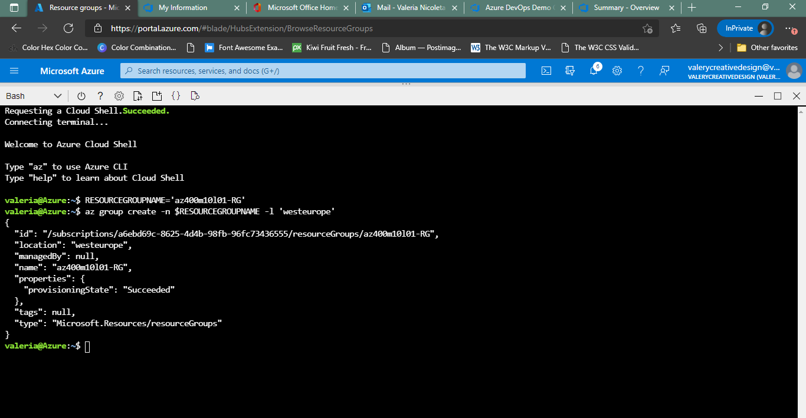

#Lab 10a: Controlling Deployments using Release Gates
This lab covers the configuration of the deployment gates and details how to use them to control execution of Azure pipelines. To illustrate their implementation, you will configure a release definition with two environments for an Azure Web App. You will deploy to the Canary environment only when there are no blocking bugs for the app and mark the Canary environment complete only when there are no active alerts in Application Insights of Azure Monitor.

A release pipeline specifies the end-to-end release process for an application to be deployed across a range of environments. Deployments to each environment are fully automated by using jobs and tasks. Ideally, you do not want new updates to the applications to be exposed to all the users at the same time. It is a best practice to expose updates in a phased manner i.e. expose to a subset of users, monitor their usage and expose to other users based on the experience of the initial set of users.

Approvals and gates enable you to take control over the start and completion of the deployments in a release. With approvals, you can wait for users to manually approve or reject deployments. Using release gates, you can specify application health criteria that must be met before release is promoted to the next environment. Prior to or after any environment deployment, all the specified gates are automatically evaluated until they all pass or until they reach your defined timeout period and fail.

Gates can be added to an environment in the release definition from the pre-deployment conditions or the post-deployment conditions panel. Multiple gates can be added to the environment conditions to ensure all the inputs are successful for the release.

As an example:

Pre-deployment gates ensure there are no active issues in the work item or problem management system before deploying a build to an environment.
Post-deployment gates ensure there are no incidents from the monitoring or incident management system for the app after it’s been deployed, before promoting the release to the next environment.
There are 4 types of gates included by default in every account.

Invoke Azure Function: Triggers execution of an Azure Function and ensures a successful completion.
Query Azure Monitor alerts: Observes the configured Azure Monitor alert rules for active alerts.
Invoke REST API: Makes a call to a REST API and continues if it returns a successful response.
Query work items: Ensures the number of matching work items returned from a query is within a threshold.

###Task 1: Configure the team project

###Task 2: Create two Azure web apps

##Exercise 1: Configure release pipeline
###Task 1: Update release tasks

##Exercise 2: Configure release gates. - set up Gates in the release pipeline.

###Task 1: Configure pre-deployment gates

###Task 2: Configure post-deployment gates
In this task, you will enable the post-deployment gate for the Canary Environment.

##Exercise 3: Test release gates
In this exercise, you will test the release gates by updating the application, which will trigger a deployment.

###Task 1: Update and deploy application after adding release gates

