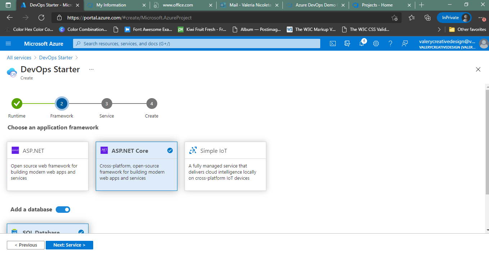
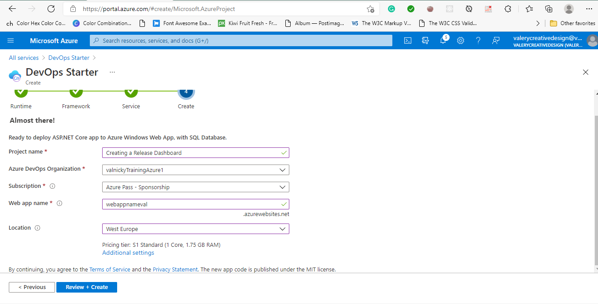
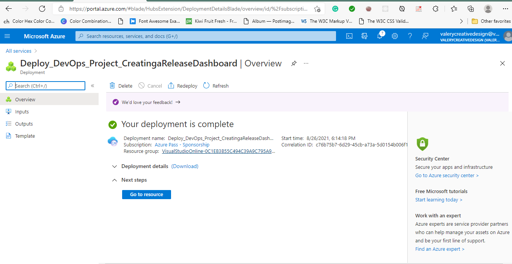
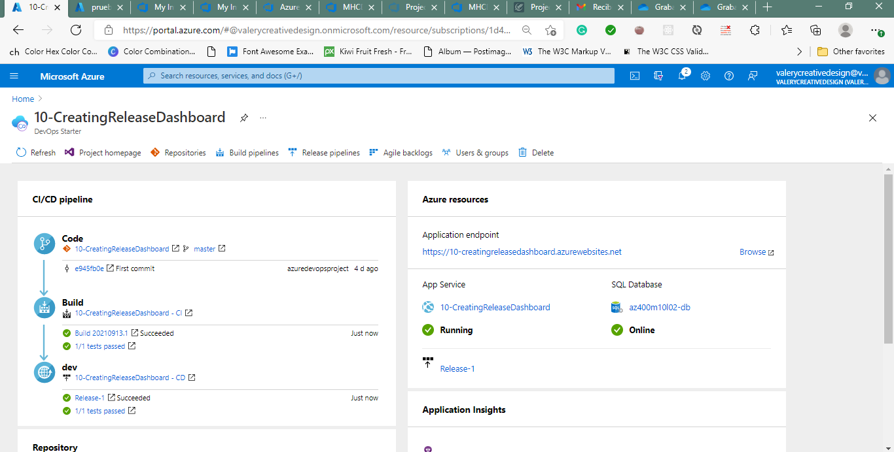
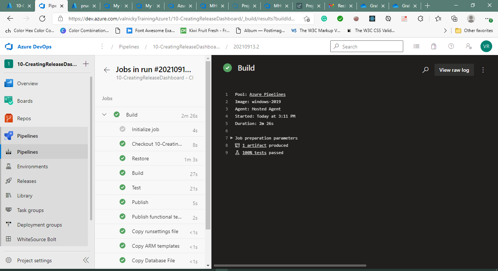
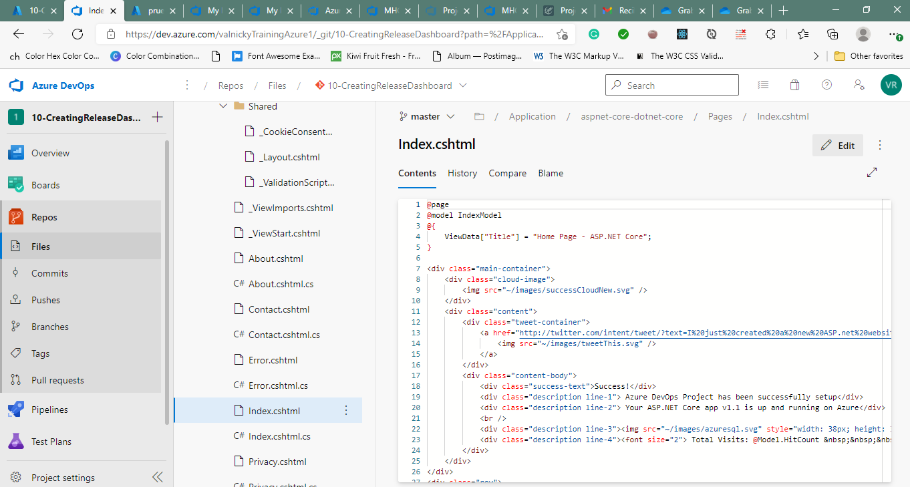
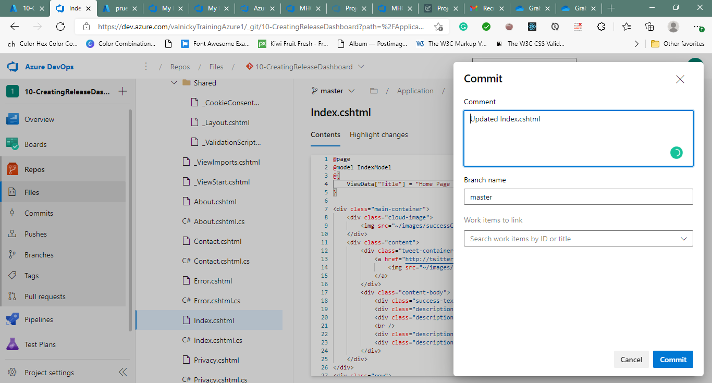

#Lab 10b: Creating a Release Dashboard
Student lab manual
Lab overview
In this lab, you will step through creation of a release dashboard and the use of REST API to retrieve Azure DevOps release data, which you can make this way available to your custom applications or dashboards.

The lab leverages the Azure DevOps Starter resource, which automatically creates an Azure DevOps project that builds and deploys an application into Azure.

Objectives
After you complete this lab, you will be able to:

create a release dashboard
use REST API to query release information
Lab duration
Estimated time: 45 minutes
Instructions
Before you start
Sign in to the lab virtual machine
Ensure that you’re signed in to your Windows 10 computer by using the following credentials:

Username: Student
Password: Pa55w.rd
Review the installed applications
Find the taskbar on your Windows 10 desktop. The taskbar contains the icons for the applications that you’ll use in this lab:

Microsoft Edge
Set up an Azure DevOps organization
If you don’t already have an Azure DevOps organization that you can use for this lab, create one by following the instructions available at Create an organization or project collection.

Prepare an Azure subscription
Identify an existing Azure subscription or create a new one.
Verify that you have a Microsoft account or an Azure AD account with the Owner role in the Azure subscription. For details, refer to List Azure role assignments using the Azure portal.
##Exercise 1: Create a release dashboard
In this exercise, you will create a release dashboard in an Azure DevOps organization.

###Task 1: Create an Azure DevOps Starter resource
In this task, you will create an Azure DevOps Starter resource in your Azure subscription. This will automatically create a corresponding project in your Azure DevOps organization.

On your lab computer, start a web browser, navigate to the Azure Portal and sign in with the user account that has the Owner or Contributor role in the Azure subscription you will be using in this lab.
In the Azure portal, search for and select the DevOps Starter resource type and, on the DevOps Starter blade, click + Add.
On the DevOps Starter blade, on the Start fresh with a new application pane, select the .NET tile and on the tops next to Setting up DevOps starter with GitHub, change settings, click here and select Azure DevOps , Done and Next: Framework >.
On the DevOps Starter blade, on the Choose an application framework pane, select the **ASP.NET Core** tile, move the **Add a database** slider to the **On** position, and click **Next: Service >**.
On the DevOps Starter blade, on the Select an Azure service to deploy the application pane, ensure that the Windows Web App tile is selected and click Next: Create >.
On the DevOps Starter blade, on the Almost there pane, specify the following settings:

Setting Value
Project name Creating a Release Dashboard
Azure DevOps Organization the name of the Azure DevOps organization you intend to use in this lab
Subscription the name of the Azure subscription you are using in this lab
Web app name any globally unique string between 2 and 60 characters consisting of letters, digits, and hyphens, starting and ending with either a letter or a digit
Location the name of Azure region into which you intend to deploy an Azure web app and an Azure SQL database
On the DevOps Starter blade, on the Almost there pane, click Additional settings.
On the Additional settings pane, specify the following settings and click OK.

Setting Value
Create new Azure DevOps organization No
Resource group az400m10l02-rg
Pricing tier S1 Standard
Application Insights Location the name of the same Azure region that you chose for the location of the Azure web app
Server name any globally unique string between 3 and 63 characters consisting of letters, digits, and hyphens, starting and ending with either a letter or a digit
Enter username dbadmin
Location the name of the same Azure region that you chose for the location of the Azure web app
Database Name az400m10l02-db
Back on the DevOps Starter blade, on the Almost there pane, click Done and then Review+Create.

Note: Wait for the deployment to complete. The provisioning of the DevOps Starter resource should take about 2 minutes.

Once you receive the confirmation that the DevOps Starter resource was provisioned, click the Go to resource button. This will redirect the browser to the DevOps Starter blade.
On the DevOps Starter blade, track the progress of CI/CD pipeline until it completes successfully.

Note: The creation of the corresponding Azure web app and Azure SQL database might take about 5 minutes. The process automatically creates an Azure DevOps project that includes a ready-to-deploy repository as well as the build and release pipelines. The Azure resources are created as part of the automatically triggered deployment pipeline.

###Task 2: Create Azure DevOps releases
In this task, you will create several Azure DevOps releases, including one that will result in a failed deployment.

In the web browser displaying the Azure portal, on the DevOps Starter page, in the toolbar, click Project homepage. This will automatically open another browser tab displaying the Creating a Release Dashboard project in the Azure Devops portal. If prompted to sign in, authenticate with your Azure DevOps organization credentials.

Note: First, you will create a new release which will deploy successfully.

In the Azure DevOps portal, in the vertical menu on the left side, click Repos, in the list of folders in the repository, navigate to the Applications\aspnet-core-dotnet-core\Pages\Shared folder and click the Index.chtml entry.
On the Index.chtml pane, click Edit, in line 20, replace 
 Your ASP.NET Core app is up and running on Azure
 with 
 Your ASP.NET Core app v1.1 is up and running on Azure
 click Commit, and, on the Commit pane, click Commit again. This will automatically trigger the build pipeline.
In the Azure DevOps portal, in the vertical navigational pane on the left side, click Pipelines.
On the Recent tab of the Pipelines pane, click the az400m10l02-CI entry, on the Runs tab of the az400m10l02-CI pane, select the most recent run, on the Summary tab of the run, in the Jobs section, click Build and monitor the job until its successful completion.
Once the job completes, in the Azure DevOps portal, in the vertical navigational pane on the left side, in the Pipelines section, click Releases.
On the az400m10l02 - CD pane, on the Releases tab, click the Release-2 entry, on the Pipeline tab of the Release-2 pane click the dev stage, on the dev pane, click View logs, and monitor progress of the deployment until its successful completion.

Note: Now, you will create a new release which deployment will fail. The failure will be caused by built-in assemblies test, which consider the change associated with the new release to be invalid.

In the Azure DevOps portal, in the vertical menu on the left side, click Repos, in the list of folders in the repository, navigate to the Applications\aspnet-core-dotnet-core\Pages\Shared folder and click the Index.chtml entry.
On the Index.chtml pane, click Edit, in line 4, replace ` ViewData[“Title”] = “Home Page - ASP.NET Core”;with ViewData[“Title”] = “Home Page v1.2 - ASP.NET Core”;` click Commit, and, on the Commit pane, click Commit again. This will automatically trigger the build pipeline.
In the Azure DevOps portal, in the vertical navigational pane on the left side, click Pipelines.
On the Recent tab of the Pipelines pane, click the az400m10l02-CI entry, on the Runs tab of the az400m10l02-CI pane, select the most recent run, on the Summary tab of the run, in the Jobs section, click Build and monitor the job until its successful completion.
Once the job completes, in the Azure DevOps portal, in the vertical navigational pane on the left side, in the Pipelines section, click Releases.
On the az400m10l02 - CD pane, on the Releases tab, click the Release-2 entry, on the Pipeline tab of the Release-2 pane click the dev stage, on the dev pane, click View logs, and monitor progress of the deployment until its failure during the Test Assemblies stage.

###Task 3: Create an Azure DevOps release dashboard
In this task, you will create a dashboard and add to it release-related widgets.

In the Azure DevOps portal, in the vertical menu on the left side, click Overview, in the Overview section, click Dashboards, and click Add a widget.
On the Add Widget pane, scroll down through the list of widgets, select the Deployment status entry and click Add.
Use the procedure described in the previous step to add the Release Health Details, Release Health Overview, and Release Pipeline Overview widgets.
Use the mouse to drag the Release Pipeline Overview to the right of the Deployment status widget to avoid the need for scrolling vertically through the dashboard and click Done Editing.
Back on the dashboard pane, in the rectangle representing the Deployment status widget, click Configure widget.
On the Configuration pane, specify the following settings (leave all others with their default values) and click Save.

Setting Value
Build pipeline az400m10l02 - CI
Linked release pipelines az400m10l02 - CD; az400m10l02 - CD\dev
Back on the dashboard pane, hover over the upper right corner of the rectangle representing the Release Health Overview widget to reveal the ellipsis sign representing the More actions menu, click it, and, in the dropdown menu, click Configure.
On the Configuration pane, specify the following settings (leave all others with their default values) and click Save.

Setting Value
Select release definition(s) az400m10l02 - CD
Back on the dashboard pane, hover over the upper right corner of the rectangle representing the Release Health Details widget to reveal the ellipsis sign representing the More actions menu, click it, and, in the dropdown menu, click Configure.
On the Configuration pane, specify the following settings (leave all others with their default values) and click Save.

Setting Value
Definition az400m10l02 - CD
Back on the dashboard pane, hover over the upper right corner of the rectangle representing the Release Pipeline Overview widget to reveal the ellipsis sign representing the More actions menu, click it, and, in the dropdown menu, click Configure.
On the Configuration pane, specify the following settings (leave all others with their default values) and click Save.

Setting Value
Release pipeline az400m10l02 - CD
Back on the dashboard pane, click Refresh to update the content displayed by the widgets.

Note: The links on widgets allow you to navigate directly to the corresponding panes in the Azure DevOps portal.

