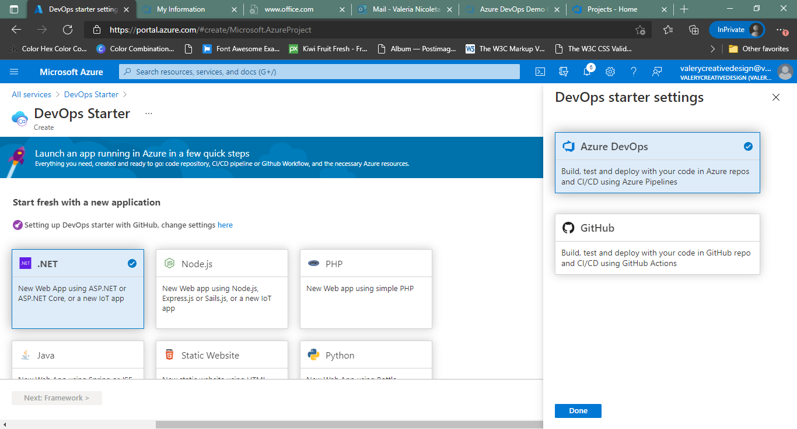
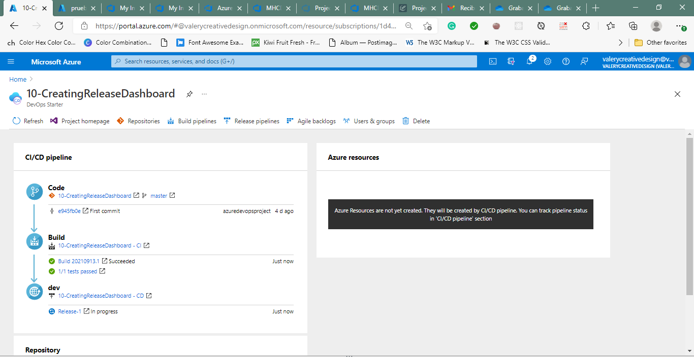
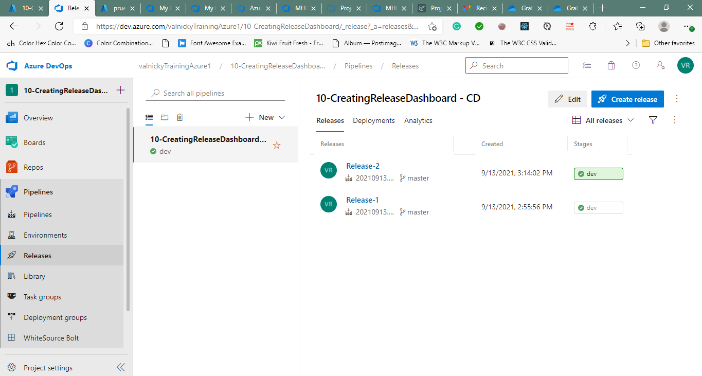
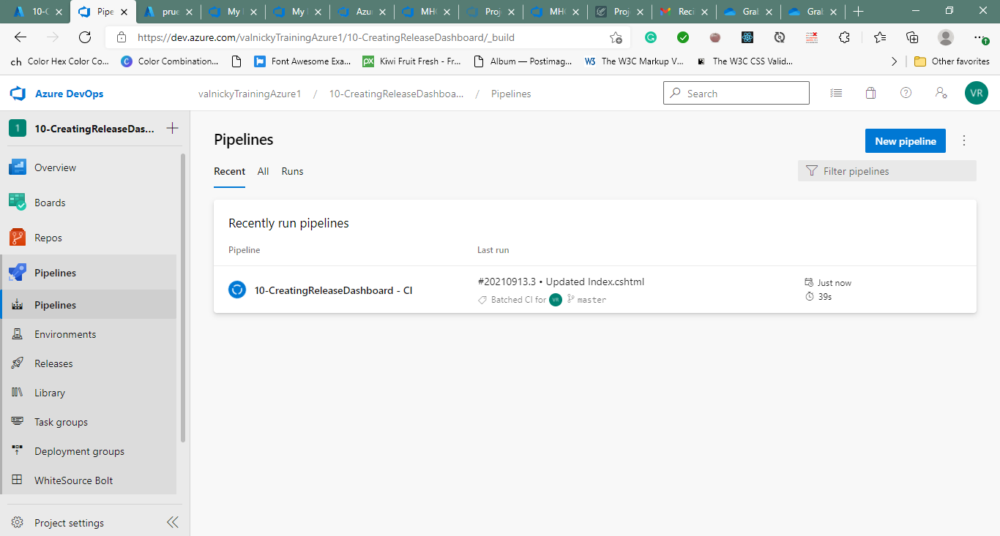
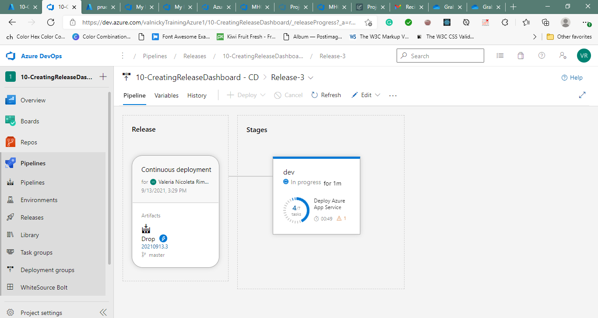
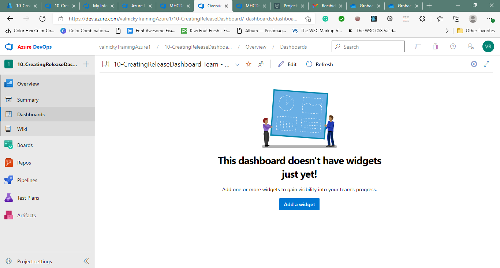
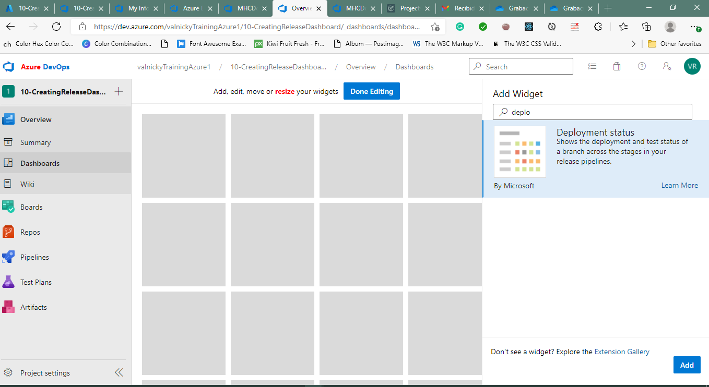
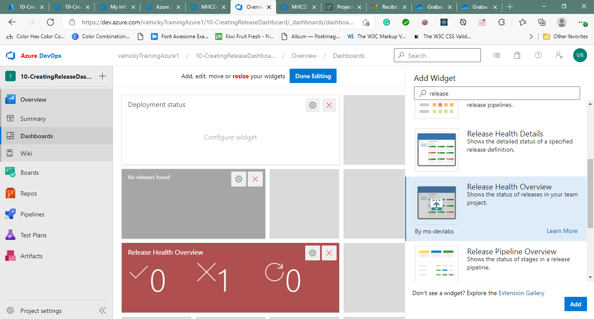

#Lab 10b: Creating a Release Dashboard
##Exercise 1: Create a release dashboard
###Task 1: Create an Azure DevOps Starter resource

###Task 2: Create Azure DevOps releases

###Task 3: Create an Azure DevOps release dashboard

