#Lab 11a: Configuring Pipelines as Code with YAML

###Task 1-2: Create Azure resources
In this task, you will create an Azure web app and an Azure SQL database by using the Azure portal.

##Exercise 1: Configure CI/CD Pipelines as Code with YAML in Azure DevOps
###Task 1: Delete the existing pipeline
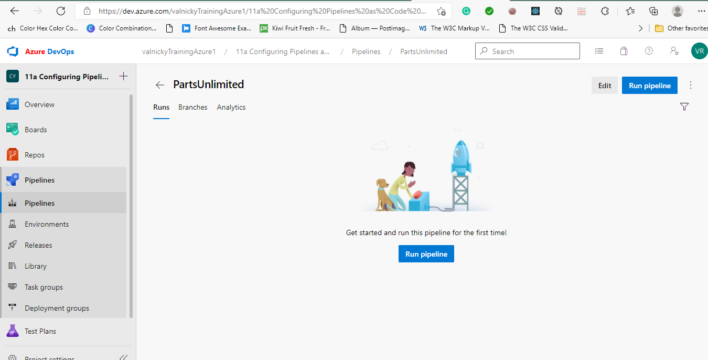

###Task 2: Add a YAML build definition - In this task, you will add a YAML build definition to the existing project.
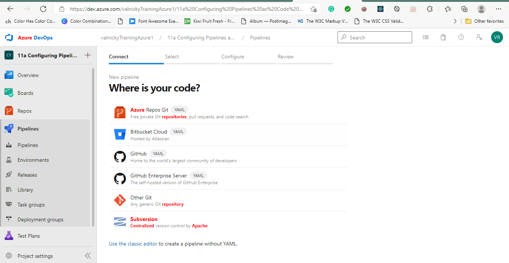

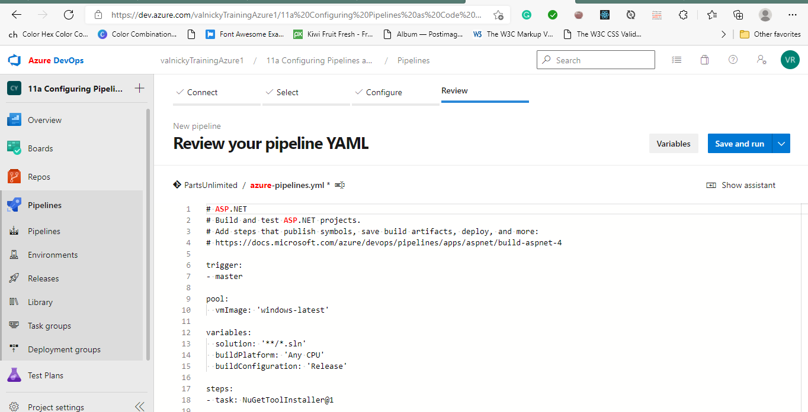

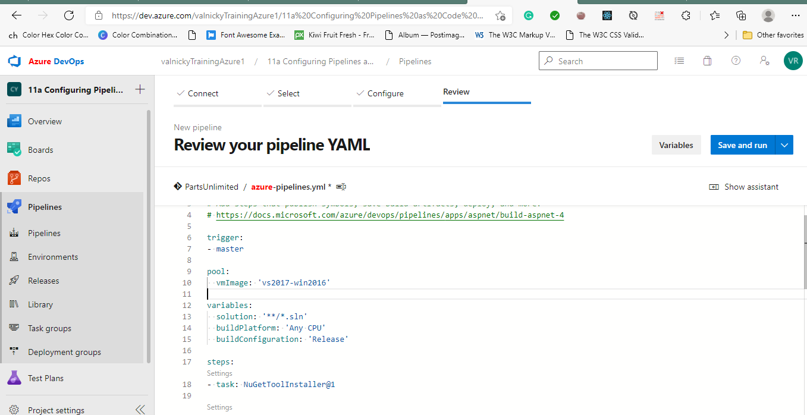

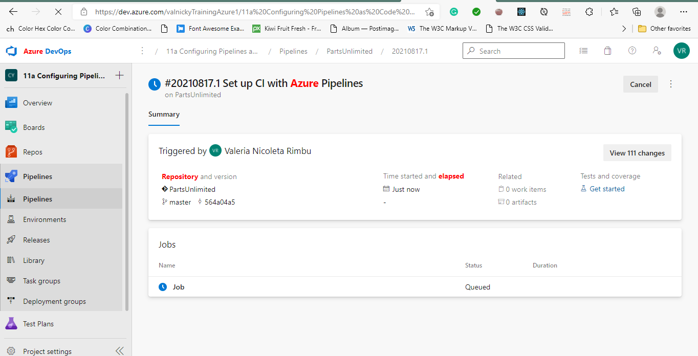

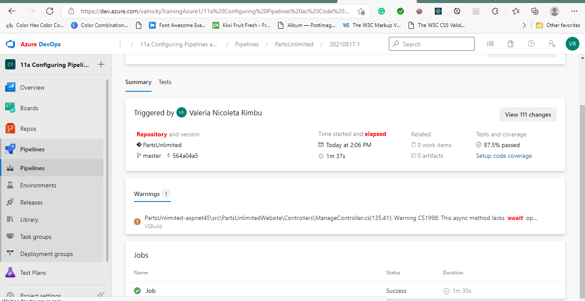

###Task 3: Add continuous delivery to the YAML definition

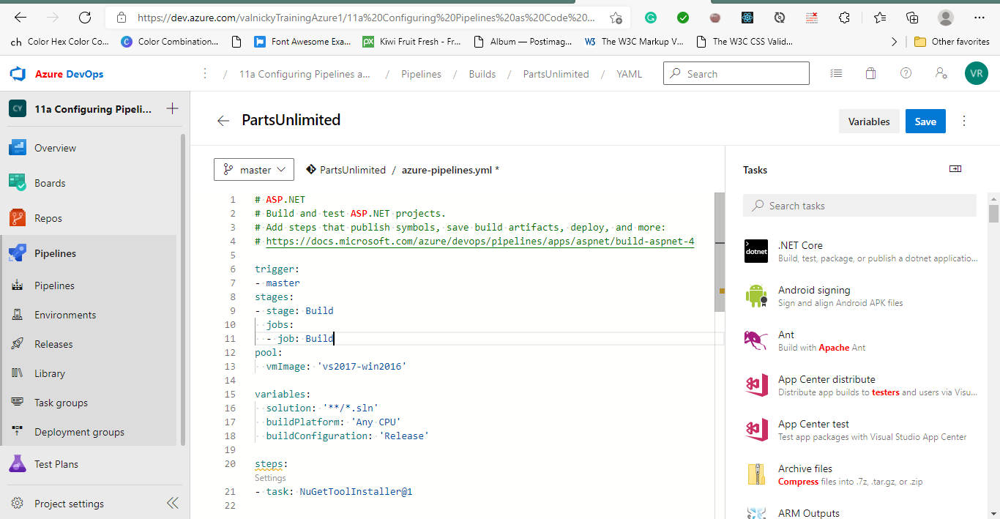

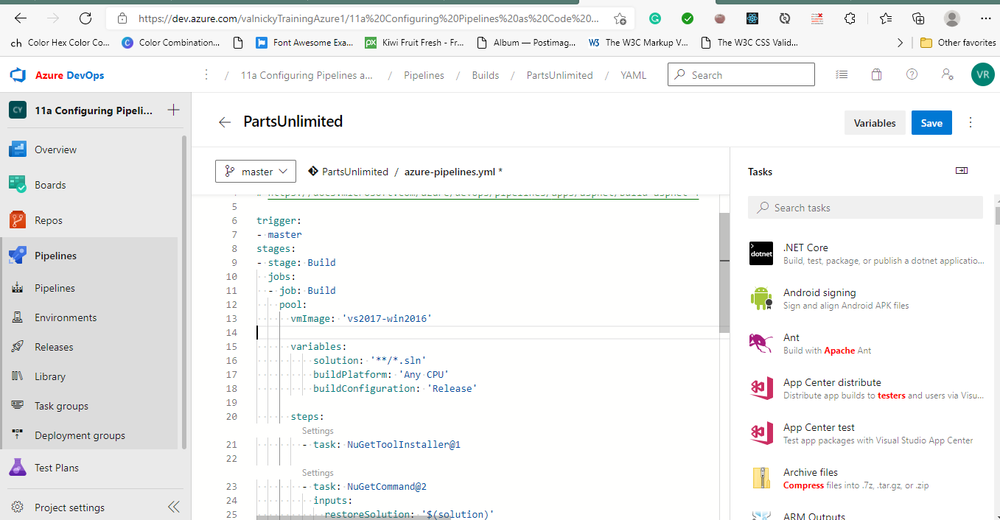

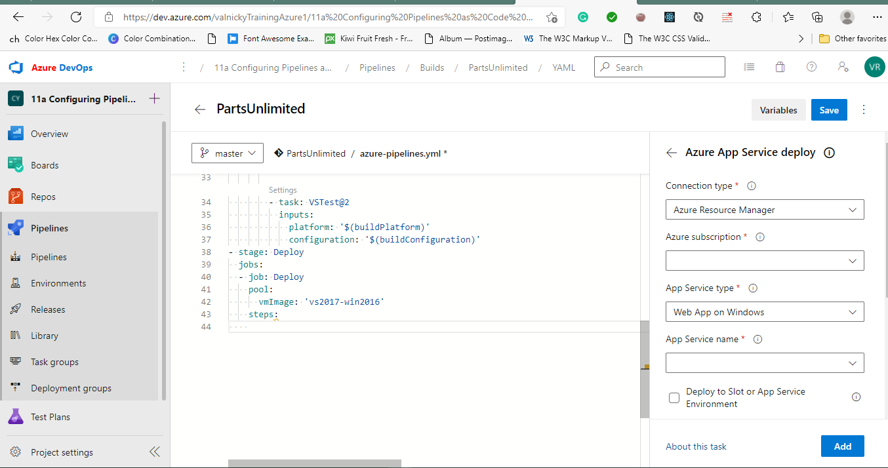

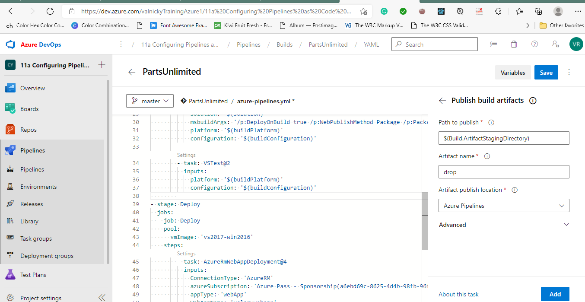

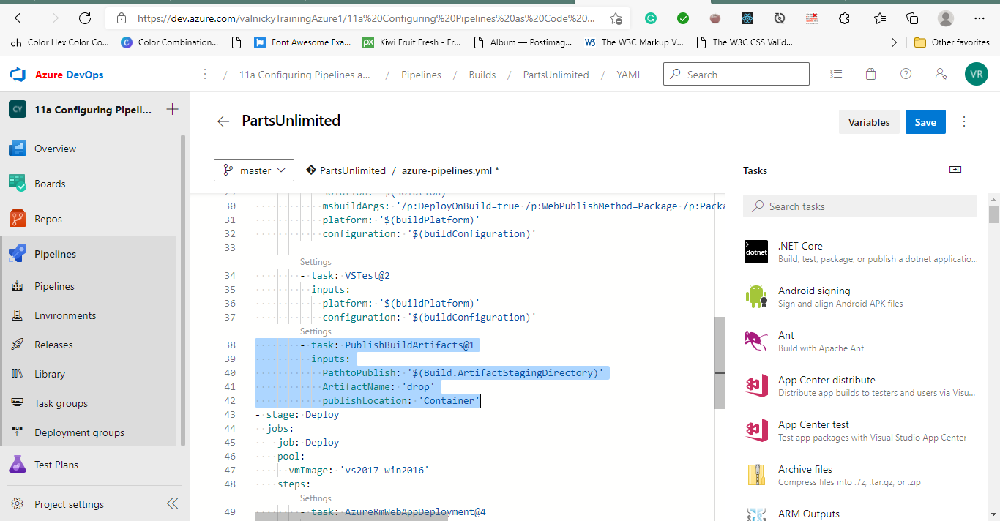

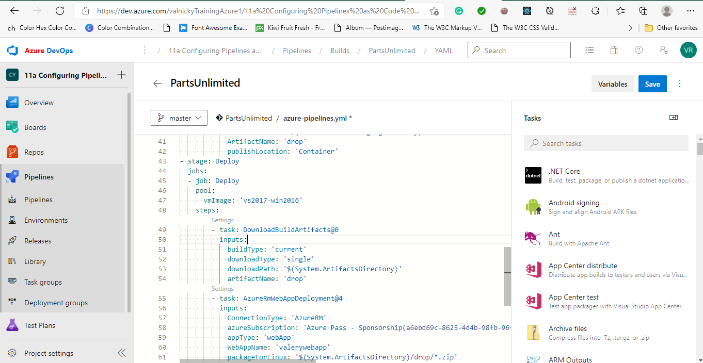

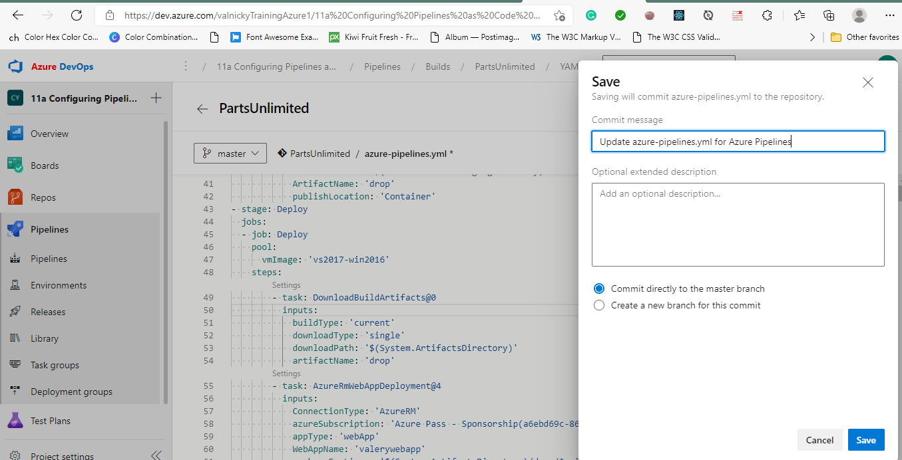

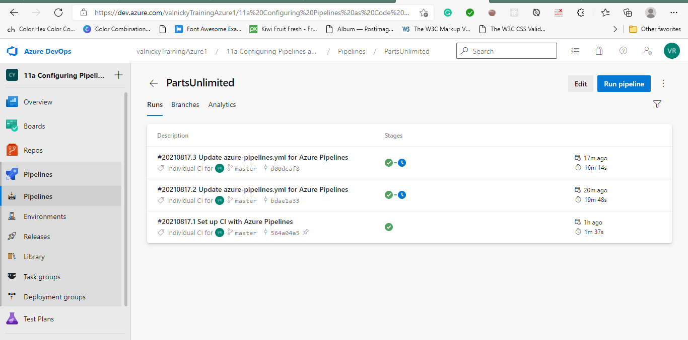

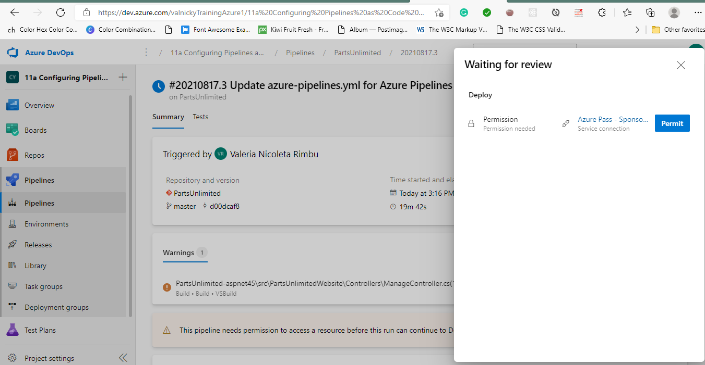

###Task 4: Review the deployed site

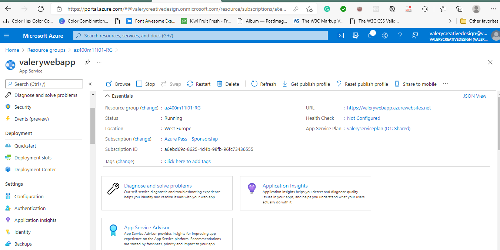

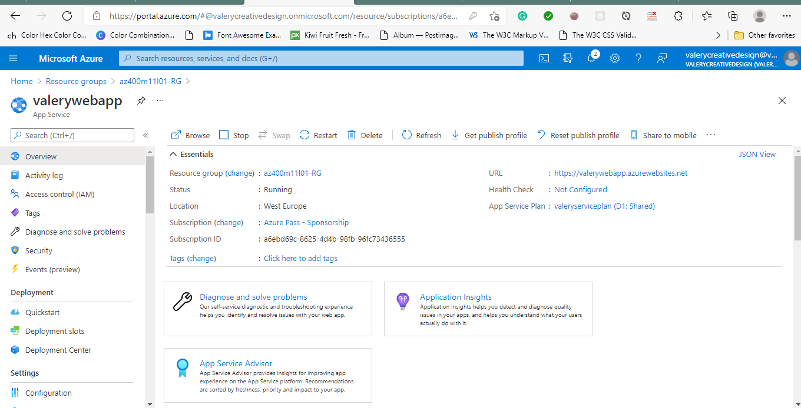

