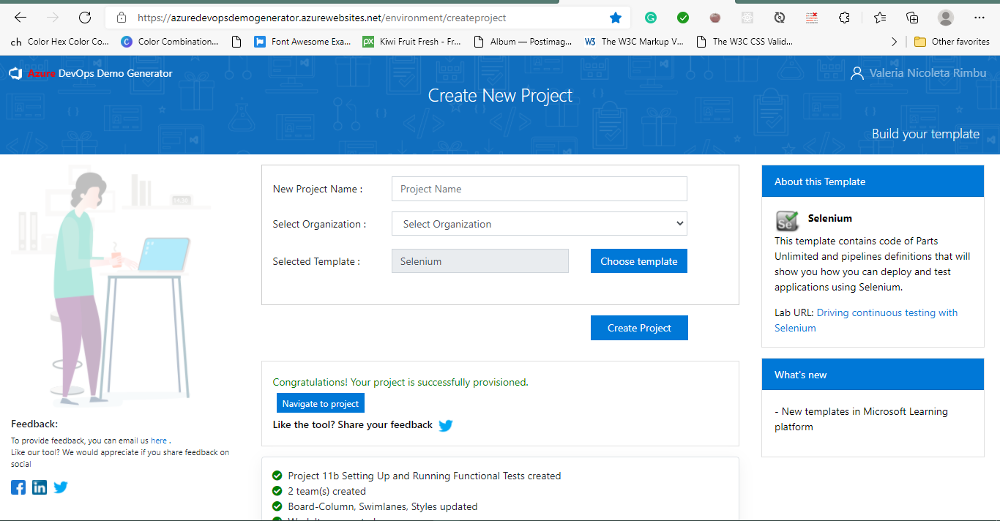
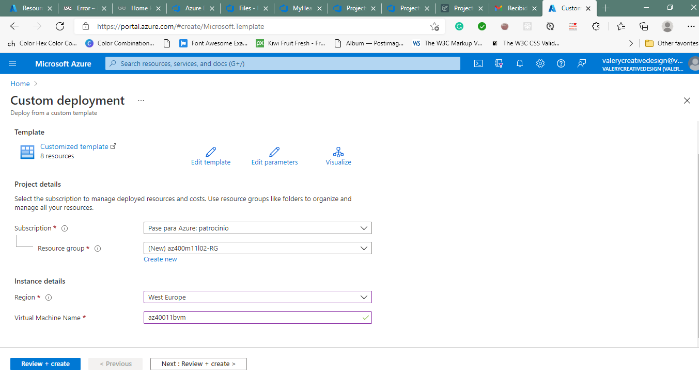
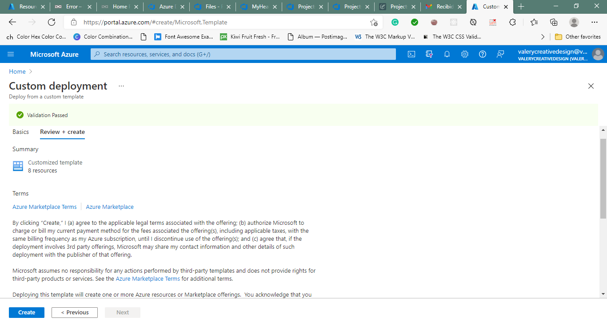
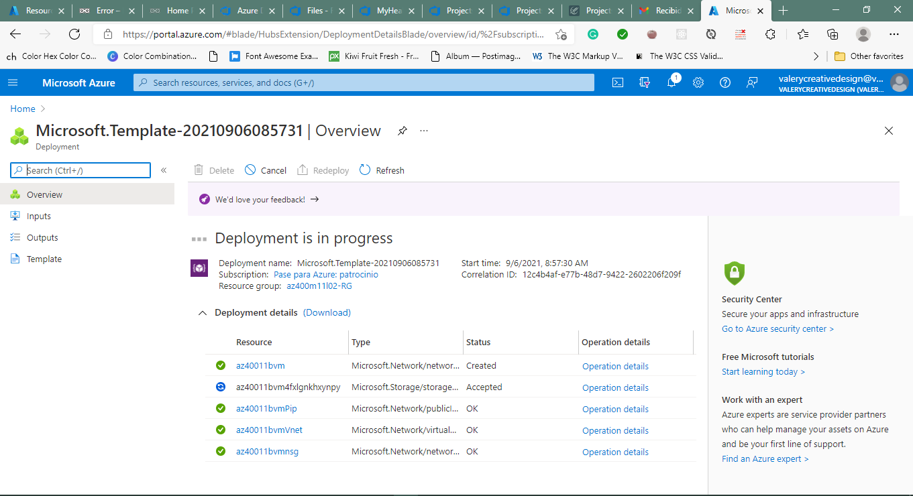
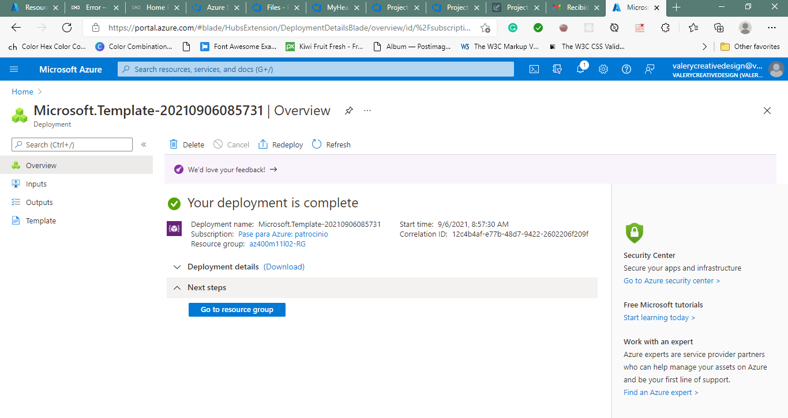
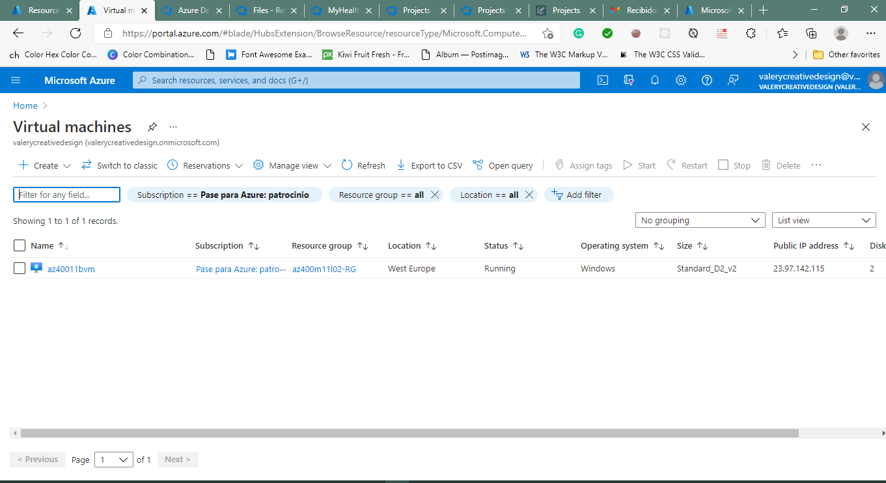
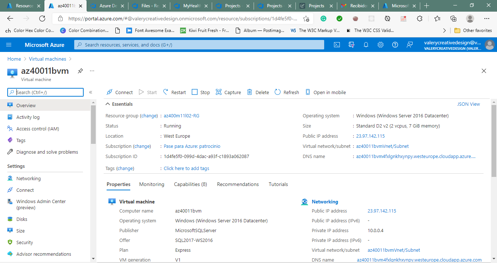

#Lab 11b: Setting Up and Running Functional Tests
Selenium is a portable open source software-testing framework for web applications. It has the capability to operate on almost every operating system. It supports all modern browsers and multiple languages including .NET (C#), Java. - execute Selenium test cases on a C# web application, as part of the Azure DevOps Release pipeline.

Instructions
Before you start
Sign in to the lab virtual machine
Ensure that you're signed in to your Windows 10 virtual machine by using the following credentials:

Username: Student
Password: Pa55w.rd
Review applications required for this lab
Identify the applications that you'll use in this lab:

Microsoft Edge
Set up an Azure DevOps organization.
If you don't already have an Azure DevOps organization that you can use for this lab, create one by following the instructions available at Create an organization or project collection.

Prepare an Azure subscription
Identify an existing Azure subscription or create a new one.
Verify that you have a Microsoft account or an Azure AD account with the Owner role in the Azure subscription and the Global Administrator role in the Azure AD tenant associated with the Azure subscription. For details, refer to List Azure role assignments using the Azure portal and View and assign administrator roles in Azure Active Directory.
##Exercise 0: Configure the lab prerequisites
In this exercise, you will set up the prerequisites for the lab, which include the preconfigured Parts Unlimited team project based on an Azure DevOps Demo Generator template and Azure resources.

###Task 1: Configure the team project
In this task, you will use Azure DevOps Demo Generator to generate a new project based on the Selenium template.

On your lab computer, start a web browser and navigate to Azure DevOps Demo Generator. This utility site will automate the process of creating a new Azure DevOps project within your account that is prepopulated with content (work items, repos, etc.) required for the lab.

Note: For more information on the site, see https://docs.microsoft.com/en-us/azure/devops/demo-gen.

Click Sign in and sign in using the Microsoft account associated with your Azure DevOps subscription.

If required, on the Azure DevOps Demo Generator page, click Accept to accept the permission requests for accessing your Azure DevOps subscription.

On the Create New Project page, in the New Project Name textbox, type Setting Up and Running Functional Tests, in the Select organization dropdown list, select your Azure DevOps organization, and then click Choose template.

In the list of templates, in the toolbar, click DevOps Labs, select the Selenium template and click Select Template.

Back on the Create New Project page, click Create Project

Note: Wait for the process to complete. This should take about 2 minutes. In case the process fails, navigate to your DevOps organization, delete the project, and try again.

On the Create New Project page, click Navigate to project.

###Task 2: Create Azure resources
In this task, we will provision an Azure VM running Windows Server 2016 along with SQL Express 2017, Chrome, and Firefox.

Click on the deploy to Azure button below. Deploy to Azure. https://portal.azure.com/#create/Microsoft.Template/uri/https%3A%2F%2Fraw.githubusercontent.com%2FMicrosoft%2Falmvm%2Fmaster%2Flabs%2Fvstsextend%2Fselenium%2Farmtemplate%2Fazuredeploy.json
This will automatically redirect you to the Custom deployment blade in the Azure portal.

If prompted, sign in with the user account that has the Owner role in the Azure subscription you will be using in this lab and has the role of the Global Administrator in the Azure AD tenant associated with this subscription.

On the Custom deployment blade, specify the following settings:

Setting Value
Subscription the name of the Azure subscription you are using in this lab
Resource group the name of a new resource group az400m11l02-RG
Region the name of the Azure region in which you want to deploy the Azure resources in this lab
Virtual Machine Name az40011bvm
Click Review + create and then click Create.

##Exercise 1: Implement Selenium tests by using a self-hosted Azure DevOps agent
In this exercise, you will implement Selenium tests by using a self-hosted Azure DevOps agent.

Task 1: Configure a self-hosted Azure DevOps agent
In this task, you will configure a self-hosted agent by using the VM you deployed in the previous exercise. Selenium requires the agent to be run in the interactive mode to execute the UI tests.

In the web browser window displaying the Azure portal, search for and select Virtual machines and, from the Virtual machines blade, select az40011bvm.
On the az40011bvm blade, select Connect, in the drop-down menu, select RDP, on the RDP tab of the az40011bvm | Connect blade, select Download RDP File and open the downloaded file.
When prompted, sign in with the following credentials:

Setting Value
User Name vmadmin
Password P2ssw0rd@123
Within the Remote Desktop session to az40011bvm, open a Chrome web browser window, navigate to https://dev.azure.com and sign in to your Azure DevOps organization.
In the lower left corner of the Azure DevOps portal, click Organization settings.
In the vertical menu on the left hand side of the page, in the Pipelines section, click Agent pools.
On the Agent pools pane, click Default.
On the Default pane, click New agent.
On the Get the agent panel, ensure that the Windows tab and the x64 section are selected and then click Download.
Start File Explorer, create a directory C:\AzAgent and extract content of the downloaded agent zip file residing in the Downloads folder into this directory.
Within the Remote Desktop session to az40011bvm, right-click the Start menu and click Command Prompt (Admin).
Within the Administrator: Command Prompt window, run the following to start the installation of the agent binaries:

Code
cd C:\AzAgent
Config.cmd
In the Administrator: Command Prompt window, when prompted to Enter server URL, type https://dev.azure.com/ <your-DevOps-organization-name>, where <your-DevOps-organization-name> represents the name of your Azure DevOps Organization, and press the Enter key.
In the Administrator: Command Prompt window, when prompted Enter Authentication type (press enter for PAT), press the Enter key.
In the Administrator: Command Prompt window, when prompted Enter personal access token, switch to the Azure DevOps portal, close the Get the agent panel, in the upper right corner of the Azure DevOps page, click the User settings icon, in the dropdown menu, click Personal access tokens, on the Personal Access Tokens pane, and click + New Token.
On the Create a new personal access token pane, specify the following settings and click Create (leave all others with their default values):

Setting Value
Name Setting Up and Running Functional Tests lab
Scopes Custom Defined
Scopes Click Show all scopes (at the bottom of the window)
Scopes Agent Pools - Read & Manage
On the Success pane, copy the value of the personal access token to Clipboard.

Note: Make sure you copy the token. You will not be able to retrieve it once you close this pane.

On the Success pane, click Close.
Switch back to the Administrator: Command Prompt window and paste the content of Clipboard and press the Enter key.
In the Administrator: Command Prompt window, when prompted Enter agent pool (press enter for default), press the Enter key.
In the Administrator: Command Prompt window, when prompted Enter agent name (press enter for az40011bvm), press the Enter key.
In the Administrator: Command Prompt window, when prompted Enter work folder (press enter for \_work), press the Enter key.
In the Administrator: Command Prompt window, when prompted Enter Perform an uszip for tasks for each step (press enter for N), press the Enter key.
In the Administrator: Command Prompt window, when prompted Enter run agent as service (Y/N) (press enter for N), press the Enter key.
In the Administrator: Command Prompt window, when prompted Enter configure autologon and run agent on startup (Y/N) (press enter for N), press the Enter key.
Once the agent is registered, in the Administrator: Command Prompt window, type run.cmd and press the Enter to start the agent.

Note: You also need to install the Dac Framework which is used by the application you will be deploying later in the lab.

Within the Remote Desktop session to az40011bvm, start a web browser, navigate to the Microsoft SQL Server Data-Tier Application Framework (18.2) download page. This will automatically trigger the download.
Once the download of the DacFramework.msi file completes, use it to run the installation of the Microsoft SQL Server Data-Tier Application Framework with the default settings.

