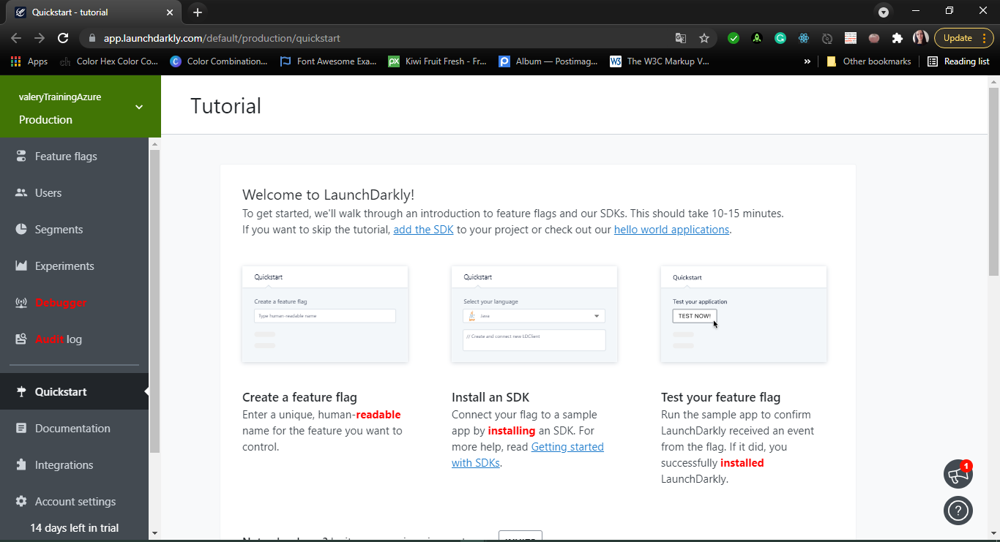
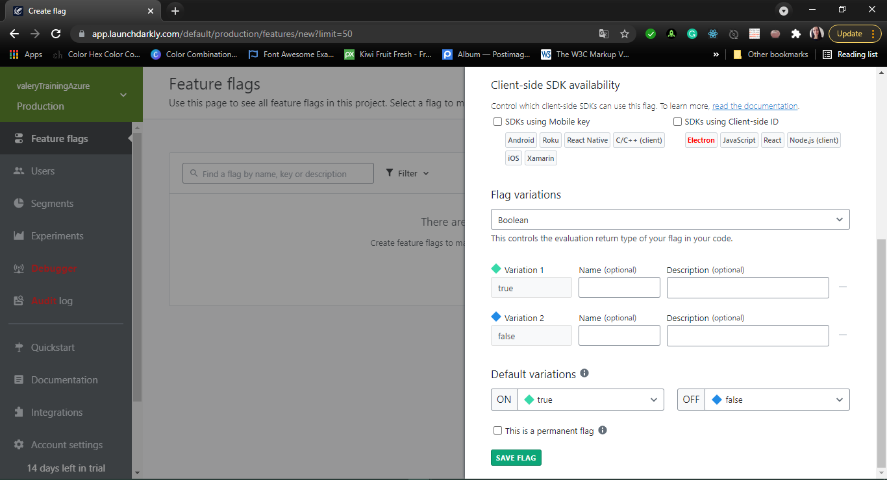
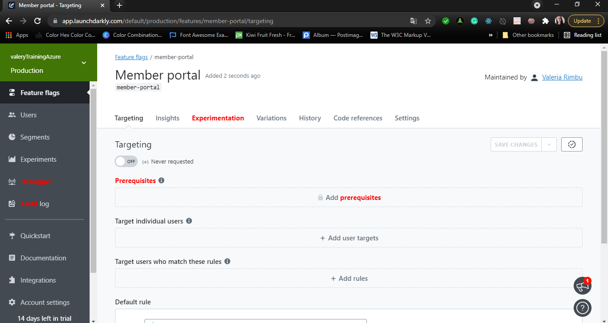

#Lab 12: Feature Flag Management with LaunchDarkly and Azure DevOps
LaunchDarkly is a continuous delivery platform that provides feature flags as a service. LaunchDarkly gives you the power to separate feature rollout from code deployment and manage feature flags at scale. Integration of LaunchDarkly with Azure DevOps minimizes potential risks associated with frequent releases.

##Exercise 1: Configure feature flags in Azure DevOps by using LaunchDarkly

###Task 2: Integrate LaunchDarkly in your Web application

