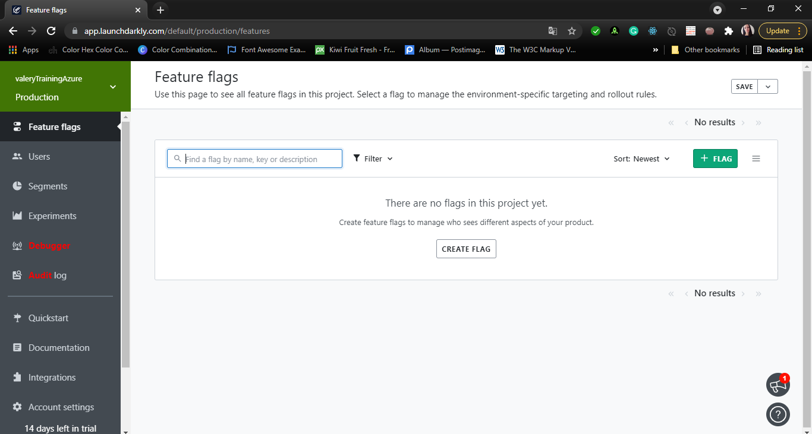
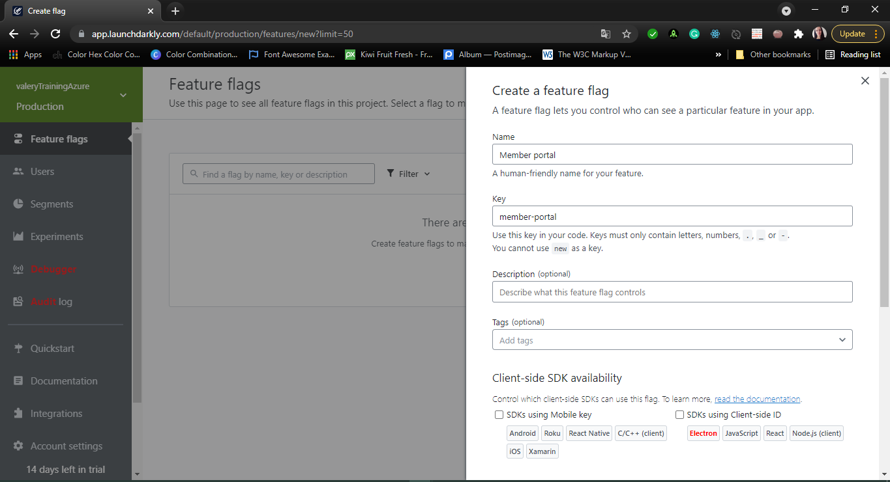
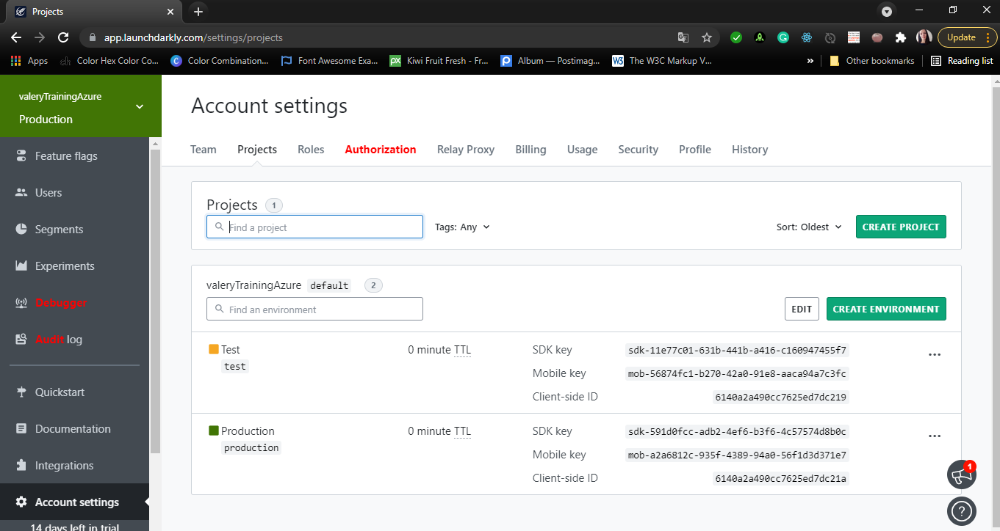
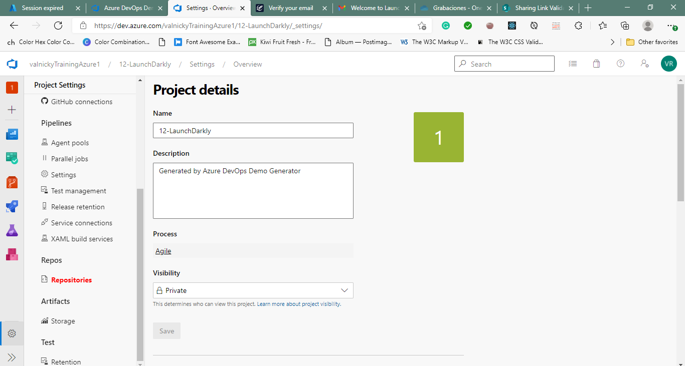

#Lab 12: Feature Flag Management with LaunchDarkly and Azure DevOps
Student lab manual
Lab overview
LaunchDarkly is a continuous delivery platform that provides feature flags as a service. LaunchDarkly gives you the power to separate feature rollout from code deployment and manage feature flags at scale. Integration of LaunchDarkly with Azure DevOps minimizes potential risks associated with frequent releases. To further integrate releases with your development process, you can link feature flag roll-outs to Azure DevOps work items.

In this lab, you will learn how to optimize management of feature flags in Azure DevOps by leveraging LaunchDarkly.

Objectives
After you complete this lab, you will be able to:

Create feature flags in LaunchDarkly
Integrate LaunchDarkly with Web applications
Automatically roll-out LaunchDarkly feature flags as part of Azure DevOps release pipelines
Lab duration
Estimated time: 60 minutes
Instructions
Before you start
Sign in to the lab virtual machine
Ensure that you’re signed in to your Windows 10 virtual machine by using the following credentials:

Username: Student
Password: Pa55w.rd
Review applications required for this lab
Identify the applications that you’ll use in this lab:

Microsoft Edge
Visual Studio 2019 Community Edition available from Visual Studio Downloads page. Visual Studio 2019 installation should include ASP.NET and web development, Azure development, and .NET Core cross-platform development workloads. This is already preinstalled on your lab computer.
Set up a LaunchDarkly trial account
Use a web browser to navigate to the LaunchDarkly web site and create a trial account.

Set up an Azure DevOps organization.
Follow instructions available at Create an organization or project collection.

Prepare an Azure subscription
Identify an existing Azure subscription or create a new one.
Verify that you have a Microsoft account or an Azure AD account with the Owner role in the Azure subscription and the Global Administrator role in the Azure AD tenant associated with the Azure subscription. For details, refer to List Azure role assignments using the Azure portal and View and assign administrator roles in Azure Active Directory.
Exercise 0: Configure the lab prerequisites
In this exercise, you will set up the prerequisites for the lab, which consist of the preconfigured Parts Unlimited team project based on an Azure DevOps Demo Generator template.

##Task 1: Configure the team project
In this task, you will use Azure DevOps Demo Generator to generate a new project based on the Parts Unlimited template.

On your lab computer, start a web browser and navigate to Azure DevOps Demo Generator. This utility site will automate the process of creating a new Azure DevOps project within your account that is prepopulated with content (work items, repos, etc.) required for the lab.

Note: For more information on the site, see https://docs.microsoft.com/en-us/azure/devops/demo-gen.

Click Sign in and sign in using the Microsoft account associated with your Azure DevOps subscription.
If required, on the Azure DevOps Demo Generator page, click Accept to accept the permission requests for accessing your Azure DevOps subscription.
On the Create New Project page, in the New Project Name textbox, type LaunchDarkly, in the Select organization dropdown list, select your Azure DevOps organization, and then click Choose template.
In the list of templates, in the toolbar, click DevOps Labs, select the LaunchDarkly template and click Select Template.
Back on the Create New Project page, if prompted to install a missing extension, select the checkbox below the LaunchDarkly Integration V2 label and click Create Project

Note: Wait for the process to complete. This should take about 2 minutes. In case the process fails, navigate to your DevOps organization, delete the project, and try again.

On the Create New Project page, click Navigate to project.

##Exercise 1: Configure feature flags in Azure DevOps by using LaunchDarkly
In this exercise, you will configure feature flags in Azure DevOps by using LaunchDarkly.

Task 1: Create a feature flag in LaunchDarkly
In this task, you will create a feature flag in LaunchDarkly

From your lab computer, start a web browser, navigate to the LaunchDarkly web site, and sign in using your account. Your browser session will be redirected to the Default Project portal where you can create a feature flag.
In the LaunchDarkly portal, in the vertical menu bar on the left, click Feature flags.
On the Feature flags pane, click + FLAG.
On the Create a feature flag pane, in the Name text box, type Member portal and click the SAVE FLAG button.

Note: You’ve created a flag named Member Portal. Let’s assume that you want to use this flag to determine the visibility of the Member Portal feature in your ASP.NET MVC web app.

Note: To integrate LaunchDarkly into your application, you need an SDK key.

In the LaunchDarkly portal, in the vertical menu bar on the left, click Account settings.

Note: On the Account settings pane, you will find two predefined environments: production and test. You can use the production environment SDK key for this project.

Copy the SDK key for the production environment and paste it into Notepad. You will need it later in this lab.

##Task 2: Integrate LaunchDarkly in your Web application
In this task, you will integrate LaunchDarkly in your Web application.

On your lab computer, switch to the web browser window displaying the Azure DevOps portal with the LaunchDarkly project open and, in the lower left corner of the project pane, click Project settings.
In the vertical menu bar titled Project Settings, in the Repos section, select Repositories.
On the All Repositories pane, click LaunchDarkly and, on the Repository Settings pane, set the Commit mention linking and Commit mention work item resolution settings to On.
In the vertical menu bar at the far left of the Azure DevOps portal, click Repos and, on the Files pane, click Clone.
On the Clone Repository pane, click the down pointing caret symbol and, in the dropdown list, click Visual Studio. This will automatically launch Visual Studio with the Azure DevOps dialog box open.
Within the Visual Studio window, in the Azure DevOps dialog box, click Clone.
Within the Visual Studio window, click the top level View menu and, in the dropdown menu, click Git Changes.
Within the Visual Studio window, at the top of the Git Changes pane, in the master dropdown list, click the down-pointing arrow head, in the drop-down dialog box, click Remotes, in the list of remote branches, click the down-pointing arrow next to the origin/launch-darkly branch, and, in the dropdown menu, click Checkout.

Note: Wait until the files in the local repository are updated.

Ensure that launch-darkly appears at the bottom right corner of the Visual Studio window, switch to the Solution Explorer window, and click PartsUnlimited.sln file to open the solution.

Note: To integrate LaunchDarkly with .NET applications you need to install the NuGet package with the LaunchDarkly client. In the current project, that package has already been added for the ease of use.

In the Solution Explorer pane, expand the PartsUnlimitedWebsite node, right-click the Dependencies subnode, and, in the right-click menu, select the Manage NuGet Packages entry.
In the NuGet: PartsUnlimitedWebsite pane, note that LaunchDarkly.Client is already installed.
In the Visual Studio interface, in the top menu, click IIS Express to launch the application locally.
Verify that the application launches successfully in the local browser session and that the Member Portal section is present in the upper right corner of the web interface.

Note: Let’s assume that this Member Portal module is a new feature and you would like to control it by using LaunchDarkly feature flags. This way, when you turn on the flag in LaunchDarkly, the feature should be visible to users.

Close the web browser window displaying the web application interface.
In the Visual Studio window, in the Solution Explorer, navigate to and open PartsUnlimitedWebsite\Controllers\HomeController.cs, replace its content with the code available at the updated HomeController.cs code snippet, and save the change.
In the Visual Studio window, in the Solution Explorer, navigate to and open PartsUnlimitedWebsite\Controllers\AccountController.cs, replace its content with the code available at the updated AccountController.cs code snippet, and save the change.
In the Visual Studio window, in the Solution Explorer, navigate to and open PartsUnlimitedWebsite\Views\Shared_Layout.chtml and replace line 55 @await Html.PartialAsync("\_Login") with the below code.

Code
@if (ViewBag.togglevalue == true)
{
@await Html.PartialAsync("\_Login")
}
Switch to the tab displaying the content of the Home Controller.cs file and replace the placeholder **YourLaunchDarklySDKKey** in the line static LdClient client = new LdClient("**YourLaunchDarklySDKKey**"); with the LaunchDarkly account SDK key which you copied in previous task of this exercise.

Note: This will create an LdClient object with your environment-specific SDK key.

Repeat the previous step with to update the code of the AccountController.cs file.

Note: The above changes will result in the HomeController starting by initializing a static LaunchDarkly client. The methods to view MemberPortal are modified to check if the Feature flag toggle in LaunchDarkly is On or Off. The \_Layout.cshtml page checks the toggle value and renders the MemberPortal link if the flag is turned on.

In the Visual Studio window, switch back to the HomeController.cs tab and review its content, focusing on the code between lines 57 and 74:

Code
//LaunchDarkly start
User user = LaunchDarkly.Client.User.WithKey("administrator@test.com");
bool value = client.BoolVariation("member-portal", user, false);
if (value)
{
ViewBag.Message = "Your application description page.";
ViewData["togglevalue"] = value;
return View(viewModel);
}
else
{
return View(viewModel);
}
// return View(viewModel);

}
//LaunchDarkly End
Note: When you request a feature flag, you need to pass in a user object. So we are initializing user object in the beginning. This will be used to check whether a user with specified key exists in LaunchDarkly or not. In this sample, we have hardcoded the user value. In real-life scenarios, you could retrieve this value by identifying the logged in user or performing a database lookup.

Note: Then we are calling the BoolVariation method to the check feature flag value in LaunchDarkly. If the flag is true it will set [ViewData[“togglevalue”] to true which is used in \_Layout.chtml to view Member Portal module. If it is false it won’t show Member Portal module.

Note: Similarly in AccountController.cs we have added LaunchDarkly code to Login() method which is responsible to show Login page once you click on Member portal icon. If the flag in LaunchDarkly is false, an HttpNotFound error will be returned for the Login page.

In the Visual Studio window, click Save All and click IIS Express to launch the application locally.
Verify that the Member portal link no longer appears in the web browser displaying the Parts Unlimited website, since the MemberPortal flag is, at this point, turned off .

Note: This implements the feature flag control using LaunchDarkly. You could now manually enable the toggle from the LaunchDarkly portal manually. However, in this lab, we will configure it via Azure DevOps Release pipeline using the LaunchDarkly extension. To include feature flags as part of the release process, we will associate this change with an Azure DevOps work item.

Close the web browser window displaying the web application interface.
In the Visual Studio window, in the Team Explorer pane, click the Home icon in the toolbar, and, on the Home page, click Work Items.
In the Team Explorer pane, on the Work Items page, right-click My Queries and, in the right-click menu, click New Query. This will automatically open the New Query tab in the center pane of the Visual Studio window.
In the New Query pane, accept the default settings and click Run. This will return the single work item associated with this branch.
In the query results, note the work item ID and click the entry representing the work item. This will automatically open another tab in the center pane of the Visual Studio window, representing the user story corresponding to the work item.
In the upper left corner of the user story tab, click Unassigned, type your Azure DevOps user name, press the Enter key to assign the work item to yourself, and click Save Work Item to save the change.
In the Visual Studio window, switch to the Git Changes pane, in the Enter a message textbox, type Integated LaunchDarkly #<work_item_ID>, where <work_item_ID> represents the ID you noted earlier, click the down-pointing arrow head next to the Commit All button, and, in the dropdown list, click Commit All and Push.

