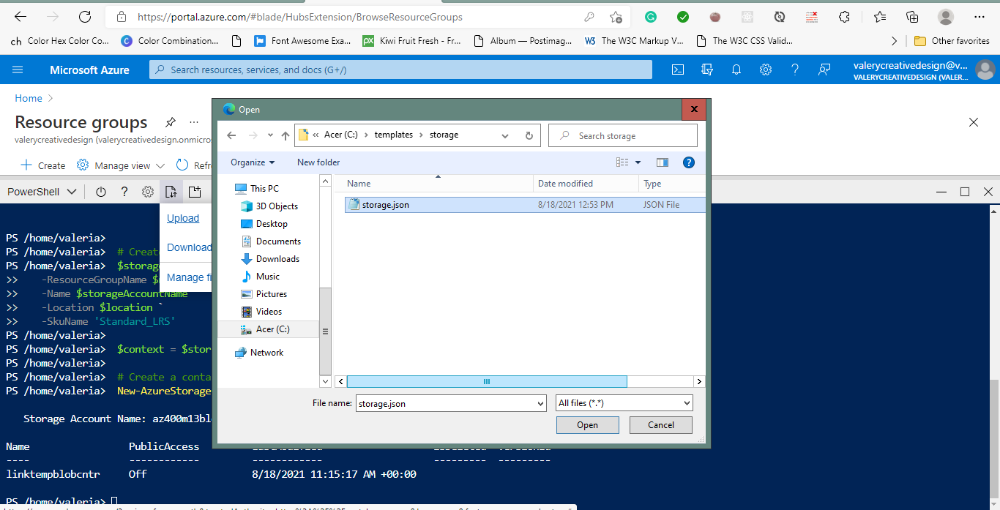
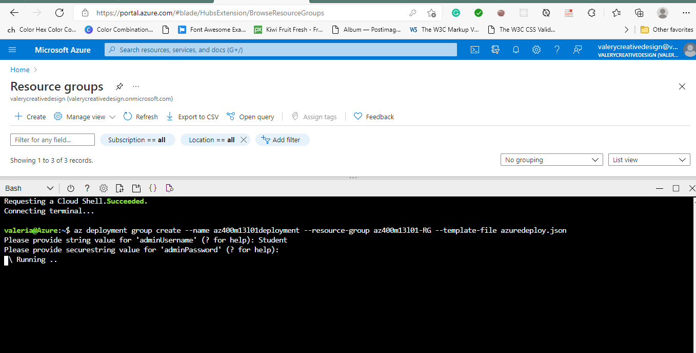

#Lab 13: Azure Deployments Using Resource Manager Templates
We'll create an Azure Resource Manager (ARM) template and modularize it by using the linked template concept. You will then modify the main deployment template to call the linked template and updated dependencies, and finally deploy the templates to Azure.

##Exercise 1: Author and deploy Azure Resource Manager templates - create an Azure Resource manager template and modularize it by using a linked template. You will then modify the main deployment template to call the linked template and updated dependencies, and finally deploy the templates to Azure.

###Task 1: Create Resource Manager template

###Task 2: Create a Linked template for storage resources - we will modify the templates we saved in the previous task such that the linked storage template storage.json will create a storage account only, while its execution will be invoked by the first template. The linked storage template needs to pass a value back to the main template, azuredeploy.json, and this value will be defined in the outputs element of the linked storage template.

###Task 3: Upload Linked Template to Azure Blob Storage and generate SAS token - we will upload the linked template we created in the previous task to Azure Blob Storage and generate SAS token to provide access to it during subsequent deployments.

###Task 4: Modify the main template to call the linked template - modify the main template to reference the linked template we uploaded to Azure Blob Storage in the previous task.

###Task 5: Modify main template to update dependencies

###Task 6: Deploy resources to Azure by using linked templates

