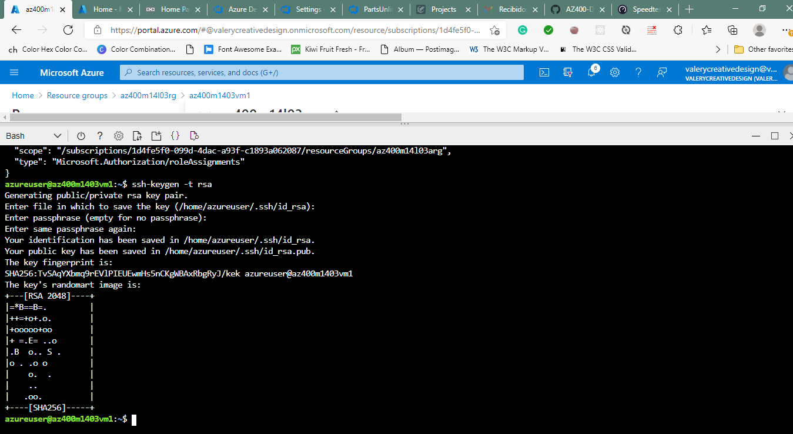
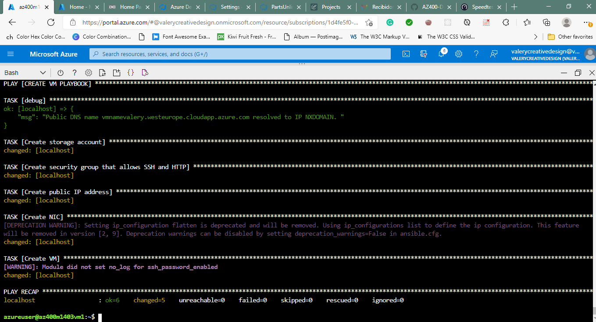

#Lab 14a: Ansible with Azure
we will deploy, configure, and manage Azure resources by using Ansible.

Ansible is declarative configuration management software. It relies on a description of the intended configuration applicable to managed computers in the form of playbooks. Ansible automatically applies that configuration and maintains it going forward, addressing any potential discrepancies. Playbooks are formatted by using YAML.

Unlike the majority of other configuration management tools, such as Puppet or Chef, Ansible is agentless, which means that it does not require the installation of any software in the managed machines. Ansible uses SSH to manage Linux servers and Powershell Remoting to manage Windows servers and clients.

In order to interact with resources other than operating systems (such as, for example, Azure resources accessible via Azure Resource Manager), Ansible supports extensions called modules. Ansible is written in Python so, effectively, the modules are implemented as Python libraries. In order to manage Azure resources, Ansible relies on GitHub-hosted modules.

Ansible requires that the managed resources are specified in a designated host inventory. Ansible supports dynamic inventories for some systems, including Azure, so that the host inventory is dynamically generated at runtime.

The lab will consist of the following high-level steps:

- Installing and configuring Ansible on the Azure VM
- Downloading Ansible configuration and sample playbook files
- Creating and configuring a managed identity in Azure AD
- Configuring Azure AD credentials and SSH for use with Ansible
- Deploying an Azure VM by using an Ansible playbook
- Configuring an Azure VM by using an Ansible playbook

##Exercise 1: Deploy, configure, and manage Azure VMs by using Ansible
In this exercise, you will deploy, configure, and manage Azure VMs by using Ansible.

###Task 1: Provision an Azure VM serving as the Ansible control node

###Task 2: Install and configure Ansible on an Azure VM

###Task 3: Download Ansible configuration and sample playbook files

###Task 4: Create and configure Azure Active Directory managed identity

###Task 5: Configure SSH for use with Ansible

###Task 6: Create a web server Azure VM by using an Ansible playbook

###Task 7: Configure an Azure VM by using an Ansible playbook
In this task, you will run another Ansible playbook, this time to configure the newly deployed Azure VM. You will use a playbook that installs a software package httpd and downloads an HTML page from a GitHub repository. Once this is completed, you will have a fully functional Web server.

