#Lab 14b: Automating infrastructure deployments in the Cloud with Terraform and Azure Pipelines
Terraform is a tool for building, changing and versioning infrastructure. Terraform can manage existing and popular cloud service providers as well as custom in-house solutions.

Terraform configuration files describe the components needed to run a single application or your entire datacenter. Terraform generates an execution plan describing what it will do to reach the desired state, and then executes it to build the described infrastructure. As the configuration changes, Terraform is able to determine what changed and create incremental execution plans to execute.

In this lab, we will learn how to incorporate Terraform into Azure Pipelines for implementing Infrastructure as Code.
##Exercise 0: Configure the lab prerequisites - set up the prerequisites for the lab, which consist of the preconfigured Parts Unlimited team project based on an Azure DevOps Demo Generator template.

###Task 1: Configure the team project - we will use Azure DevOps Demo Generator to generate a new project based on the Terraform template.

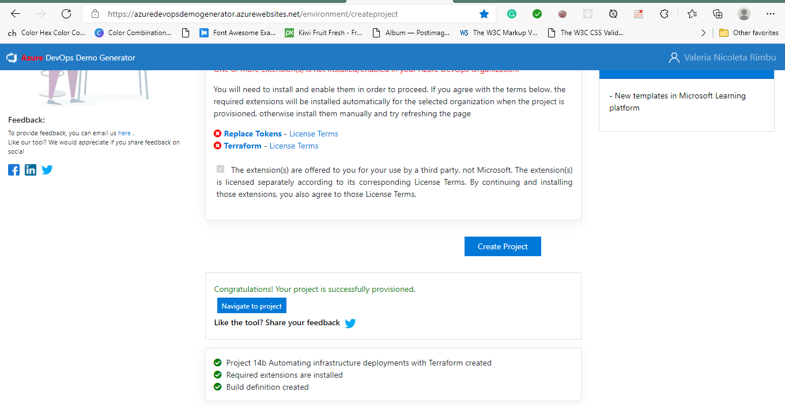

##Exercise 1: Automate infrastructure deployments in the cloud with Terraform and Azure Pipelines
###Task 1: Examine the Terraform configuration files
we want to create an Azure Resource group, App service plan and App service required to deploy a website. We have added the Terraform file to source control repository in the Azure DevOps project so you can use it to deploy the required Azure resources.

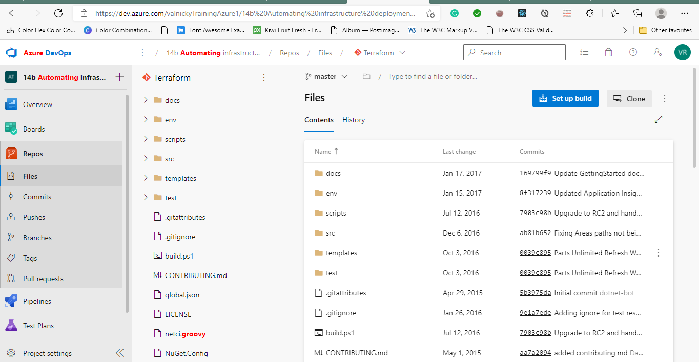

###Task 2: Build your application using Azure CI Pipeline - build your application and publish the required files as an artifact called drop.

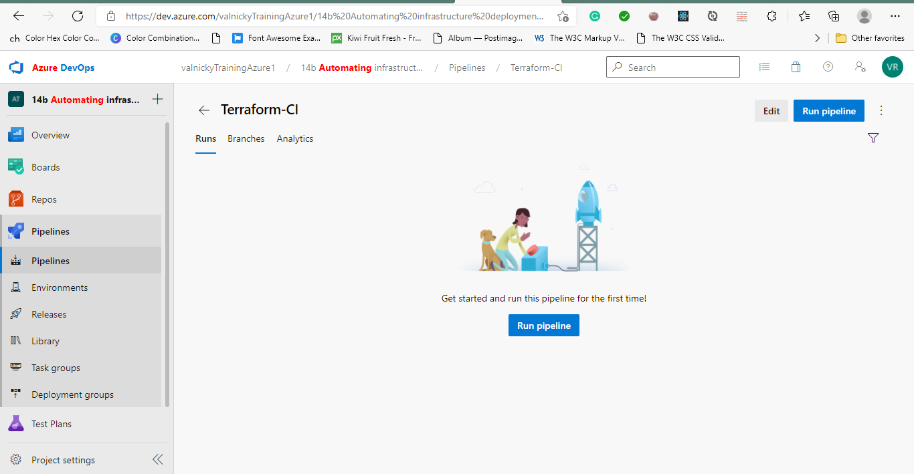

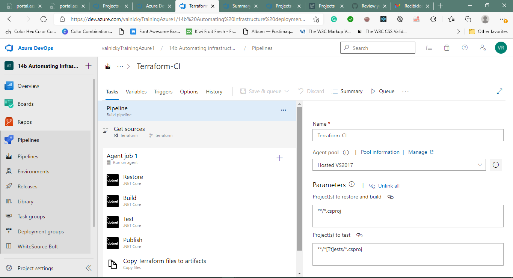

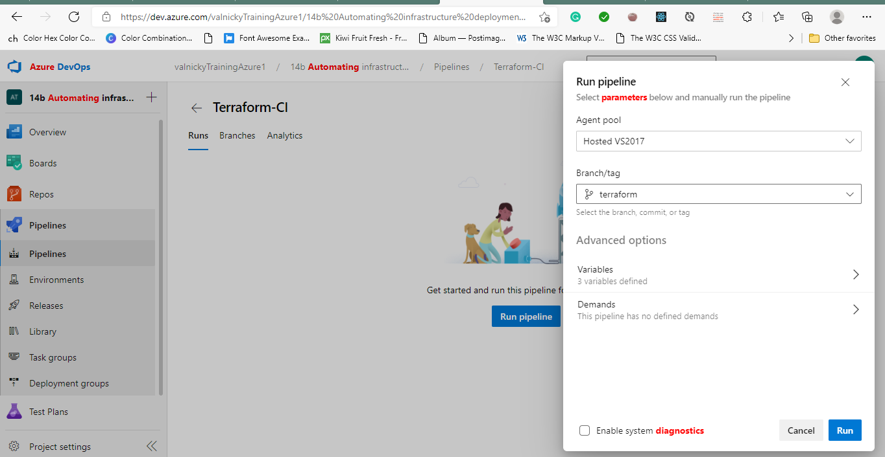

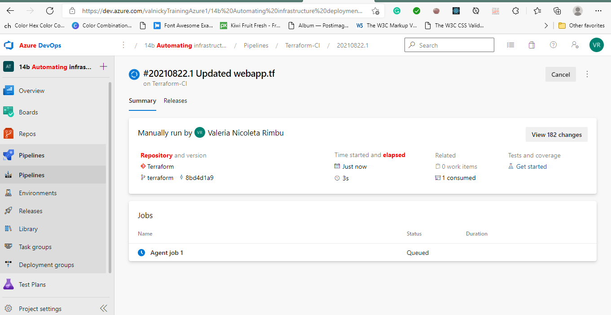

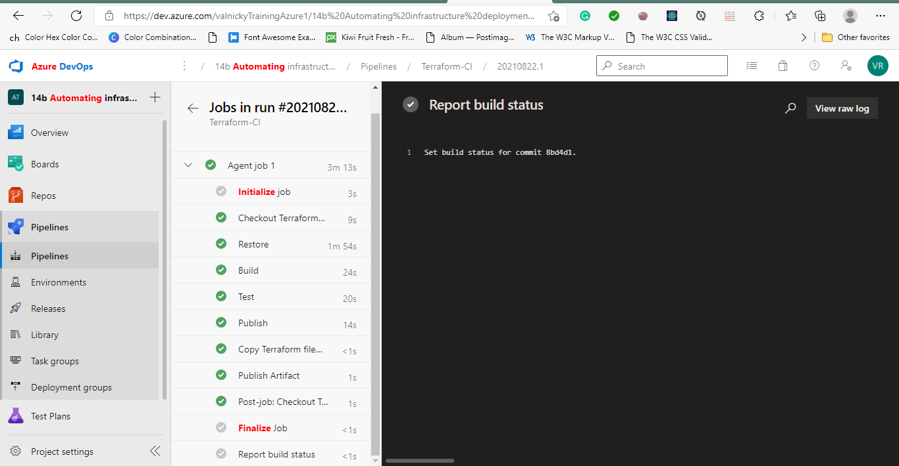

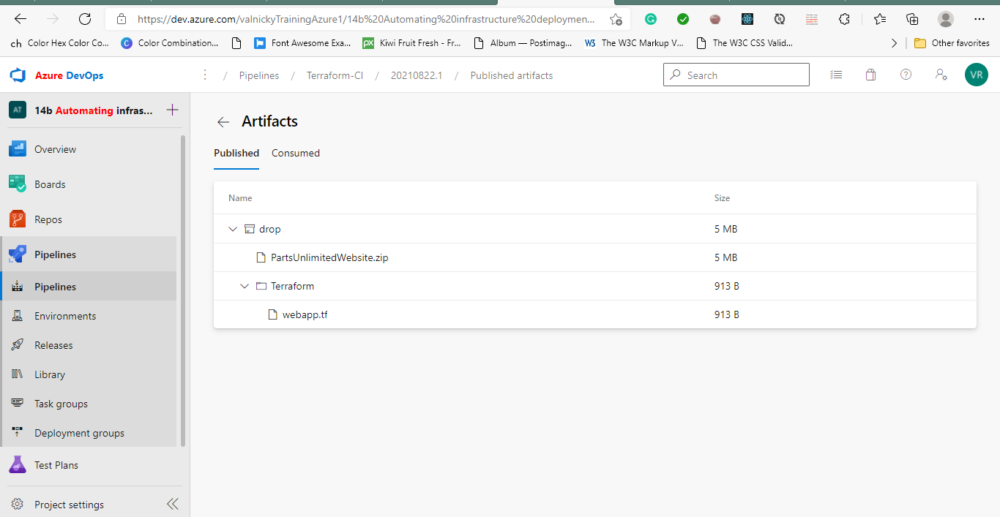

###Task 3: Deploy resources using Terraform (IaC) in Azure CD pipeline
we will create Azure resources using Terraform as part of our deployment pipeline and then deploy the PartsUnlimited application to an Azure app service web app provisioned by Terraform.

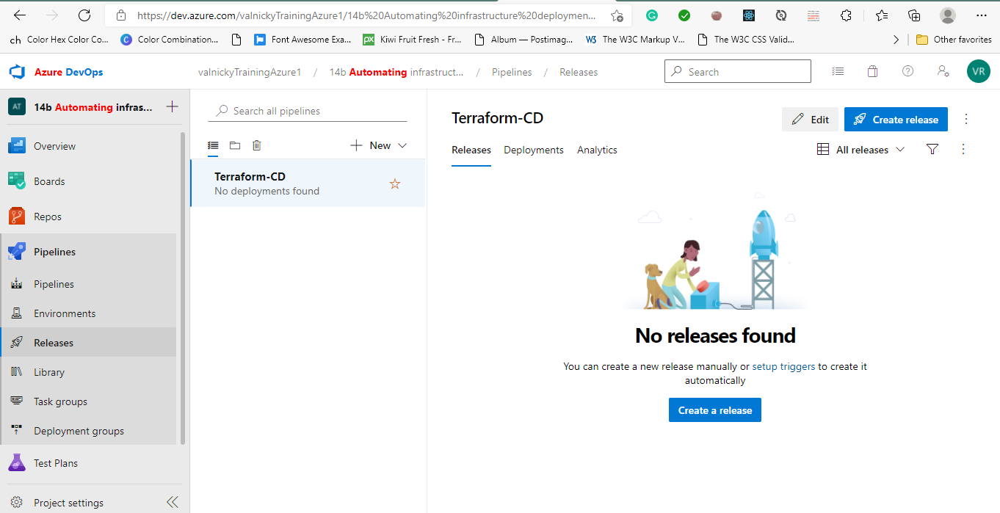

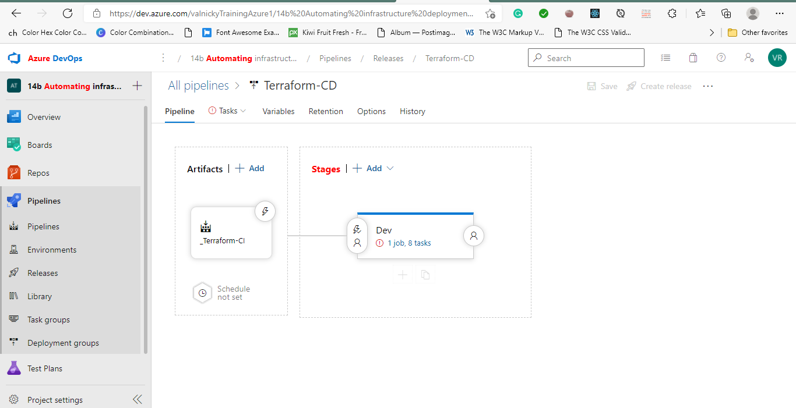

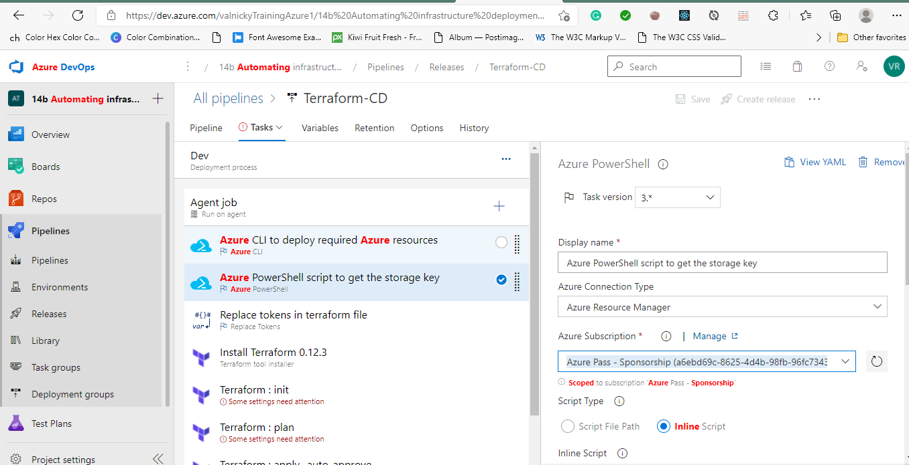

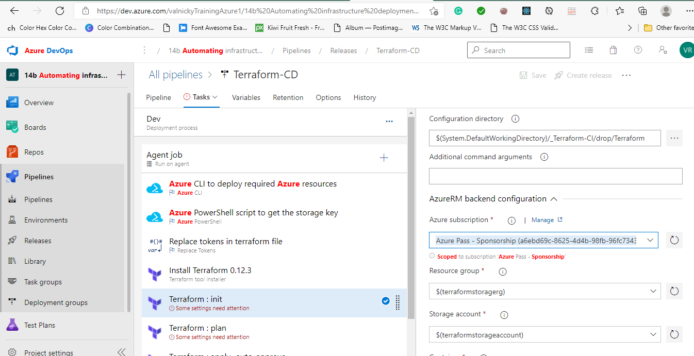

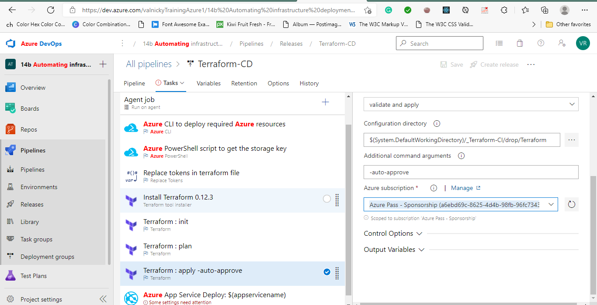

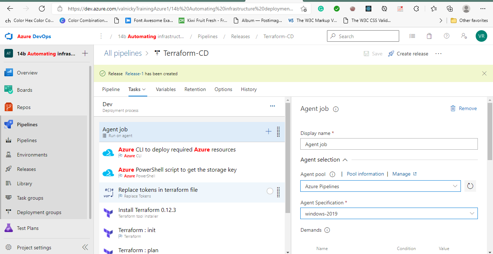

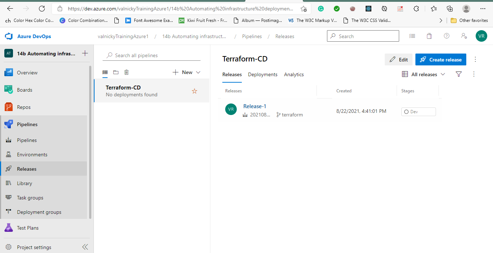

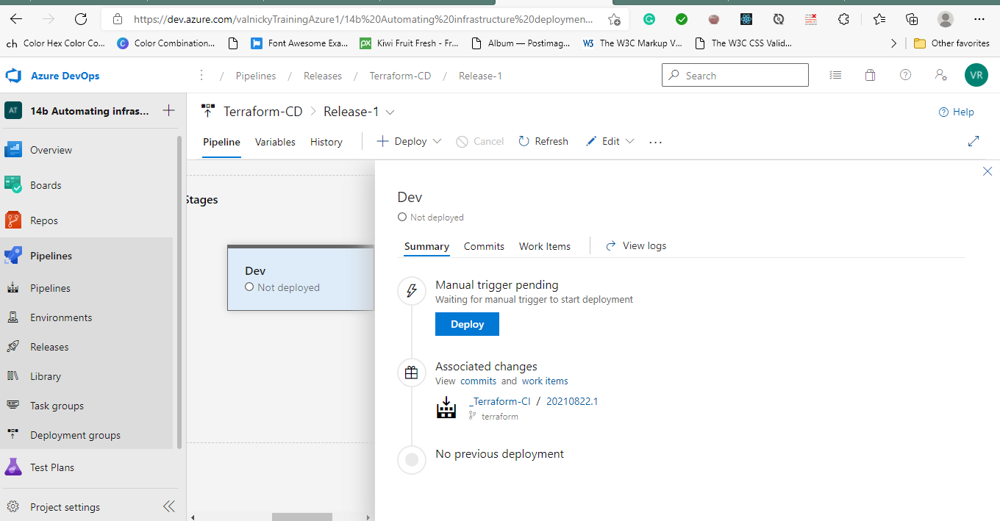

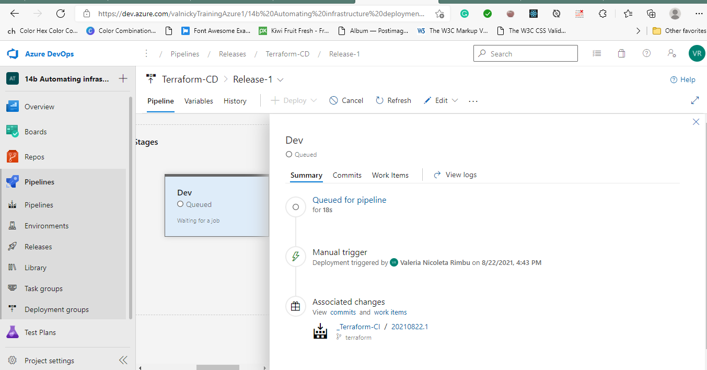

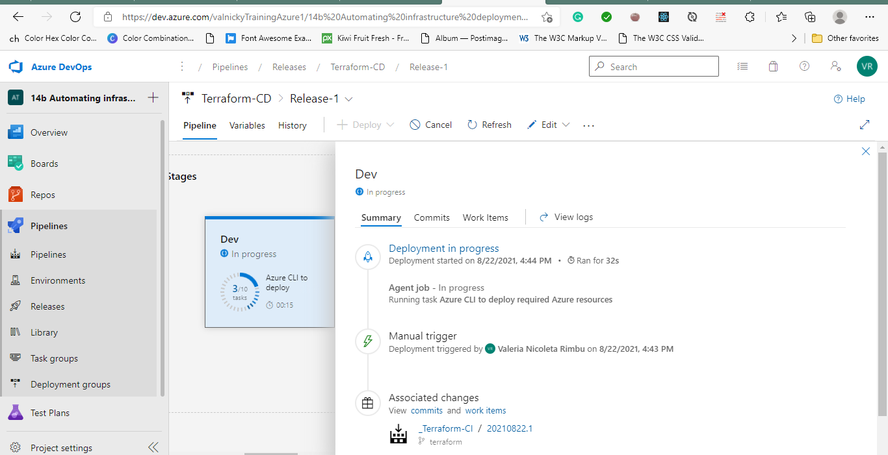
