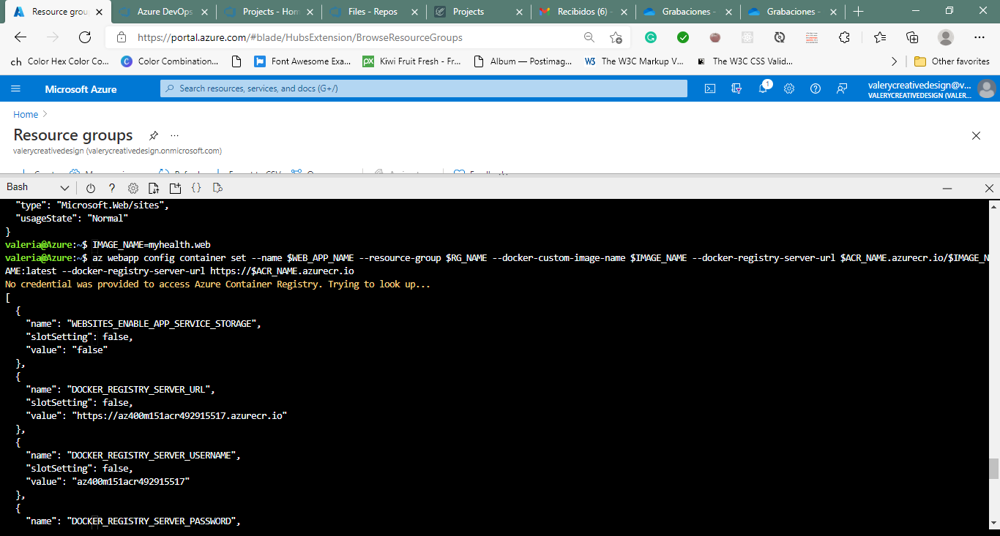
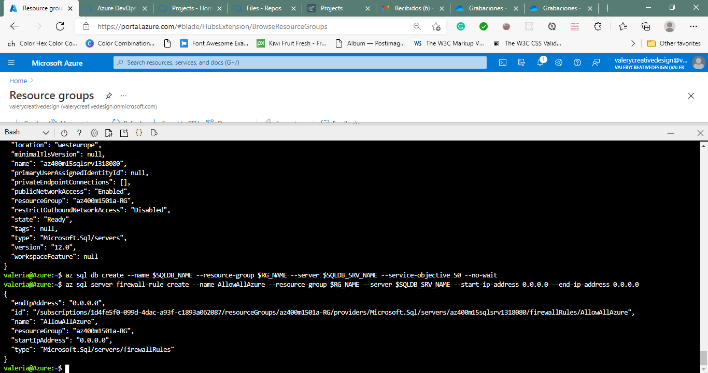
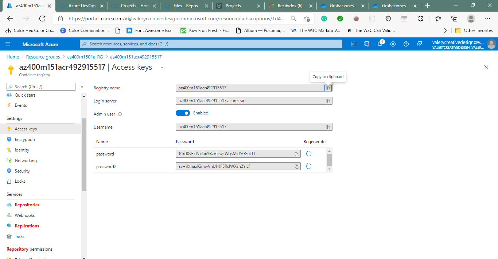
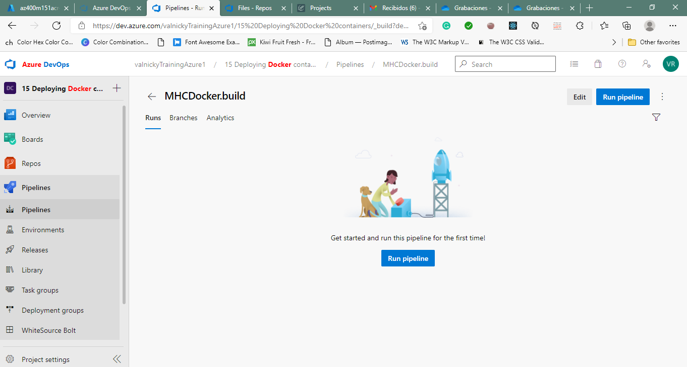
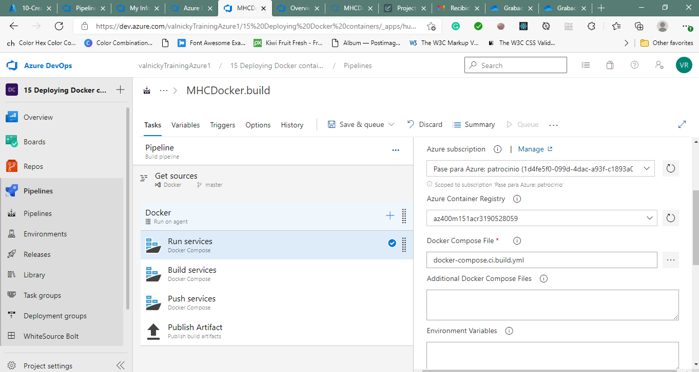
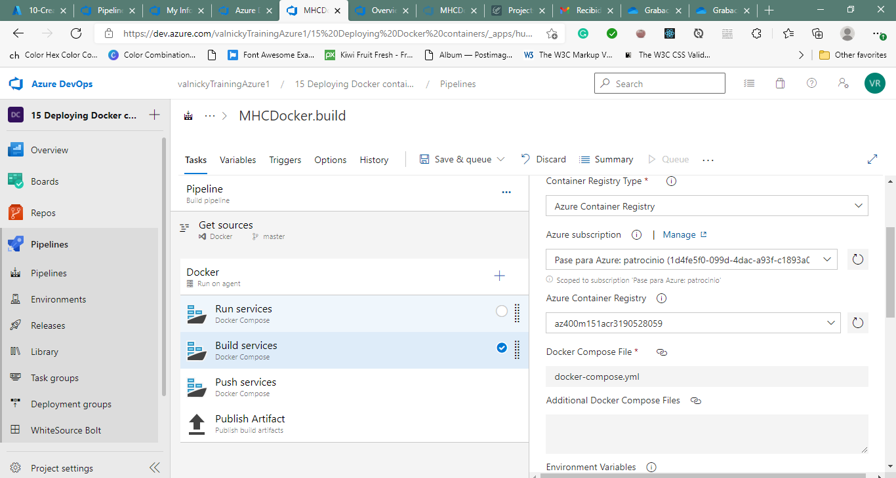
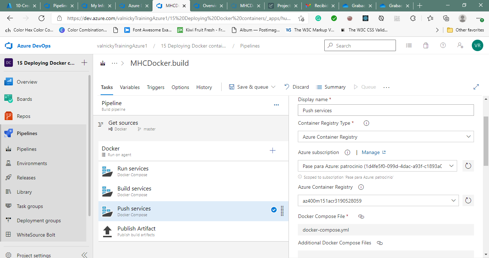
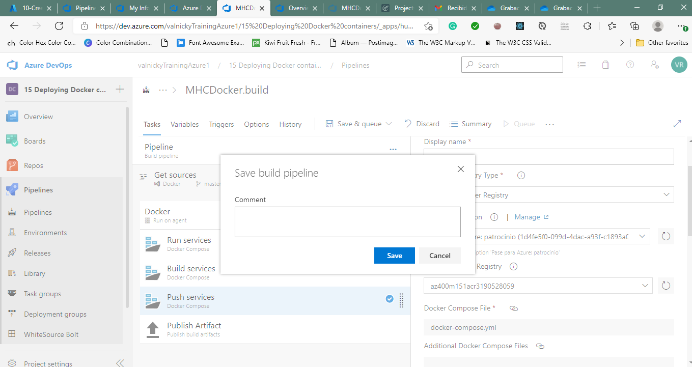

#Lab 15: Deploying Docker containers to Azure App Service web apps - how to use an Azure DevOps CI/CD pipeline to build a custom Docker image, push it to Azure Container Registry, and deploy it as a container to Azure App Service.

###Task 1: Configure the team project

###Task 2: Create Azure resources
In this task, you will use Azure Cloud Shell to create Azure resources required in this lab:

-Azure Container Registry
-Azure Web App for Containers
-Azure SQL Database

##Exercise 2: Deploy a Docker container to Azure App Service web app by using Azure DevOps
###Task 1: Configure Continuous Integration (CI) and Continuous Delivery (CD)

