#Lab 16: Deploying a multi-container application to Azure Kubernetes Services
Azure Kubernetes Service (AKS) is the quickest way to use Kubernetes on Azure. Azure Kubernetes Service (AKS) manages your hosted Kubernetes environment, making it straightforward to deploy and manage containerized applications without requiring container orchestration expertise. It also enhances agility, scalability, and availability of your containerized workloads. Azure DevOps further streamlines AKS operations by providing continuous build and deployment capabilities.

In this lab, we will use Azure DevOps to deploy a containerized ASP.NET Core web application MyHealthClinic (MHC) to an AKS cluster.
##Exercise 0: Configure the lab prerequisites

###Task 1: Configure the team project

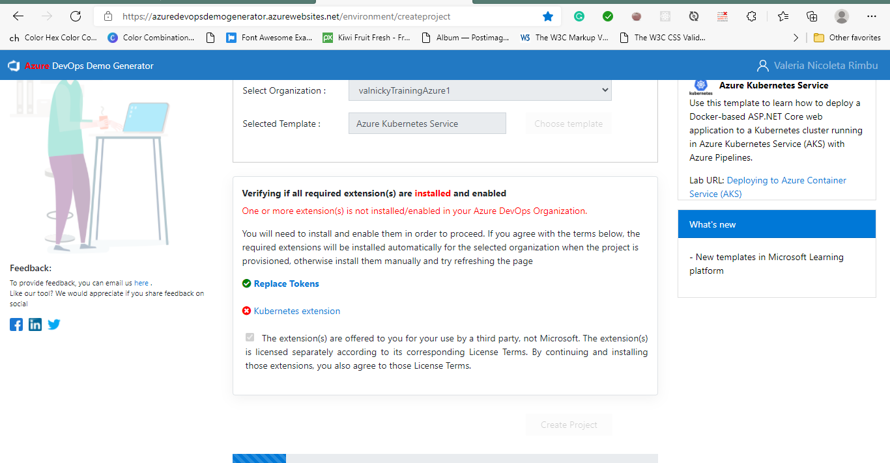

##Exercise 1: Deploy a containerized ASP.NET Core web application to an AKS cluster by using Azure DevOps

###Task 1: Deploy Azure resources for the lab

In this task, we will use Azure CLI to perform deployment of the Azure resources required for this lab

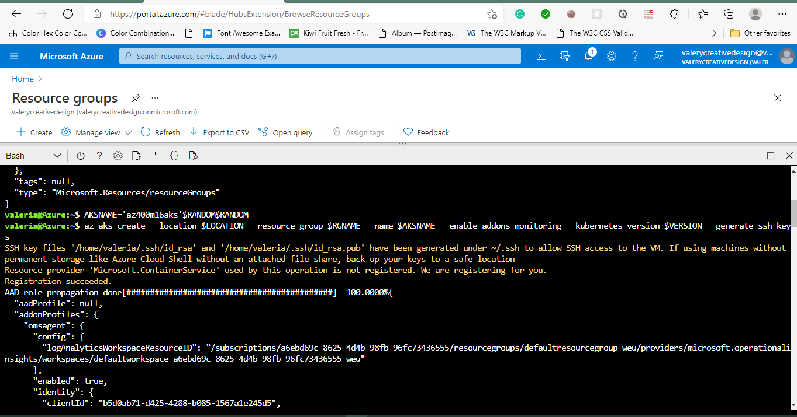

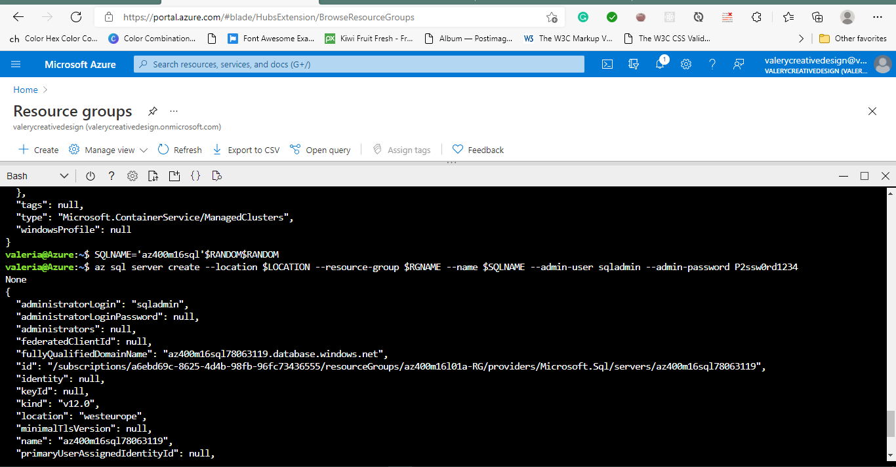

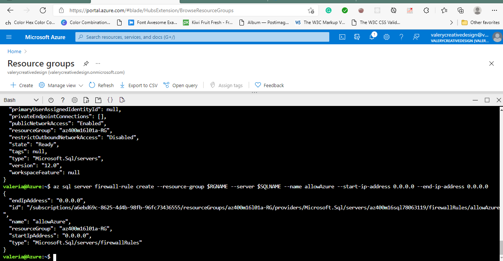

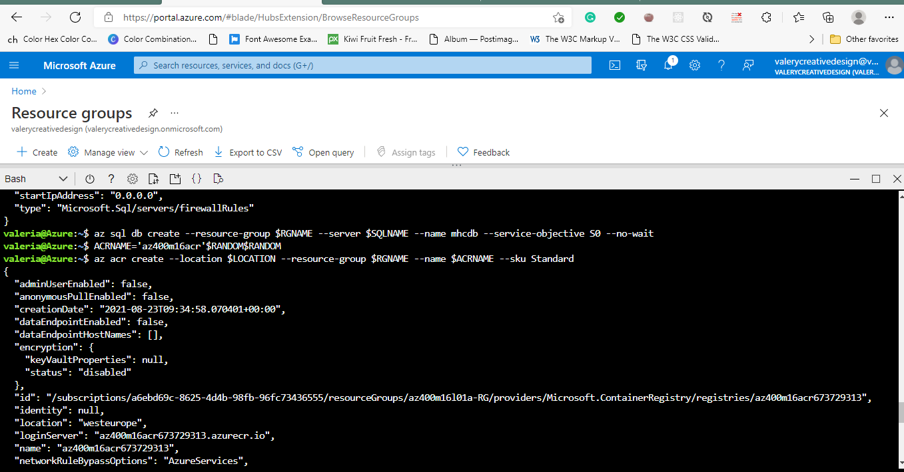

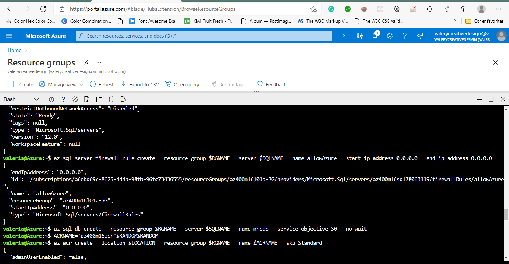

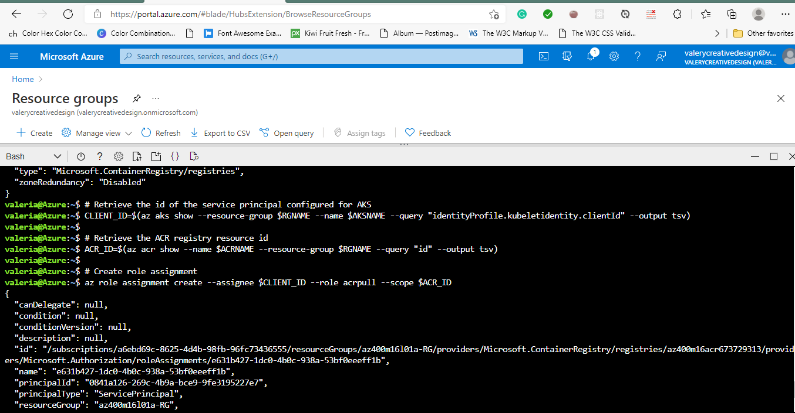

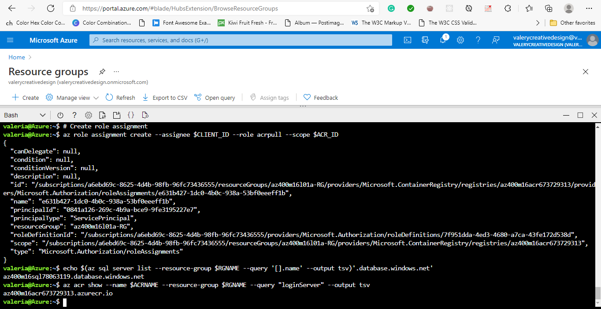

###Task 2: Configure the build and release pipelines
In this task, we will configure the build and release pipelines in the Azure DevOps project we generated earlier in this lab, by mapping Azure resources, including the AKS cluster and Azure Container registry to the build and release definitions.

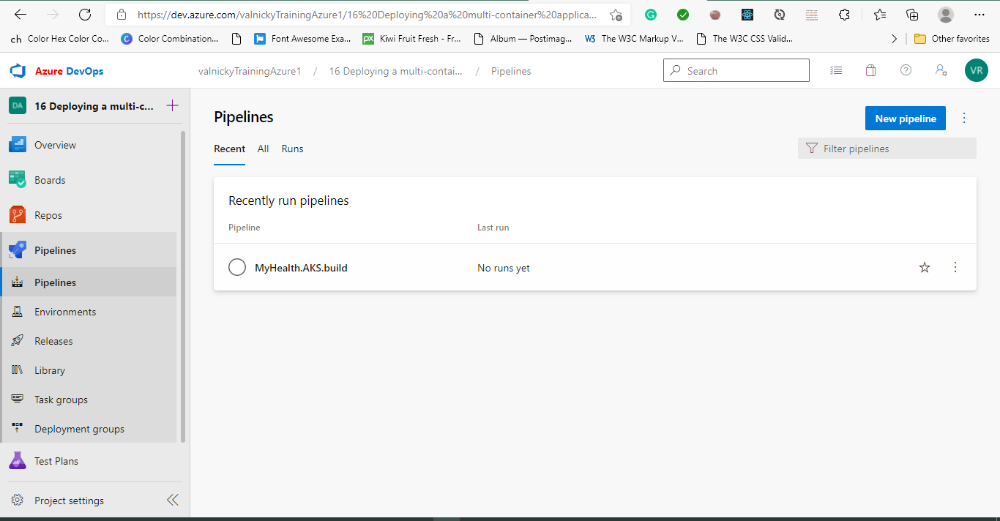

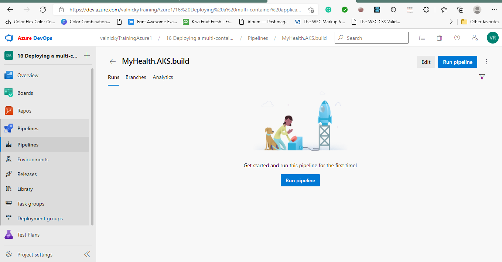

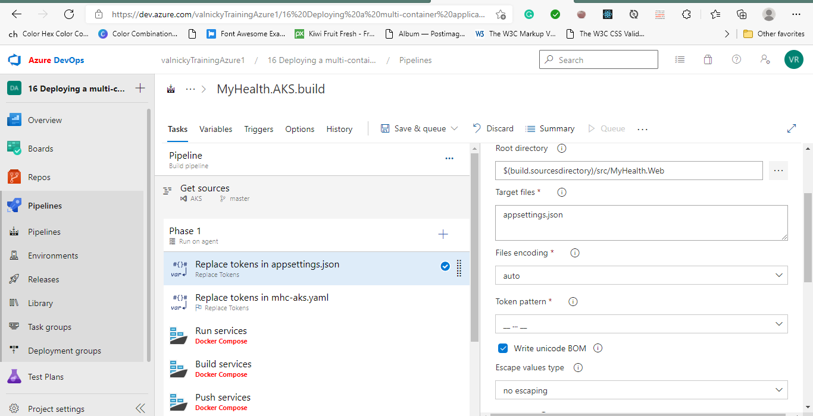

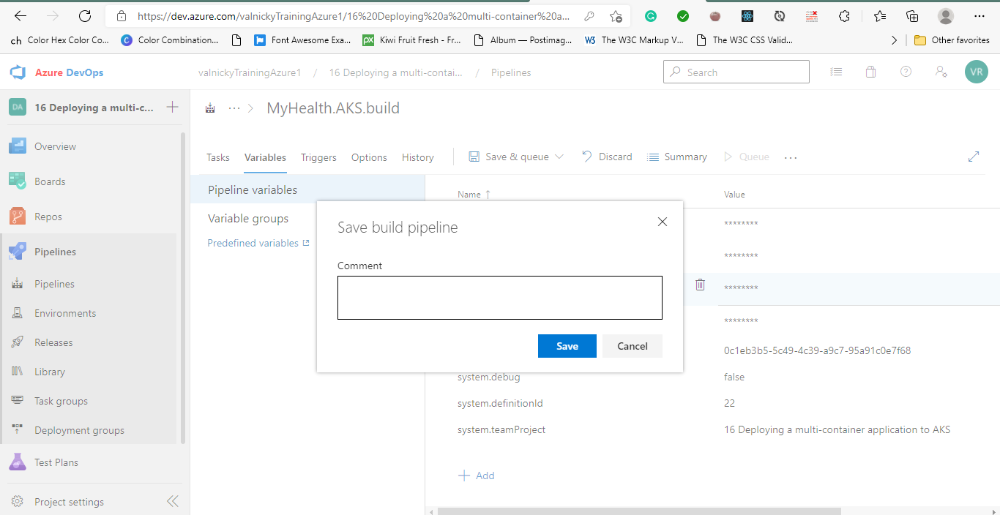

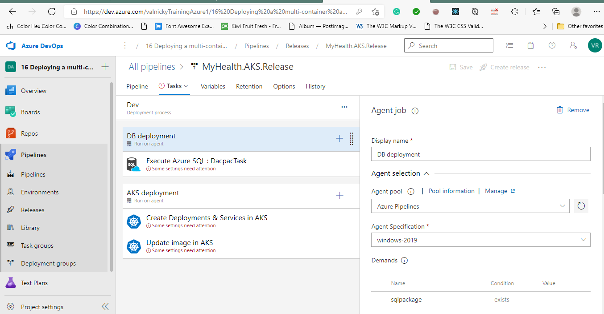

###Task 3: Trigger the build and release pipelines
In this task, you will trigger the build and release pipelines and validate their completion.
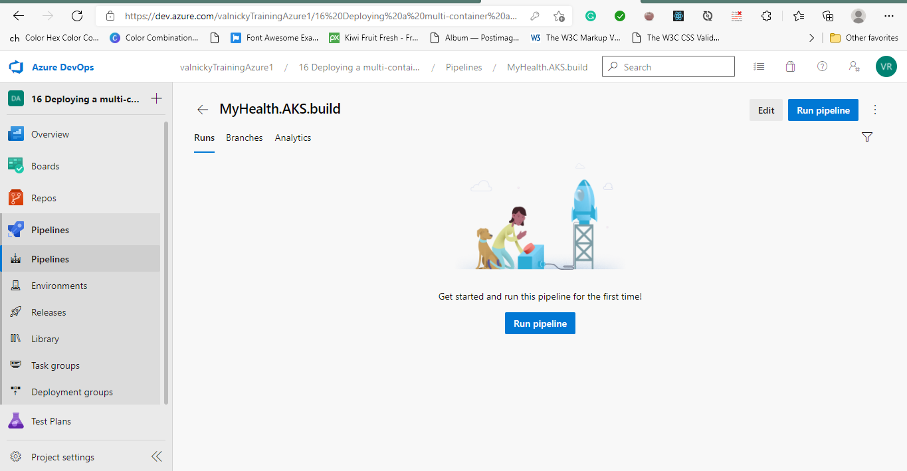

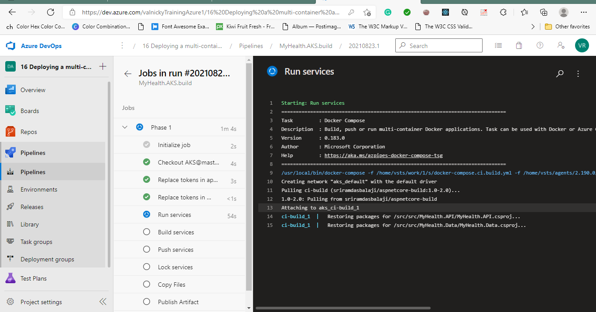

