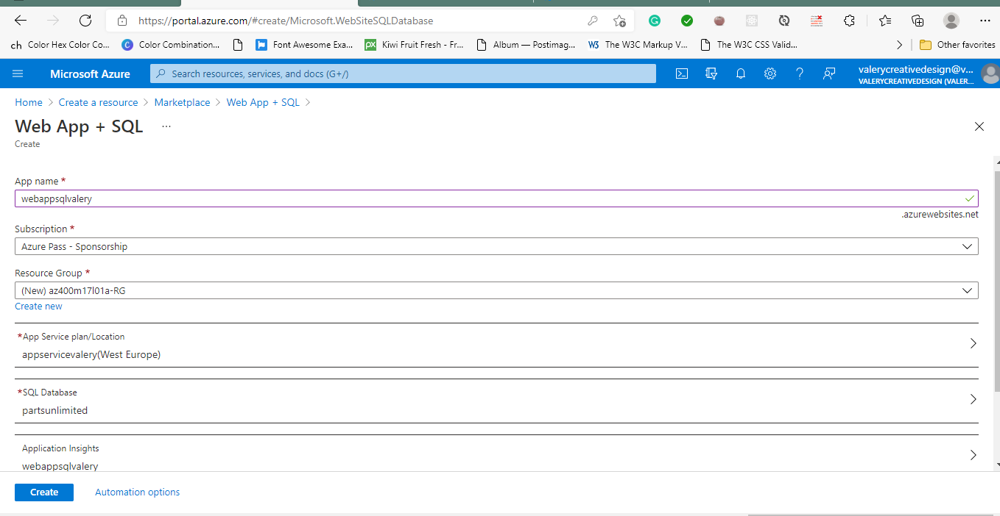
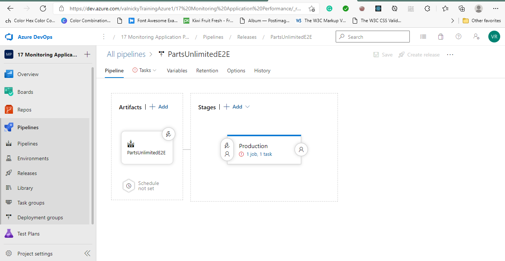
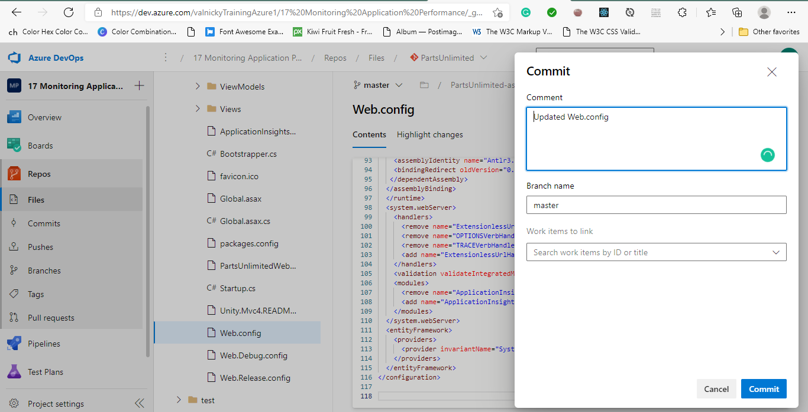
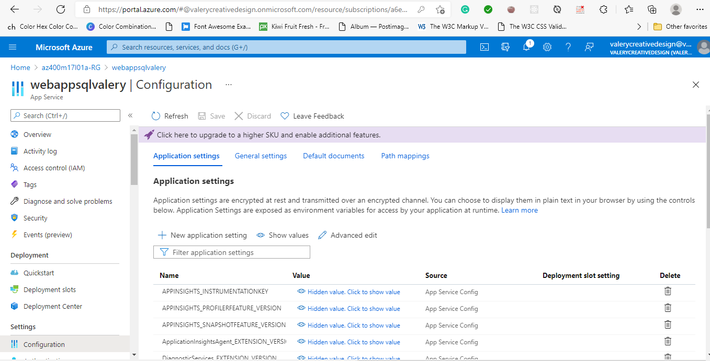
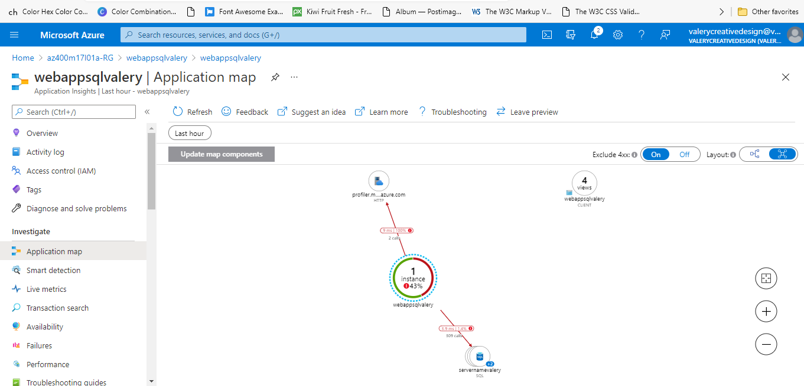
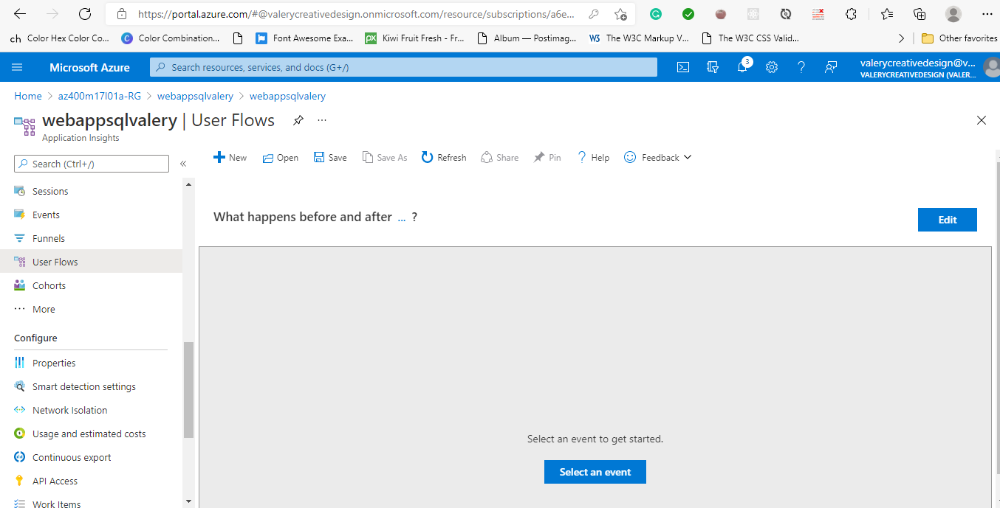
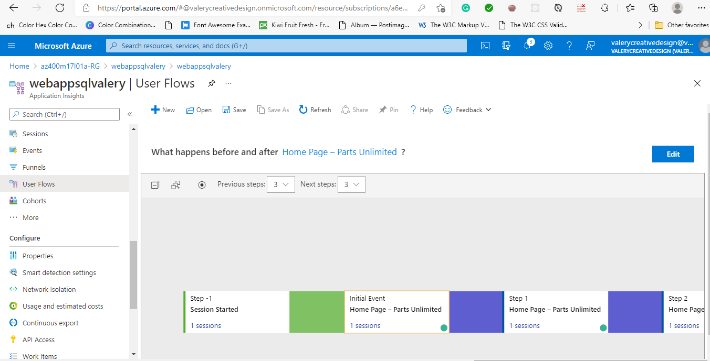

#Lab 17: Monitoring Application Performance with Application Insights
Application Insights is an extensible Application Performance Management (APM) service for web developers on multiple platforms. You can use it to monitor your live web applications. It automatically detects performance anomalies, includes powerful analytics tools to help you diagnose issues, and helps you continuously improve performance and usability. It works for apps on a wide variety of platforms including .NET, Node.js and Java EE, hosted on-premises, hybrid, or any public cloud. It integrates with your DevOps process with connection points available in a variety of development tools. It also allows you to monitor and analyze telemetry from mobile apps through integration with Visual Studio App Center.

##Exercise 0: Configure the lab prerequisites

###Task 1: Configure the team project

###Task 2: Create Azure resources
we will create an Azure web app and an Azure SQL database by using the Azure portal

##Exercise 1: Monitor an Azure App Service web app by using Azure Application Insights
In this exercise,we will deploy a web app to Azure App Service by using Azure DevOps pipelines, generate traffic targeting the web app, and use Application Insights to review the web traffic, investigate application performance, track application usage, and configure alerting.

###Task 1: Deploy a web app to Azure App Service by using Azure DevOps

###Task 2: Generate and review application traffic
In this task, we will generate traffic targeting the App Service web app we deployed in the previous task and review the data collected by Application Insights resource associated with the web app.

###Task 3: Investigate application performance
In this task, we will use Application Insights to investigate performance of the App Service web app.

###Task 4: Track application usage

###Task 5: Configure web app alerts

