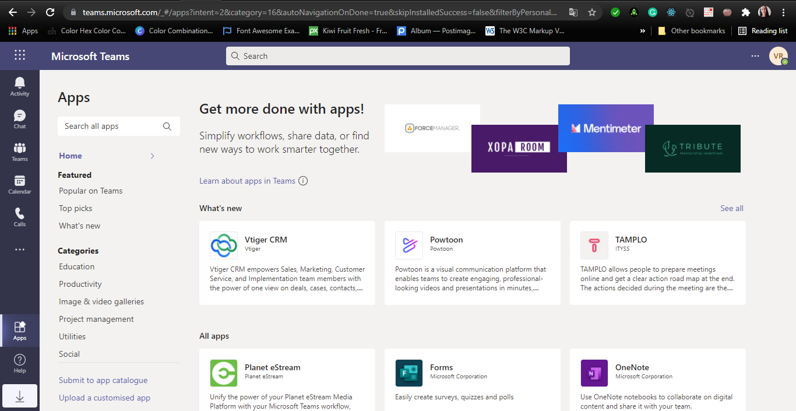
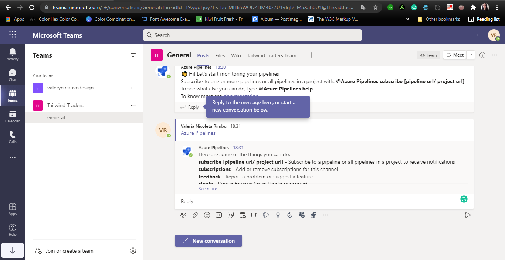
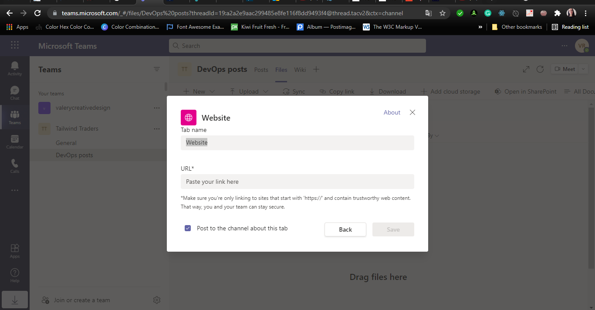

#Lab 18: Integration between Azure DevOps and Teams
Microsoft Teams is a hub for teamwork in Office 365. It allows us to manage and use all our team’s chats, meetings, files, and apps together in one place. It provides software development teams with a hub for teams, conversations, content and tools from across Office 365 and Azure DevOps.

In this lab, you will implement integration scenarios between Azure DevOps services and Microsoft Teams.
##Exercise 0: Configure the lab prerequisites
###Task 1: Configure the team project

###Task 2: Create a team in Microsoft Teams

##Exercise 1: Integrate Azure Boards with Microsoft Teams
###Task 1: Install and configure Azure Boards app in Microsoft Teams

###Task 2: Add Azure Boards Kanban boards to Microsoft Teams

##Exercise 2: Integrate Azure Pipelines with Microsoft Teams

###Task 1: Install and configure Azure Pipelines app in Microsoft Teams

###Task 2: Subscribe to the Azure Pipeline notifications in Microsoft Teams

###Task 3: Using filters to customize subscriptions to Azure Pipelines in Microsoft Teams

##Exercise 3: Review Microsoft Teams collaboration features in DevOps scenarios

###Task 1: Review Microsoft Teams conversation capabilities

###Task 2: Create channels in Microsoft Teams

###Task 3: Share content in Microsoft Teams
In this task, we will step through the process of sharing Azure DevOps wikis in Microsoft Teams

