#Lab 19: Implement Security and Compliance in an Azure DevOps pipeline
We will use WhiteSource Bolt with Azure DevOps to automatically detect vulnerable open source components, outdated libraries, and license compliance issues in your code. You will leverage WebGoat, an intentionally insecure web application, maintained by OWASP designed to illustrate common web application security issues.

WhiteSource is the leader in continuous open source software security and compliance management. WhiteSource integrates into your build process, irrespective of your programming languages, build tools, or development environments. It works automatically, continuously, and silently in the background, checking the security, licensing, and quality of your open source components against WhiteSource constantly-updated definitive database of open source repositories.

WhiteSource provides WhiteSource Bolt, a lightweight open source security and management solution developed specifically for integration with Azure DevOps and Azure DevOps Server. Note that WhiteSource Bolt works per project and does not offer real-time alert capabilities, which requires Full platform, generally recommended for larger development teams that want to automate their open source management throughout the entire software development lifecycle (from the repositories to post-deployment stages) and across all projects and products.

##Exercise 0: Configure the lab prerequisites

###Task 1: Create and configure the team project

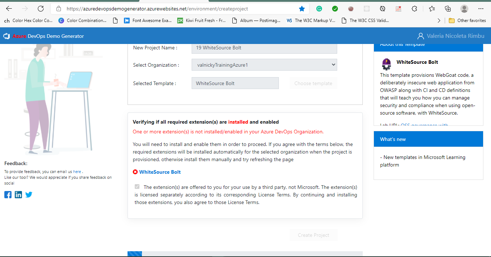

##Exercise 1: Implement Security and Compliance in an Azure DevOps pipeline by using WhiteSource Bolt
In this exercise, leverage WhiteSource Bolt to scan the project code for security vulnerabilities and licensing compliance issues, and view the resulting report.

###Task 1: Activate WhiteSource Bolt

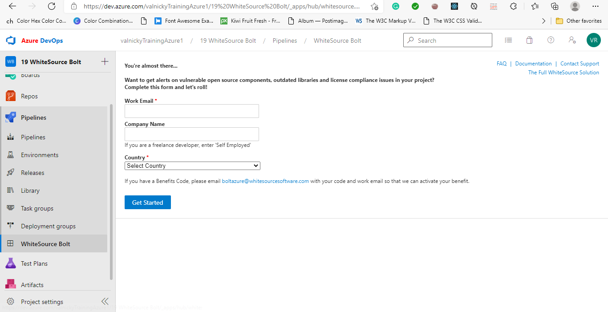

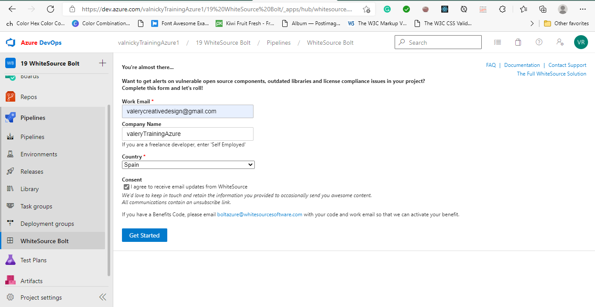

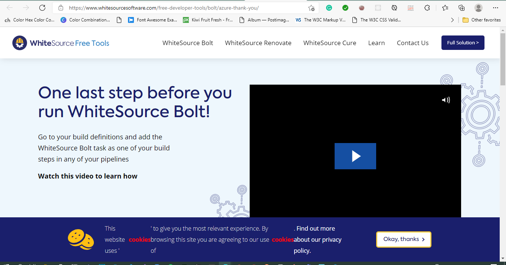

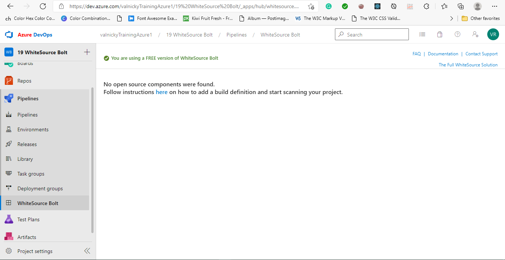

###Task 2: Trigger a build

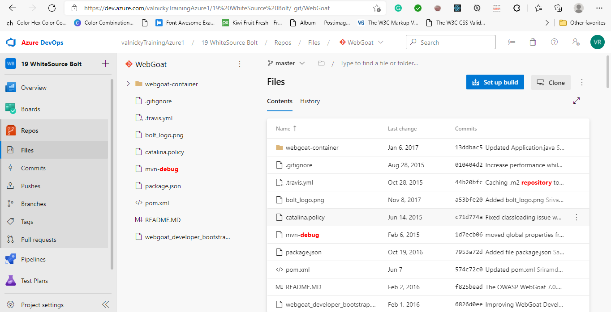

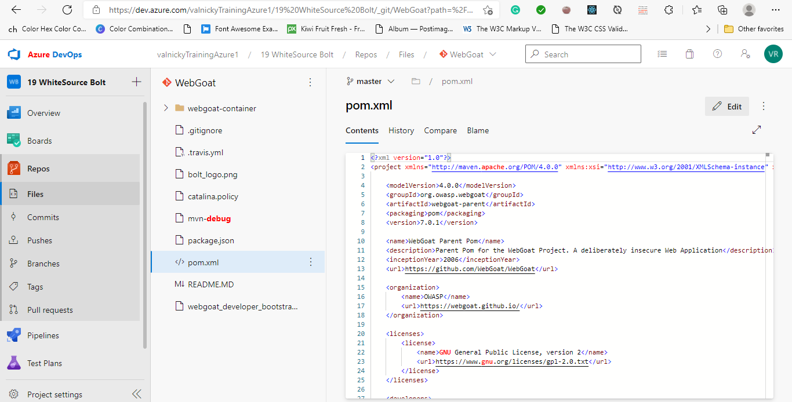

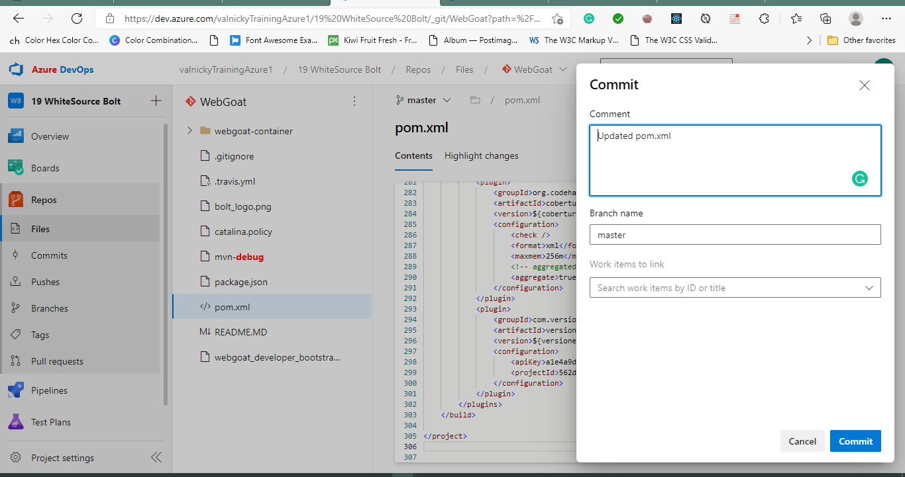

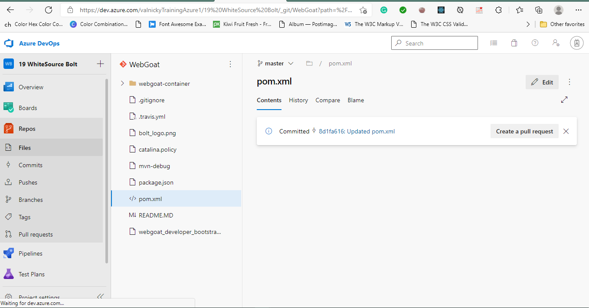

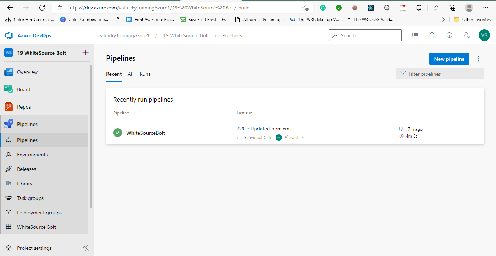

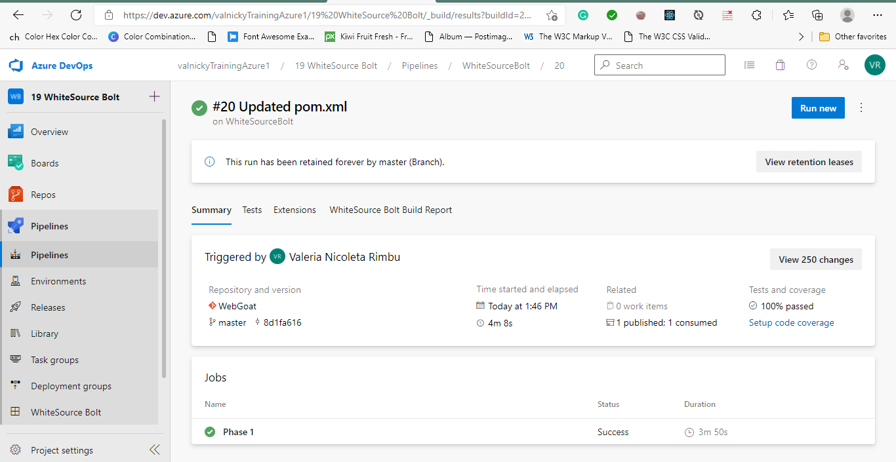

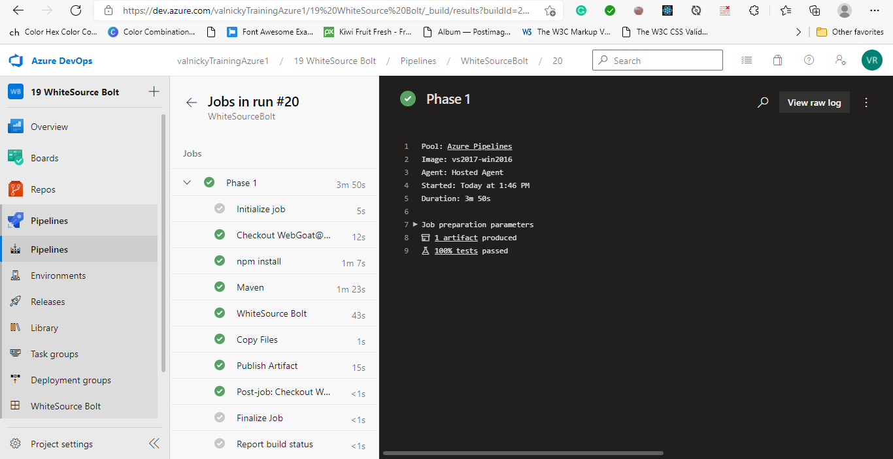

###Task 3: Analyze Reports

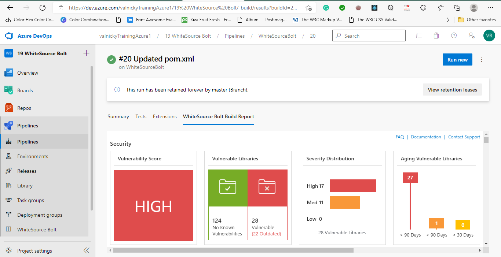

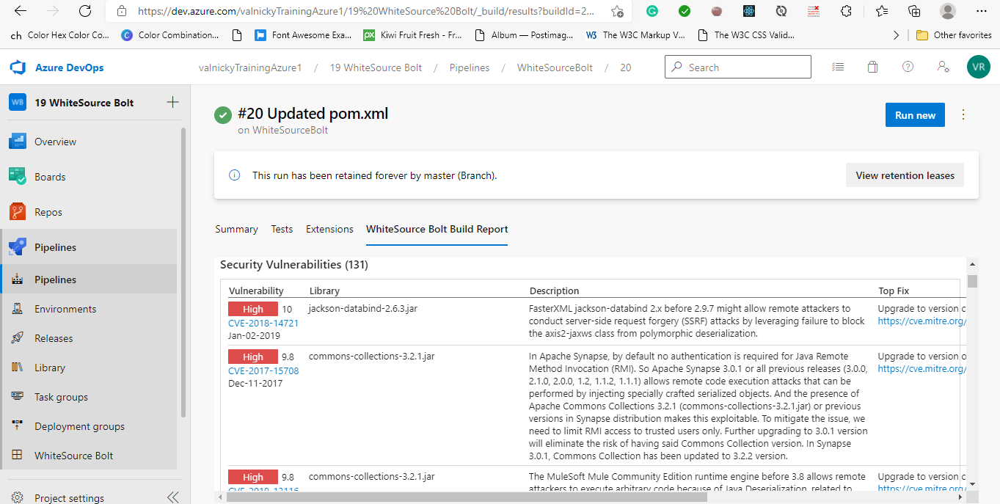

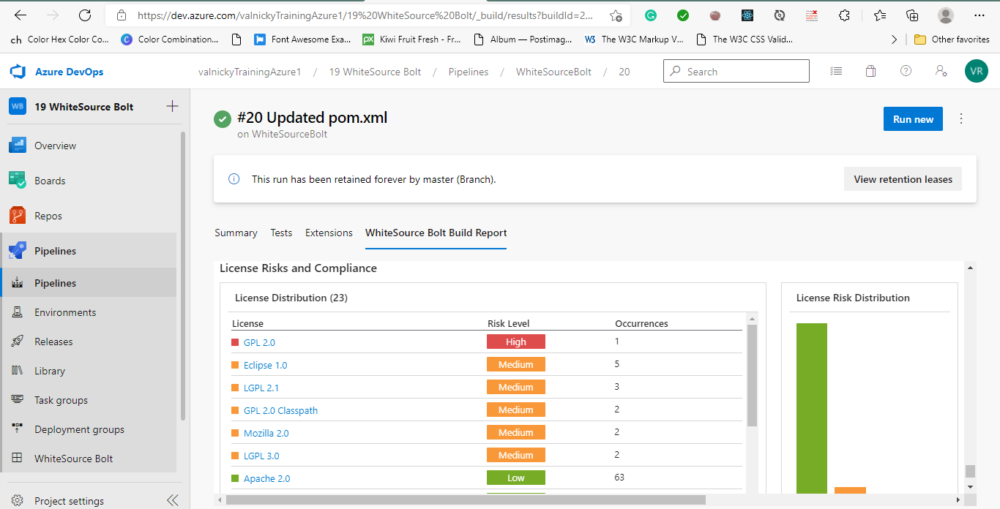
