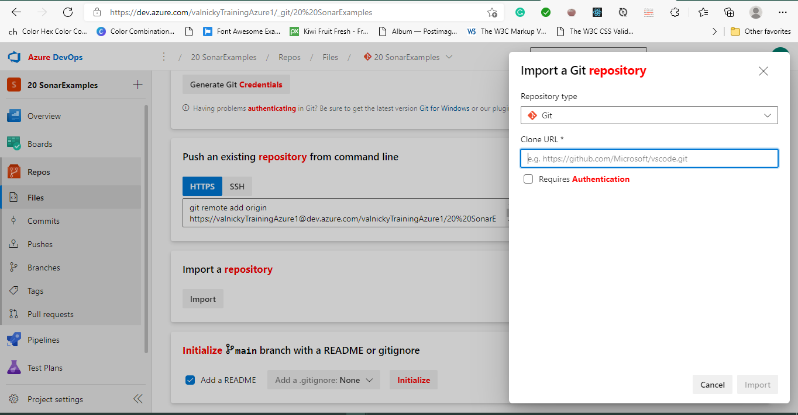
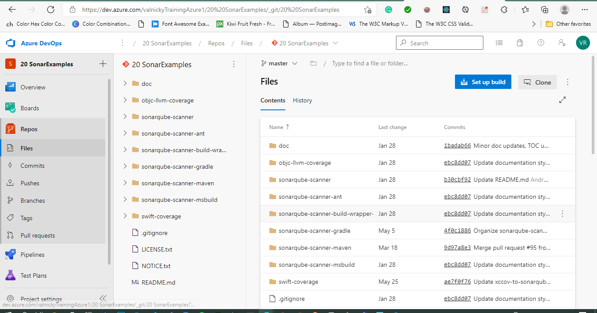
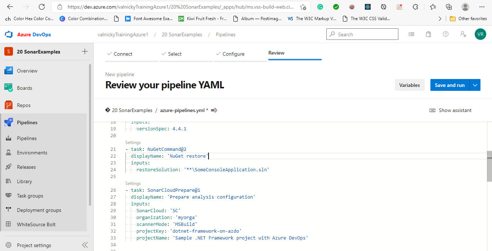
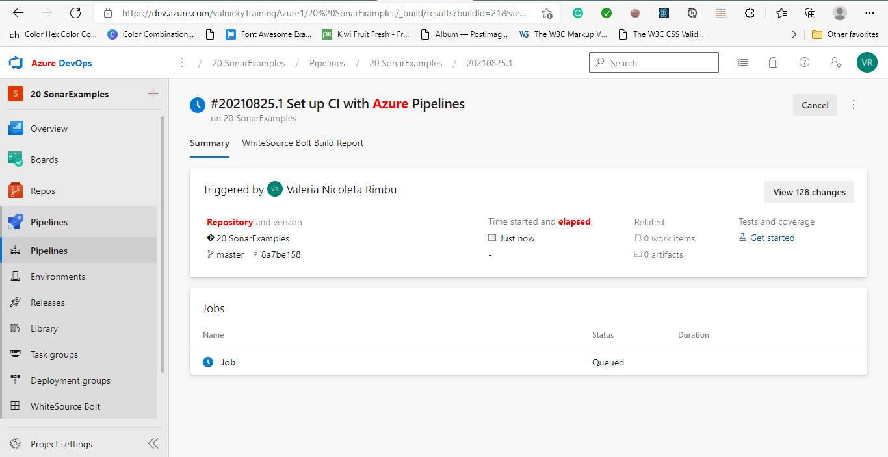
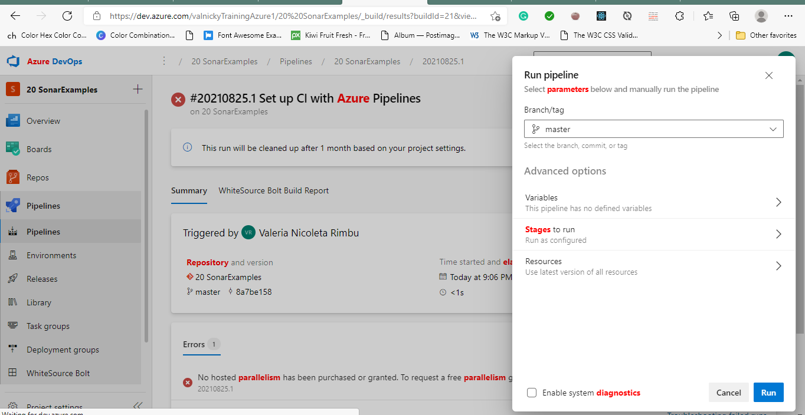
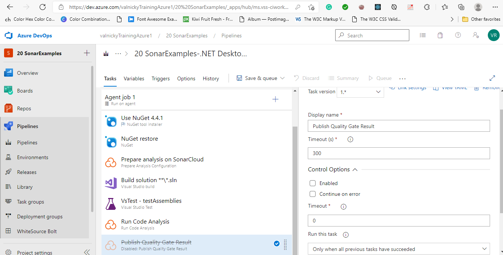
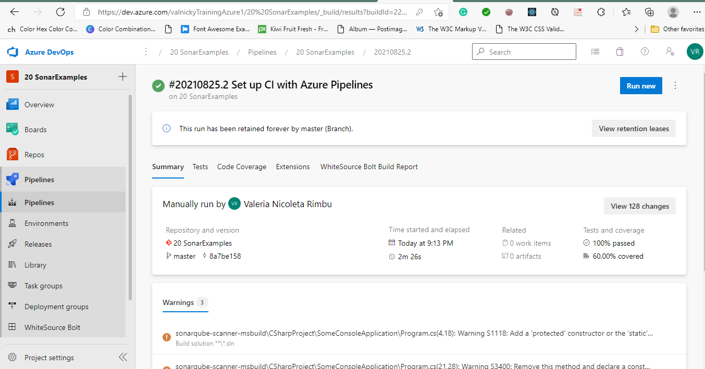

#Lab 20: Managing technical debt with SonarCloud and Azure DevOps
In the context of Azure DevOps, the term technical debt represents suboptimal means of reaching tactical goals, which affect negatively the ability to reach strategic objectives in the area of software development and deployment. Technical debt affects productivity by making code hard to understand, prone to failures, time-consuming to change, and difficult to validate. Without proper oversight and management, technical debt can accumulate over time and significantly impact the overall quality of the software and the productivity of development teams in the longer term.

SonarCloud is a cloud-based code quality and security service.

##Exercise 0: Configure the lab prerequisites

###Task 1: Create the team project

###Task 2: Generate an Azure DevOps personal access token
In this task, we will generate an Azure DevOps personal access token that will be used to authenticate from the Postman app we will install in the next task of this exercise.

###Task 3: Install and configure the SonarCloud Azure DevOps extension
we will install and configure the SonarCloud Azure DevOps extension in our Azure DevOps project.

##Exercise 1: Set up an Azure DevOps pipeline that integrates with SonarCloud
###Task 1: Initiate creation of the project build pipeline

We can configure the pipeline with either the YAML editor or with the classic editor. With the classic editor, we can take advantage of the pre-defined templates that were installed as part of the SonarCloud Extension, above. With the YAML editor we need to use a separately provided YAML file. We will step through each of these two options.

###Task 2: Create a pipeline by using the YAML editor

###Task 3: Create a pipeline by using the classic editor

###Task 4: Check pipeline results

